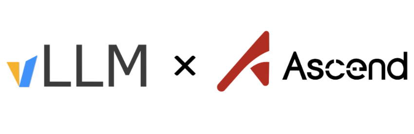
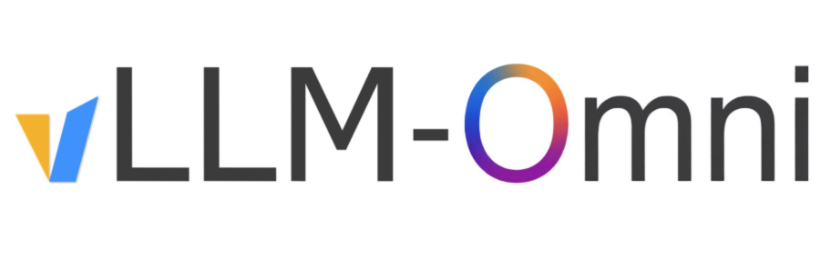
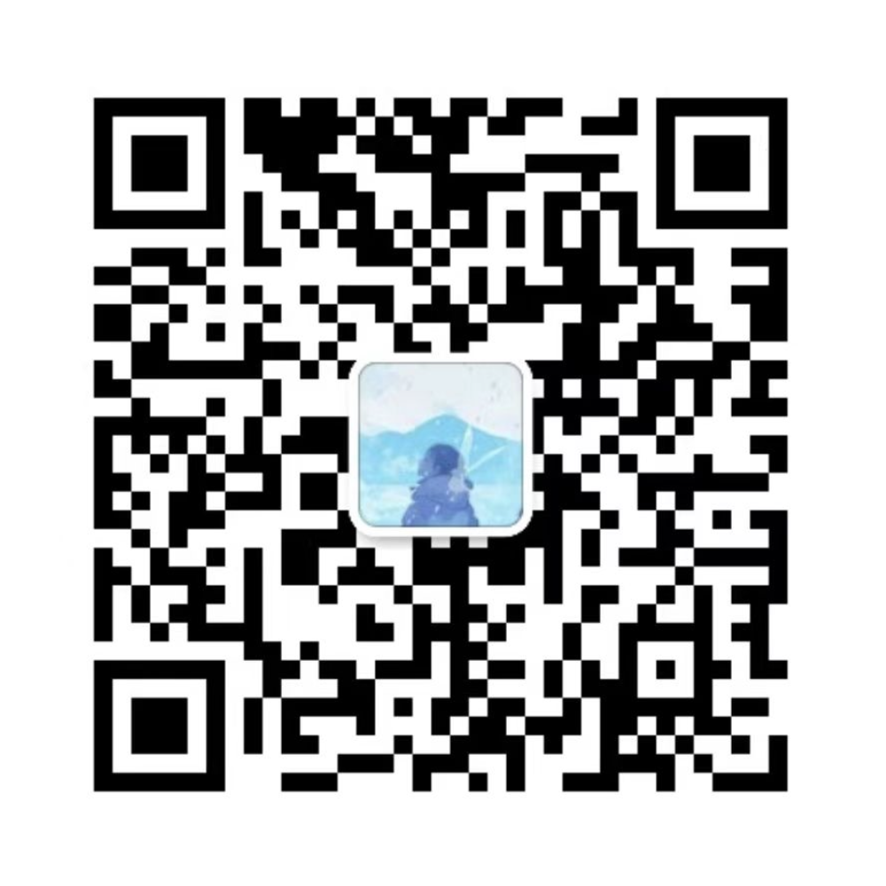

---

## Overview

**Shanshan Shen | 申杉杉**

September 18th, 1998

I am currently a software engineer working at [Huawei Ascend](https://www.hiascend.com/), focusing on LLM/VLM inference and GPU/NPU computing. I have contributed to some popular open source projects such as [vLLM](https://github.com/vllm-project/vllm), to build a easy-to-use software ecosystem for Ascend. Before this, I was a student at [Beijing Jiao Tong University](https://www.bjtu.edu.cn/) (BSc/MSc), majoring in communication engineering. You can see my projects at [Github](https://github.com/shen-shanshan), or see my posts at [Zhihu](https://www.zhihu.com/people/sss-53-26).

---

## Experiences




Working at Huawei Ascend, building vLLM inference engine, previously at Quality and Process IT Department.



Studying at School of Electronic and Information Engineering, focusing on wireless communication NAS layer security.



Studying at School of Electronic and Information Engineering, majoring in communication engineering.




---

<!-- ## Publications -->

## Open Source Contributions

During my open source experience, I have become a:

- Outside collaborator of [vllm](https://github.com/vllm-project/vllm).
- Core contributor to [vllm-ascend](https://github.com/vllm-project/vllm-ascend).

<!-------------------------- last updated: 2025/12/29 ------------------------->
In addition, I have contributed [119 PRs](https://github.com/pulls?q=is%3Apr+author%3Ashen-shanshan+is%3Amerged+is%3Apublic+org%3Avllm-project) to the vLLM ecosystem, focusing on structured output, multi-modal inference and elastic scaling.



 



Find more details about all PRs I have contributed [here](https://github.com/pulls?q=is%3Apr+author%3Ashen-shanshan+is%3Amerged+is%3Apublic).

<!--
I am a core contributor to [vllm-ascend](https://github.com/vllm-project/vllm-ascend) and an outside collaborator of [vllm](https://github.com/vllm-project/vllm).


  
  
  


- I have contributed [98 PRs](https://github.com/vllm-project/vllm-ascend/pulls?q=is%3Apr+is%3Amerged+author%3Ashen-shanshan) to:

- I have contributed [21 PRs](https://github.com/vllm-project/vllm/pulls?q=is%3Apr+is%3Amerged+author%3Ashen-shanshan) to:


-->

---

## Projects

[cs-self-learning](https://github.com/shen-shanshan/cs-self-learning) is one of my projects used for archiving my notes, codes and materials of CS (Computer Science) learning.



---

## Programming Skills


  
  
  
  
  
  
  
  
  
  
  
  
  
  
  
  
  
  
  
  
  


---

## Multi-lingual Skills

- English: IELTS overall band score of **6.5**.

---

## Contact me

Feel free to drop me an email, <b><a href="shanshanshen333@gmail.com">gmail</a></b> or <b><a href="467638484@qq.com">qq-mail</a></b> are both available.

You can also have my WeChat through the picture shown below:

    

> NOTE: Remember to add a description about your intentions before sending a request.

---
