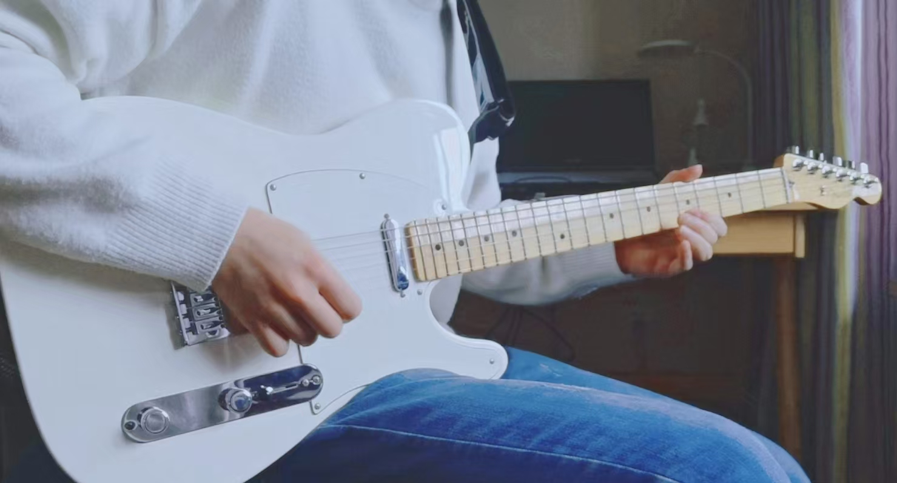

---

## Overview

**Shanshan Shen | 申杉杉**

September 18th, 1998

<!-- 

    

 -->

Hello, I am currently a software engineer working at [Huawei Ascend](https://www.hiascend.com/), engaging in AI Infra and LLM. I have contributed to some open-source projects such as [vLLM](https://github.com/vllm-project/vllm), [SGLang](https://github.com/sgl-project/sglang) and [ChatTTS](https://github.com/2noise/ChatTTS), to build a easy-to-use software ecosystem for Ascend. Before this, I was a student at [Beijing Jiao Tong University](https://www.bjtu.edu.cn/) (BSc/MSc), majoring in communication engineering. You can see more projects at my [Github](https://github.com/shen-shanshan), or see my posts at [CSDN](https://blog.csdn.net/weixin_44162047?type=blog) and [Zhihu](https://www.zhihu.com/people/sss-53-26).

---

## Experience




Working at Huawei from MetaCRM to Ascend, engaging in AI Infra and software development.



Studying at School of Electronic and Information Engineering, engaging in security research of wireless communication.



Studying at School of Electronic and Information Engineering, majoring in communication engineering.




---

## Hobbies

In my spare time, I have many hobbies such as reading books, playing badminton and doing exercise. I am not only a programmer, but also a guitarist loving play both acoustic and electric guitars.

- 📚 Books
- 🎸 Guitars
- 🎵 Albums
- 🏸 Badminton

---

### 📚 Books

**_TODO..._**

---

### 🎸 Guitars

I love listening to guitar music especially fingerstyle songs and may do some recordings myself when I come across some beautiful songs. My guitars and gears used for recording are showed below, and there are also my albums that have been published so far. You can find my music at <b><a href="https://space.bilibili.com/14112152">bilibili</a></b> or <b><a href="https://music.163.com/#/artist?id=62054947">NetEase Cloud Music</a></b>.




This is my electric guitar which is made of Alderwood (body) and Maplewood (fingerboard), and is equipped with pickup system of Alnico 5 single coil.




This is my favorite guitar which is made of Sitka Spruce (panel) and Indian Rosewood (backboard), and is equipped with pickup system of Lim magnet (passive) and Lim piezo.





---

**Other recording gears I used:**

| Gears | My Choice |
|:---------|:----------|
| Mic | AKG C3000 |
| Preamp | Lim |
| Audio Card | Yamaha UR242 |
| DAW | Studio One |
| Plugins | Bias fx2 / Ozone / Lexicon / Waves / Slate Digital / Raum |
| Video Editing | Video Studio Pro 2019 |

---

### 🎵 Albums

<!-- **I have published 2 albums so far:** -->




This album is a collection of multi-track acoustic guitar cover which contains 11 songs that I like, such as <b><i>In The Rain</i></b> and <b><i>Crack</i></b>. You can listen to these songs at <b><a href="https://music.163.com/#/album?id=197408623">here</a></b>.




This album is a collection of fingerstyle guitar and ukulele cover which contains 11 songs that I like, such as <b><i>Tickets to Starry Sky</i></b> and <b><i>Rain stops, Good-bye</i></b>. You can listen to these songs at <b><a href="https://music.163.com/#/album?id=197653151">here</a></b>.





---

### 🏸 Badminton

I love playing badminton and will participate in this activity 1~4 times a week. Awards I have received are showed below. Welcome to battle with me!

- <b>Fourth place</b> in the Inter-Department Team Competition of Xian Huawei at 2024
- <b>Second place</b> in the Quality and Process IT Department Team Competition of Xian Huawei at 2024
- <b>Third place</b> in the Inter-School Cup of Beijing Jiao Tong University at 2023

---

## Contact me

Feel free to drop me an email, <b><a href="shanshanshen333@gmail.com">gmail</a></b> and <b><a href="467638484@qq.com">qq-mail</a></b> are both available.

You can also have my WeChat through the picture below:

    

> Remember to add a explaination before sending a request!

---
