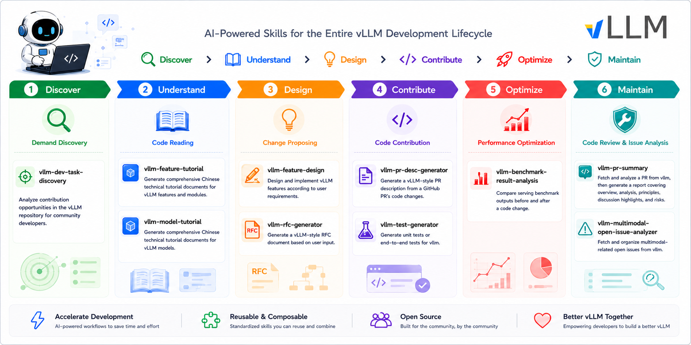
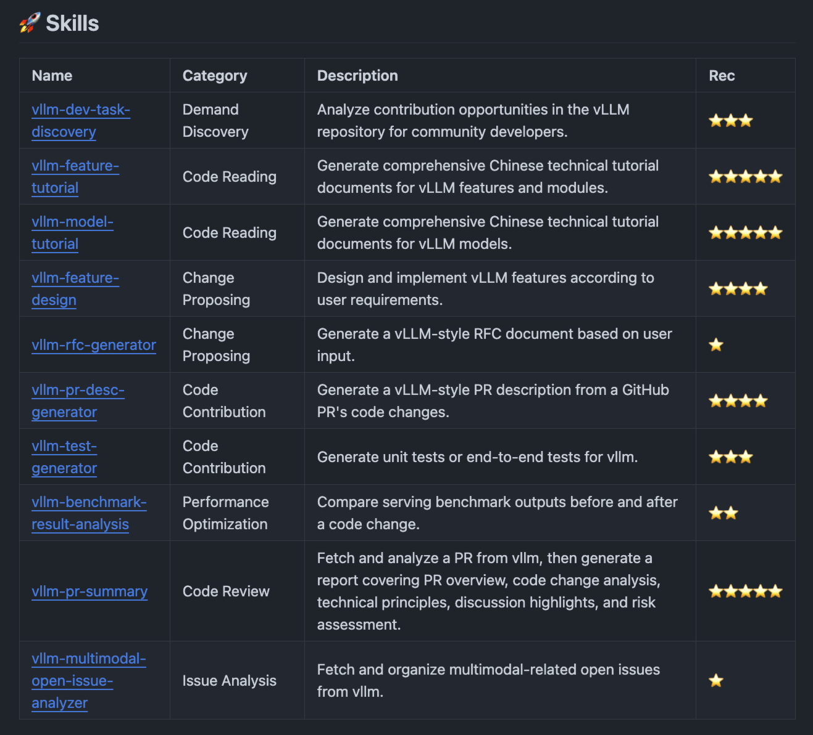
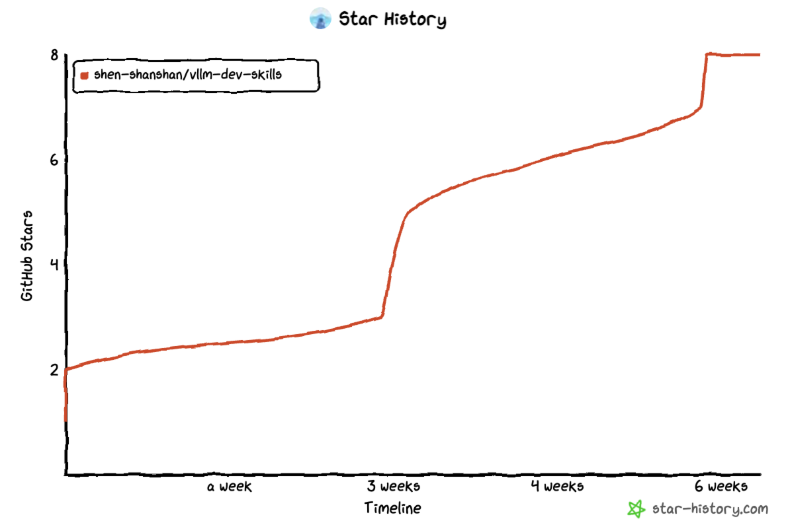

## 一、引言

[vLLM](https://github.com/vllm-project/vllm) 是目前最主流的大模型推理框架之一，但作为社区贡献者，上手成本实在不低——代码库庞大、模块耦合深、迭代速度又快，光搞清楚一个 Feature 的实现路径就得花不少时间。

去年开始我尝试把 Claude Code 接入到自己的 vLLM 开发流程里，用了一段时间发现确实能省不少力气。我把常用的工作流封装成了一个个 Skill，放在 [vllm-dev-skills](https://github.com/shen-shanshan/vllm-dev-skills) 这个仓库里。这篇文章聊聊这些 Skill 具体做什么、我实际怎么用，以及踩过的一些坑。

> NOTE：本文跟随项目演进持续更新中（last update：2026/06/12）。

## 二、项目介绍

该仓库中目前一共有 10 个 Skill，按我日常的开发流程分成 6 类：

### 2.1 需求发现：找活干

**`vllm-dev-task-discovery`**：

这是个我最近才加的新 Skill。输入一个模块或方向（比如"多模态"、"V1 Engine"），它会从 vLLM 的 Open Issues、近期合并的 PR、Discussions、代码里的 TODO/FIXME、Roadmap 标签等多个渠道搜集信息，整理出一份"当前有哪些事可以干"的报告，每个 task 标注了难度、前置知识、相关 maintainer、紧急程度等信息。

### 2.2 代码学习：读代码和看模型

**`vllm-feature-tutorial`**：

这是我用得最多的一个。输入一个 Feature 名（比如 EPD、Chunked Prefill、Prefix Caching），它会自动去翻 vLLM 的源码和文档，生成一篇中文技术文档，包含架构图（Mermaid）、核心类的继承关系、完整调用链、关键代码走读等内容。

实际用下来最爽的场景是接手一个完全陌生的模块。比如有次需要了解 EPD disaggregation 的 encoder cache 传输机制，20 分钟读完文档基本就有概念了，换以前纯手工翻代码至少半天起步。当然它也不是万能的，偶尔会漏掉一些冷门分支逻辑，或者 Mermaid 图里的类名跟实际代码对不上，但作为零基础入门的跳板，效率提升还是很明显的。

**`vllm-model-tutorial`**：

和上面的 Feature 教程类似，但专注在模型层面。比如你想了解 DeepSeek-OCR 在 vLLM 里是怎么接进去的、ViT 的图像预处理流程是怎样的，它会把模型架构、vLLM 里的注册和推理流程、多模态输入的处理 pipeline 都梳理出来。

这个 Skill 特别适合需要快速理解某个模型在 vLLM 里实现细节的场景——比如你要给某个 VLM 加新功能，得先搞清楚它的 multimodal processor 是怎么写的。

### 2.3 需求设计：做 POC、提 RFC

**`vllm-feature-design`**：

输入需求描述、相关 PR/Issue 链接、参考资料，输出核心代码实现和一份设计文档。

这个 Skill 的定位不是"自动写 PR"，而是"帮你快速出一个能跑的设计草稿"，实测准确度大概六到七成。架构图和接口定义那部分基本可以直接用，但具体实现细节还是得自己改。一个比较好用的姿势是：先让它生成初版，然后在这个基础上迭代调整，比自己从空白文件开始效率高不少。

之前用它设计了一个支持 Mooncake 的 ECConnector（给 EPD 场景传 encoder cache），生成的代码框架和设计文档后来直接发到了 vLLM 社区当 RFC 讨论：[Issue #39766](https://github.com/vllm-project/vllm/issues/39766)。

**`vllm-rfc-generator`**：

vLLM 社区对大的架构改动要求先提 RFC。这个 Skill 根据你的想法生成符合社区规范的 RFC 草稿。说实话这个 Skill 的实用性一般（我自己评分最低），因为 RFC 写得好不好太依赖对社区设计偏好的理解了，AI 目前还不太能把握这种 nuance。更多是当个模板生成器用，省去打框架的时间。

### 2.4 代码贡献：提 PR、补测试

**`vllm-pr-desc-generator`**：

输入一个 PR 链接，自动按 vLLM 的 PR 模板（Purpose / Test Plan / Test Result）生成描述。这个算是 ROI 最高的 Skill 之一，改了很多文件的 PR 用它能省不少写文档的时间，生成的描述稍微改改就能用。

**`vllm-test-generator`**：

给定函数、类或 PR 的代码变更，生成单元测试或端到端测试。之前给 ViT Full CUDA Graph 的 PR 写测试时用了一次，生成的结构基本合理。

### 2.5 性能优化：Benchmark 分析

**`vllm-benchmark-result-analysis`**：

把改代码前后的 benchmark 输出贴进去，自动算各项指标的百分比变化，标出改善/退步。之前提了个 vllm-ascend 的 PR 时用它对比过性能数据，比自己手动按计算器快多了。

### 2.6 项目维护：Review 和分析

**`vllm-pr-summary`**：

输入一个 PR 编号，生成分析报告：PR 目的、代码变更分析（带架构/流程图）、潜在风险点。我主要用它快速浏览社区 PR，尤其是那种改动很大但跟自己的活没直接关系、只想了解个大概的。Review 自己负责的 PR 时还是得老老实实读代码，这个只当辅助参考。

**`vllm-multimodal-open-issue-analyzer`**：

自动拉 vLLM 仓库里跟多模态相关的 Open Issue，按 Bug / Feature Request / 性能等分类整理。适合定期跑一下了解社区动向，但输出比较长，建议配合搜索用。

## 三、使用经验

这些 Skill 的安装很简单：把仓库里的 `skills/` 目录拷到 Claude Code 的 skills 路径下（`~/.claude/skills/`），然后在 Claude Code 里用 `/skill-name` 调用就行。

具体每个 Skill 的 prompt 示例和输出样例在仓库 [README](https://github.com/shen-shanshan/vllm-dev-skills) 里都有，这里不展开。

下面分享几个我在不同开发阶段的使用经验：

1. **找活干**：定期跑 `vllm-dev-task-discovery` 看某个方向有没有适合自己水平的 task，锁定目标后再去对应 Issue 里深入了解；
2. **接手新任务**：先跑 `vllm-feature-tutorial` 或 `vllm-model-tutorial` 建立全局认知，再翻代码补细节。比直接硬读效率高不少；
3. **做设计**：用 `vllm-feature-design` 出初版 → 手动调整细节 → 把设计文档扔到社区讨论（需要 RFC 的话用 `vllm-rfc-generator` 起个框架）；
4. **提交 PR**：`vllm-pr-desc-generator` 生成描述草稿，`vllm-benchmark-result-analysis` 对比性能（如果有 benchmark 数据的话）；
5. **Code Review**：自己负责 Review 的 PR 老实读代码，但用 `vllm-pr-summary` 快速了解背景和改动范围。

## 四、使用感受

- **Skill 在"格式化输出"的任务上最稳定**：像 PR 描述、benchmark 对比报告、RFC 模板这类有明确格式要求的，AI 输出质量很高，基本不用大改。但越需要"理解社区偏好"或"做设计权衡"的任务（比如 RFC 的实际内容、Feature Design 的细节实现），AI 的表现就越依赖你的 prompt 质量和后续的人工调整；
- **好的 Skill 帮的是"冷启动"，不是"全自动"**：我从不指望任何一个 Skill 直接出最终结果。它们最大的价值是把你从零拉到 60-70%，剩下的 30-40% 还是得靠自己对代码和领域的理解。但这个 60-70% 已经很值了——它把你的精力从"搞清楚怎么回事"转移到"想清楚怎么做更好"；
- **文档生成类的 Skill 要注意过时问题**：vLLM 代码迭代太快，生成的教程可能过几周就有部分过时。我现在养成了个习惯：用 `vllm-feature-tutorial` 生成的文档只当一次性速读材料，重要的理解还是回归到读源码；
- **不是 Skill 越多越好**：10 个 Skill 里我真正高频用的就 4-5 个（feature-tutorial、model-tutorial、pr-desc-generator、pr-summary、feature-design），其他的按需使用。与其堆数量，不如把常用的那几个 prompt 持续打磨。

## 五、未来计划

- 增加 `vllm-pr-review` Skill，参考阿里巴巴的 [open-code-review](https://github.com/alibaba/open-code-review) 思路，在 PR Review 阶段做更结构化的检查；
- 给 [README](https://github.com/shen-shanshan/vllm-dev-skills) 增加一个 Tricks 章节，记录一些实际使用中的小技巧；
- 探索用 GitHub Pages 做个更易读的 Web 网站。

## 六、总结

如果你也准备/正在做 vLLM 社区贡献，或者有自己好用的 Skill 想分享，欢迎来仓库提 Issue/PR，或者直接 Star/Fork 拿去用。

