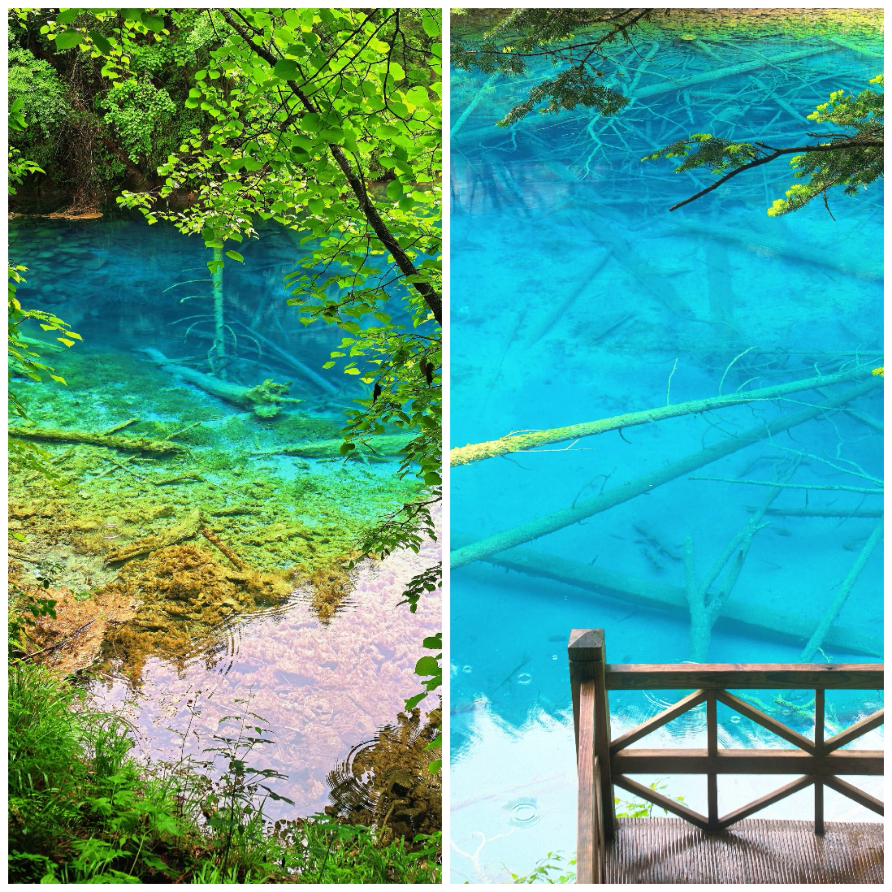

## 楔子

今年 6 月份，我从华为离职了，结束了长达 3 年的高压生活。距离入职新公司还有一周时间，我决定利用这段时间回老家四川陪陪家人，顺便出去玩一趟。

作为一名土生土长的四川人，我竟然一直还没去过大名鼎鼎的九寨沟，于是便选定了这里作为此行的目标。虽然网上有人说在历经地震之后，九寨沟的水少了很多，不如以前那么好看了，但还是祈祷此行的美景能够不负我的期待吧！

## Day 1｜启程

离职之前，我在东莞生活了快一年。在这个交通不便的地方，我搭过不少朋友的便车（感谢🙏），深刻地体会到了会开车的重要性。于是，这次回家的一个重要支线任务便是练车！

今天是启程的第一天，我一路猛开了五六百公里高速，开得我腰酸背痛，属于是高强度练车的一天了。

傍晚时分，我们终于从家里赶到了九寨沟景区门口，并决定在这里暂住一晚。这里的海拔有两三千米，穿着短袖短裤的我刚下车便打了个寒颤，幸好我多带了一套秋季的衣服！

## Day 2｜九寨沟

今天，我们一早便进入了景区，虽然不是什么节假日，但景区的客流量依然不少。

天空中下着小雨，游客们不得不在雨伞的碰撞中缓慢前行，雨滴滴落碧蓝的水面，溅起圈圈涟漪，让这如镜面般平静的湖水变得朦胧又迷离。

在游览的过程中，时常可以见到成群的小鱼在清澈的水中嬉闹，不由得让我想起幼时学过的诗句：

> “潭中鱼可百许头，皆若空游无所依。日光下澈，影布石上，佁然不动，俶尔远逝。”

整个景区总体成“Y”字形，由三条“沟”组成。在最接近顶部的位置，有一个面积非常大的“海子”（即一片水域），名叫“长海”。这里视野开阔，山间雾气缭绕，山色与水色相衬，让人心神宁静。

从山顶往下走，沿途会路过“五彩池”和其它“海子”（“犀牛海”、“老虎海”、“五花海”等）。与“长海”的大气磅礴相比，山间的景色更显绚丽与灵秀。五光十色的溪水在山间静静流淌着，粗壮的树木沉落水中，散布在池底，为这片池水平添了几分岁月的厚重感。

山腰处，白玉般的瀑布倾泻而下，与先前的平静形成了鲜明的反差。一动一静，张弛有度，人生亦当如是！

## Day 3｜黄龙

在九寨沟景区里游览了整整一天之后，我们将目标转移到了与之相邻不远的黄龙。这里同样以水闻名，而且竟然也有一个“五彩池”！

我们直接乘坐缆车🚠到了山顶，并准备看完山顶的“五彩池”后沿步行道一路下山。

离缆车终点不远处，有一个视野非常开阔的观景点。从这里望出去，连绵的群山映入眼帘，苍翠欲滴的原始森林覆盖在山间，终年不化的积雪残留山顶，一汪汪蔚蓝的、重叠着的池水散落山间，是和九寨沟不一样的美景！

沿途有木头铺就的山道，我们一路而下，一边享受和家人在一起的时光，一边欣赏沿途的山色。

途中，偶尔会遇到几只可爱的松鼠🐿。它们似乎也不怕游客，一边吃着我们投喂的面包粒，一边偷偷地打量着我们。

终于，我们来到了此行的重头戏——“五彩池”旁。一个个大小不一、或蓝或绿的池水散落山间，残破的庙宇屹立池旁，如梦似幻、有如仙境，真不愧为“人间瑶池”！

## Day 4｜返程

在历经两天的游历之后，我们心满意足，并计划于今日开始返程。

不得不说，今天的运气真不行，沿途一路都是蜿蜒的山路，载满货物的大货车来来往往，开得我心惊胆战。

更危险的是，在途经一个隧道时，隧道里停电了，一进去一片漆黑，开灯也不好使，只能凭着感觉向前开，真是给我惊出了一身冷汗！所幸的是，我们最终还是有惊无险地抵达了成都。

明天就要回深圳开启新的打工生活了，偶尔让自己take a break from daily routine也蛮不错，调整好心情继续出发吧！

## 后记

……

> “松声竹声钟磬声，声声自在。”\
> “山色水色烟霞色，色色皆空。”
