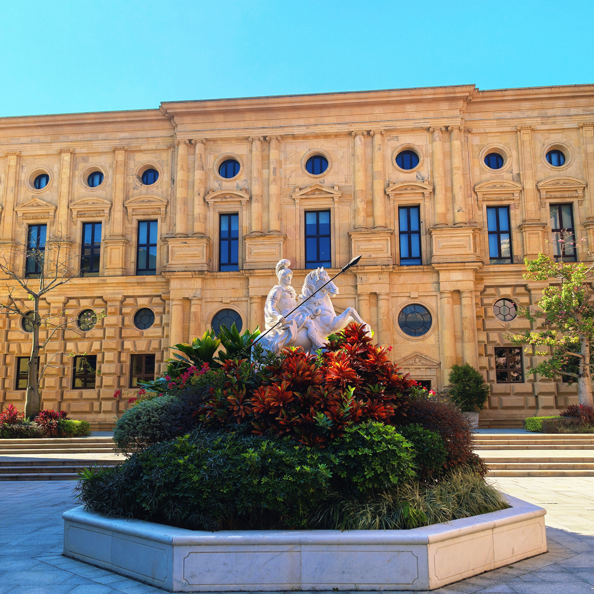

## 楔子

2025 年 8 月，由于工作调动的原因，我被迫从西安来到了东莞。

在最初的一段时间里，我心中总是混杂着面对陌生环境时的焦虑和不安，以及一丝丝兴奋。随着时间逐渐流逝，动荡的心境也慢慢平静下来，我终于可以沉下心来继续专注于我的工作，也终于留意到了华为松山湖园区内许多美丽的风景。

## 夏末的雨

初来东莞时，正值夏末的雨季，淅淅沥沥的雨声时常在耳边响起，雨滴滴落湖面，溅起圈圈涟漪，建筑外墙的藤蔓在暴雨中肆意生长着。


  
  


## 林中站台

刚来这儿上班时，我住在离我的办公区较远的酒店，每天需要乘坐园区中的小火车上班。每天清晨，火车的轰鸣声从站台外远远响起，打破了林中的寂静，预示着新的一天的开始。


  
  
  


## 欧式城堡

园区内，披着红墙的城堡屹立在湖边，跃动着金光的湖水化为溪流延伸向远处，岸边的密林在微风中轻轻摇曳，偶有几颗树干从溪水中挺拔而出，午后的阳光透过树叶的间隙，在绿茵处洒下一地的斑驳。


  
  
  
  


继续往里深入，灰白色的尖塔直插云天，蓝色的塔尖与蔚蓝的天空仿佛融为了一体，古堡的外墙爬满了红枫与藤蔓，为这片建筑平添了几分生机。


  
  
  
  
  


除了各式各样的建筑之外，园区内的绿化和植被也相当不错。

五彩滨纷的花坛被摆放在广场的中央，衬托着白玉般的雕像，楼边随处可见葱郁的绿植，为枯燥的打工生活增加了一丝绿意。

午饭后，我总会和同事们在园区内散步消食，沐浴冬日的暖阳，感受微风拂过脸庞，是打工生活中为数不多能完全放松下来的时刻。


  
  
  
  


## 黄昏之时

临近傍晚，泛着粉红色光晕的云朵点缀在天边，让这片空间多了几分梦幻的色彩。随着夜色加深，绚烂的粉红充斥了整片天空，映照在屋边的矮墙上，使其仿佛和天空融为了一体。


  
  
  


夜幕降临，从窗户透出的灯光倒映在湖面上，就好像有一个镜中世界藏于这湖水之下。

路边的街灯也纷纷亮起，昏黄的灯光映照着周围的藤蔓，也照亮了人们前行的路。

钟楼亮起，明月高悬，深蓝的夜空也被照亮。


  
  
  
  
  


## 后记

截至今天，我也已经在东莞生活了几个月了。从长安到岭南，我虽不用考虑怎么去运送荔枝，但这也迫使我不得不开始去思考自己今后的人生规划。

目前来说，我对于广东的环境还算适应——这里没有西北地区的干燥与风沙，气候温润，经济发达，工作机会众多……

我并不知道自己是否会在这一片土地上成家立业，我唯一知道的，就是要过好当下的生活、做好眼前的事。未来的事情，就交给命运来决定吧！
