## 楔子

转眼间，从“华子”离职进入“按摩店”也已经 3 个月了，在经历了初期的各种不适应之后，也算是顺利通过了实习期并得到了 leader 的认可。趁着中秋假期，决定和家人一起去广西桂林短暂地放松一下。

我们于周五晚上提前抵达了桂林阳朔县。酒店位于西街，是当地非常有名的小吃街，晚上街灯亮起，街道上人来人往，还有不少老外，很是热闹～

## Day 1｜阳朔

第二天一早，我们就出发前往了著名的“20 元人民币背景”打卡地，然后乘坐竹筏沿着漓江一路向北，开启了我们的观光之旅。


  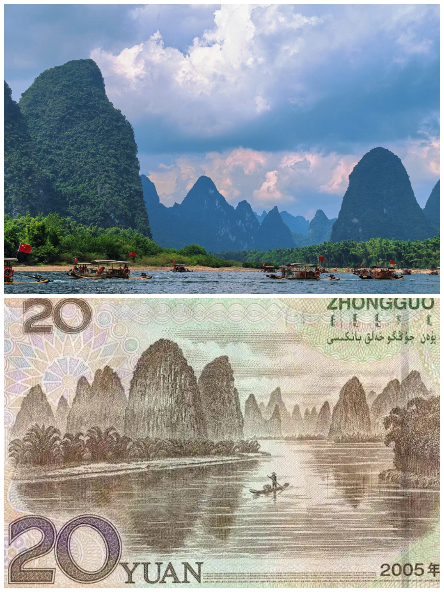


这里有很多低矮、陡峭的山峰，形状千奇百怪，就像一头头猛兽从水中破浪而出，当地人也因此为它们取了不少有趣的名字，比如：“乌龟岩”、“蜗牛峰”、“九马画山”等等。这里的江水呈碧绿色，水浅而平缓，偶尔能见到一些渔民直接站立在水中打渔。在另一旁，是他们圈养的鸬鹚，既用于给游客观赏，也是当地人捕鱼的好伙伴。


  
  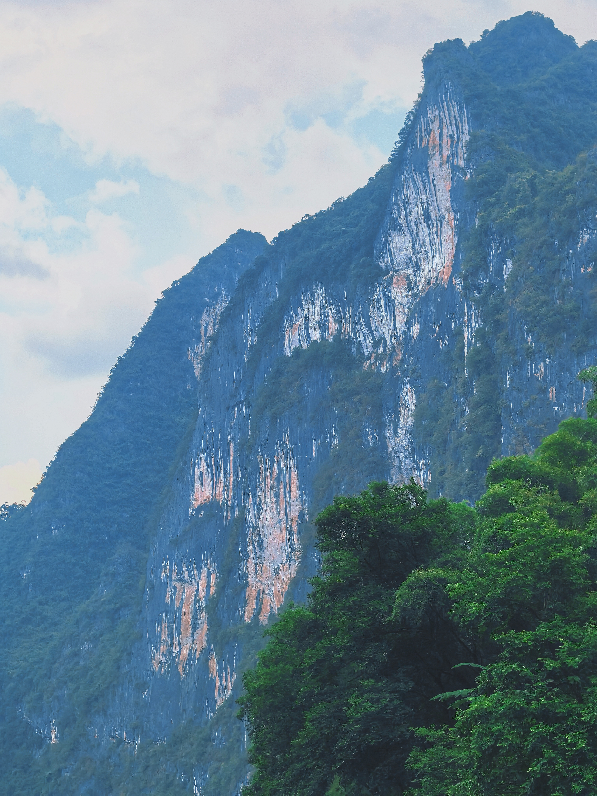
  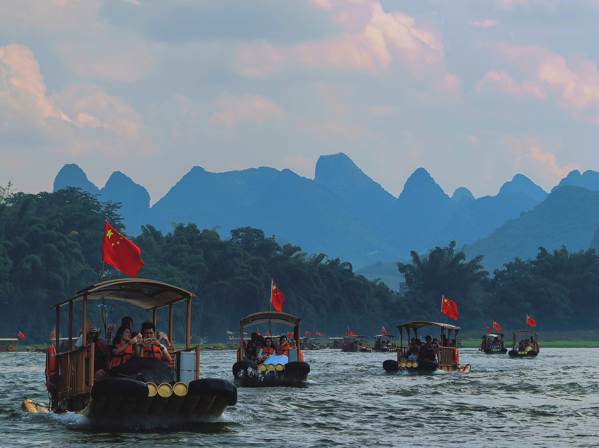


中午，我们品尝了当地的特色美食——竹筒饭，味道还不错！


  


晚上，我们去欣赏了当地著名的大型山水实景演出——《印象刘三姐》。它不是传统意义上的“剧院演戏”，而是把漓江、喀斯特山峰、夜色直接当成舞台，让当地演员和渔民参与表演，核心灵感则来自广西著名的民间传说人物刘三姐。在漆黑的天幕下，绚烂的灯光洒落江水、印照山崖，也震感了人心。

不过，有一说一，画面虽美，但我们却看不懂剧情在演什么，也听不懂演员的台词（几乎全程用的当地的“土语”），所以其实到后半场就已经有点审美疲劳了……


  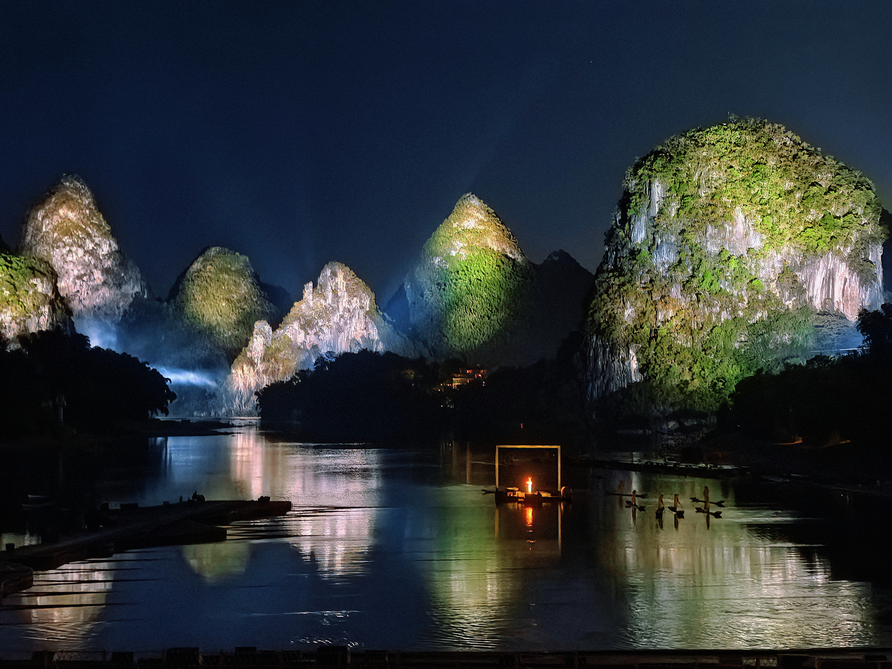
  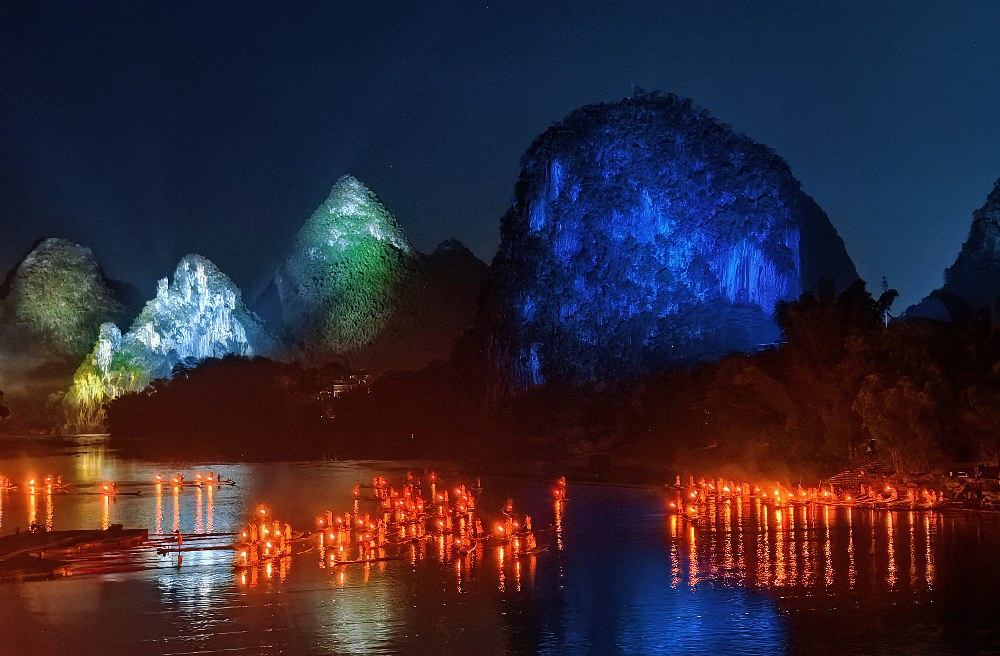
  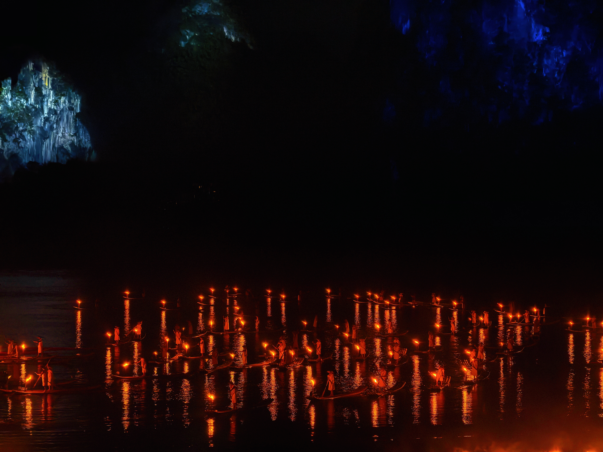
  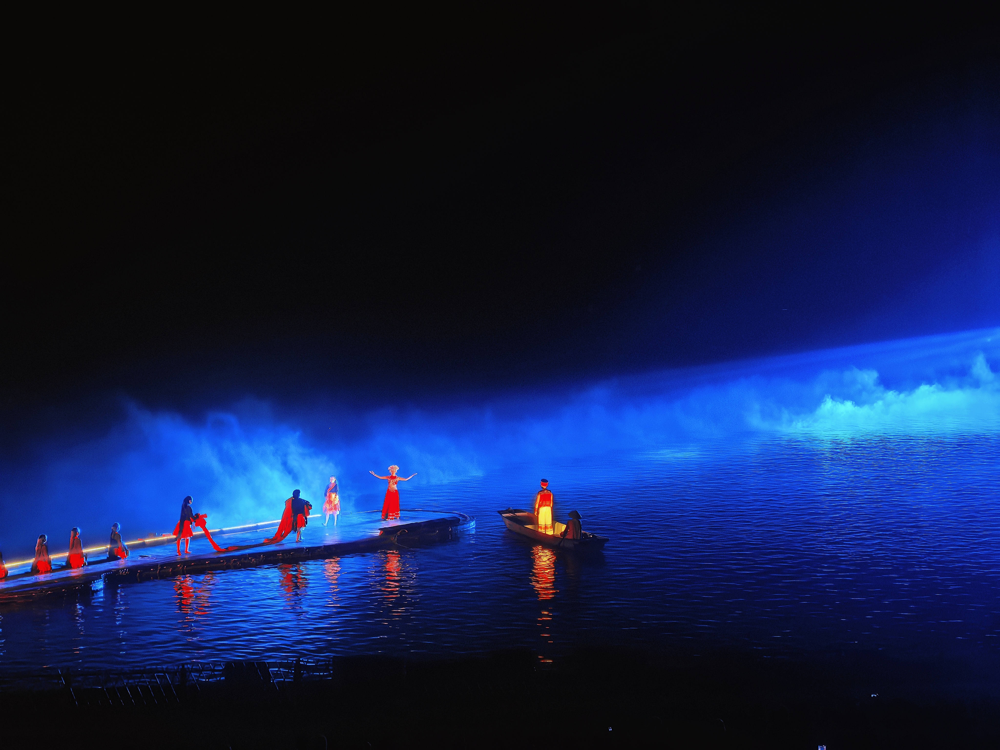
  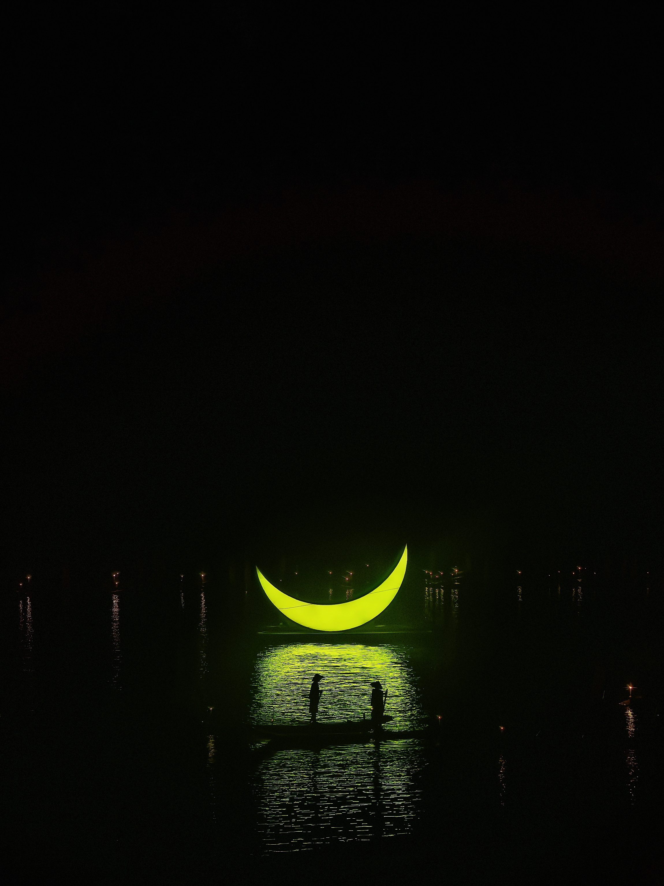
  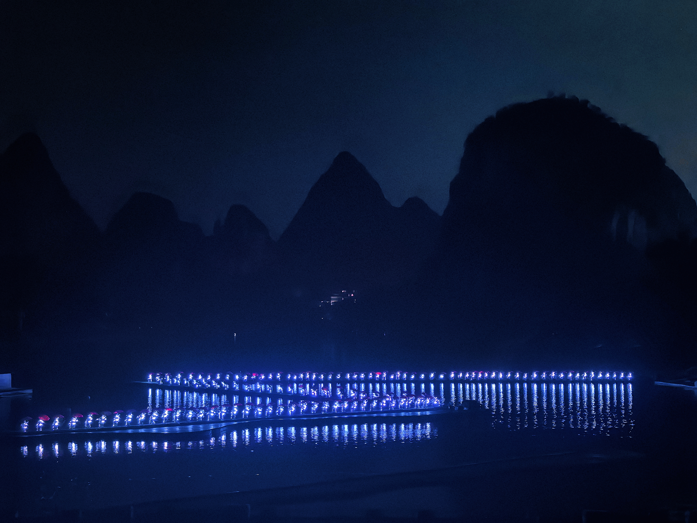
  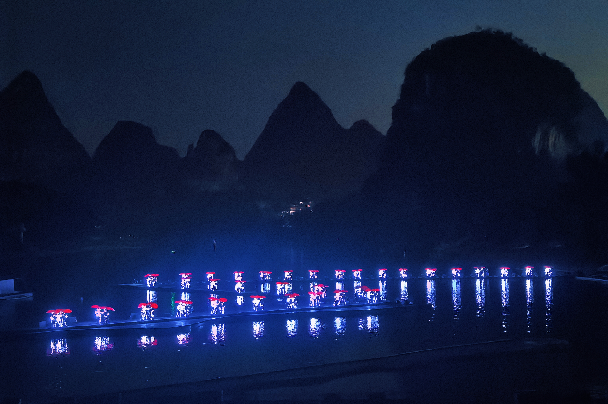


今晚的月亮很亮、很圆，我已记不清这是第几个漂泊在外的中秋，但不同的是这次有家人在身旁。人虽身处异乡，但有家人在的地方就是家～


  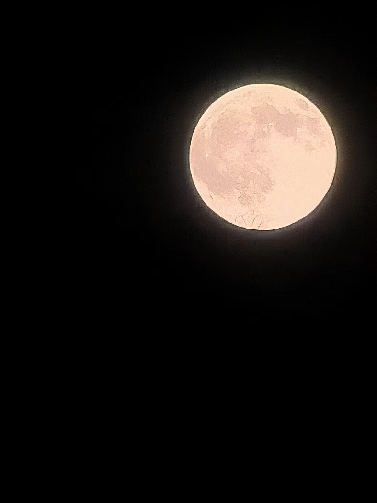

