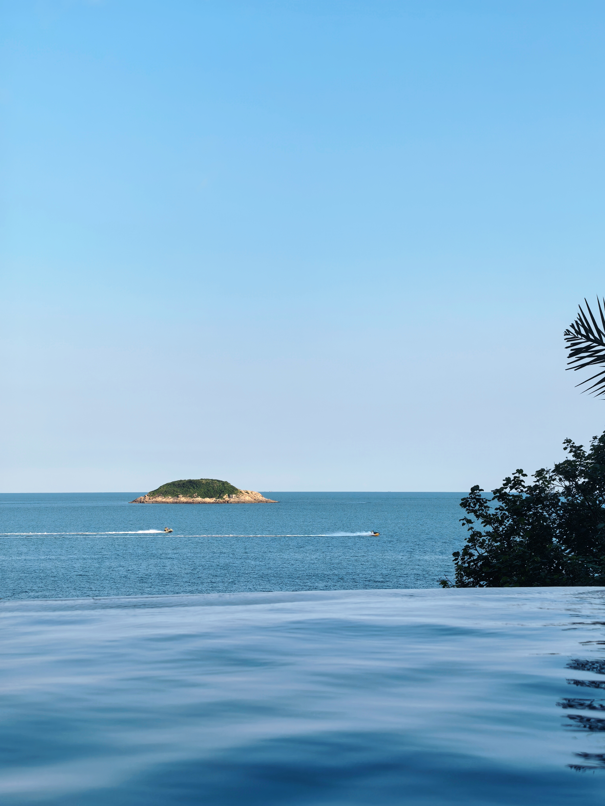
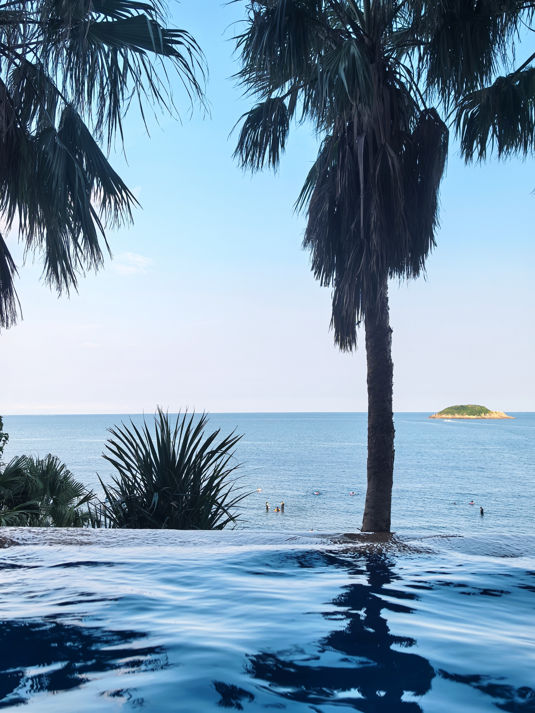
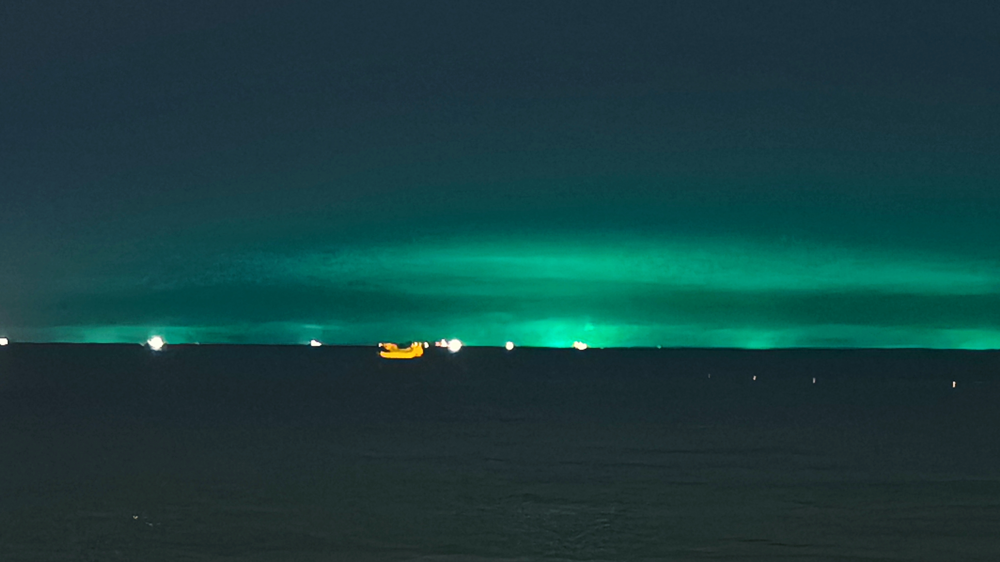
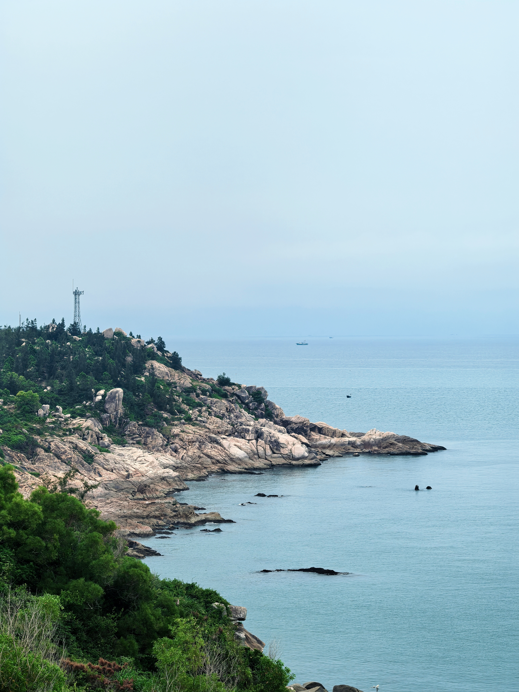
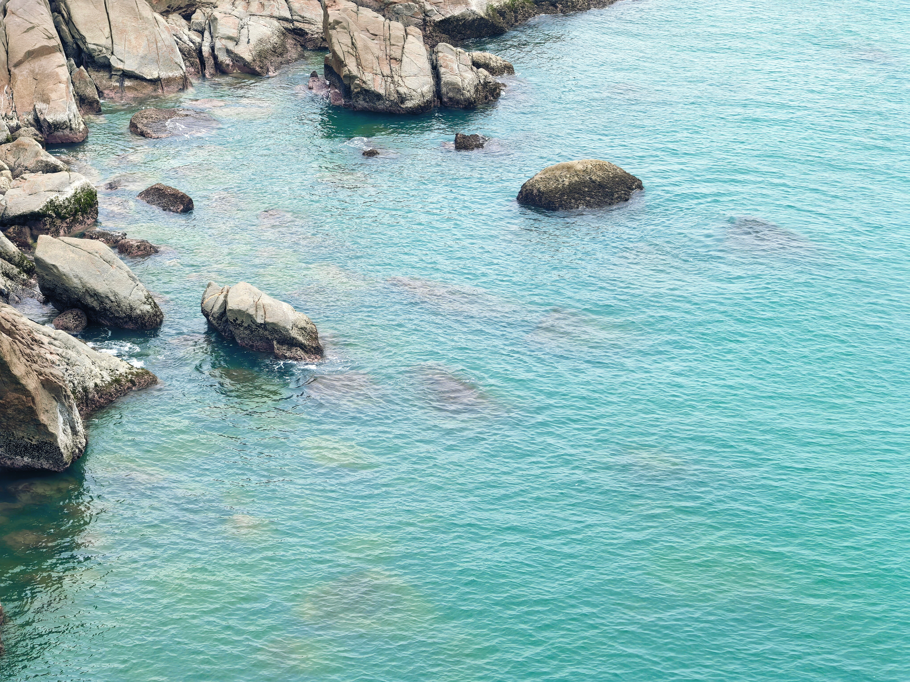
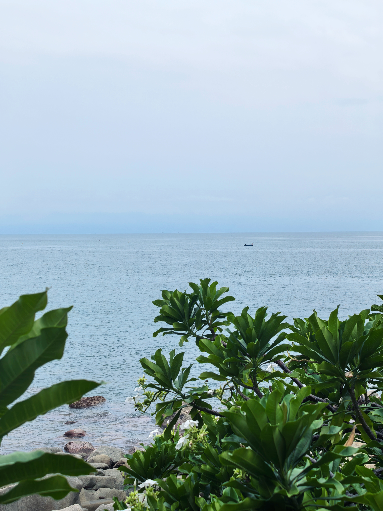
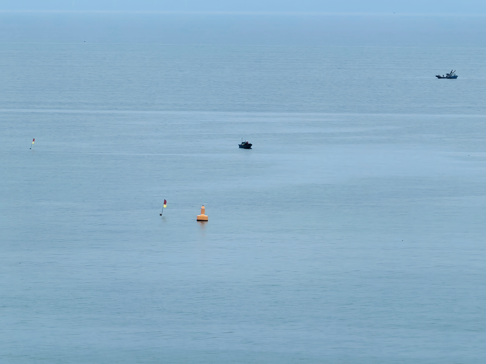
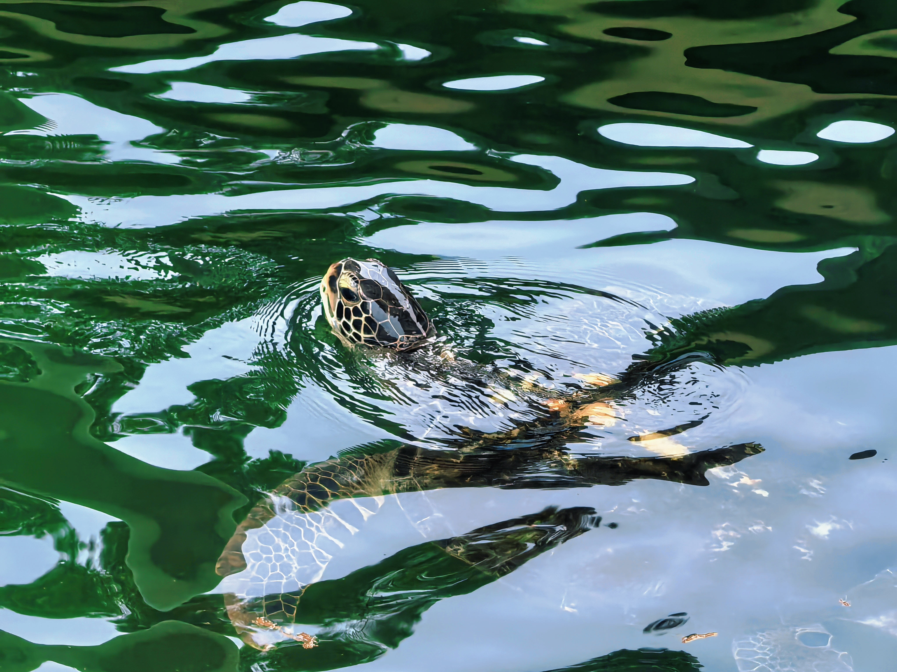
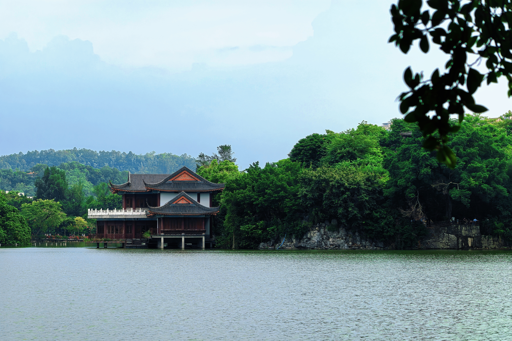

## 楔子

于中秋佳节和家人在桂林短暂地团聚之后，我的父母也随我一起来到了我现在工作的城市——深圳。

从四川的一名小镇做题家，到去北京上学，再到去西安、东莞、深圳工作，这已是我长时间呆过的第五个城市。在外漂泊的感觉是自由的，也是孤独的。

趁着国庆期间，正好邀请父母来我的新居做客，他们对这里很是满意。顺便，我们也决定去深圳周边——惠州游玩一番。

## Day 1｜双月湾

10 月 1 日，这天我们一早就出发了，可惜还是没能躲过堵车的命运。下午，我们抵达了双月湾，并入住了海边的酒店。

窗边就是一望无际的大海，咸咸的海风吹拂着海浪，带来潮湿的空气，让人感觉闷热又舒爽。这时沙滩上的人还不多，偶尔能见到两三人在水中嬉闹。

我们放好行李稍作休息之后，就直奔酒店的“无边泳池”去了。所谓的“无边”，其实就是看起来好像和大海连在一起一样，实则还是和海隔开的。从泳池中可以直接眺望到远处的海岛，风景还算不错。


  
  


晚饭吃过海鲜🦞之后，我们一路散步至海边踩水。

不知是远处城市的灯光还是什么，将天边渲染为了一条碧绿的光带，好似北欧的极光，美轮美奂。


  


夜晚的海滩变得热闹了起来，许多人在海边席地而坐，就着灯火，诉说着生活的快乐与苦闷。

## Day 2｜海龟湾 & 惠州西湖

第二天，我们去了中国大陆海岸线上唯一的国家级海龟自然保护区/海龟产卵场——海龟湾，大约在每年的 6～10 月，绿海龟会洄游到这里交配、产卵，可惜我们没能亲眼目睹这盛况。

沿着山道一路而下，有一条海边栈道，旁边就是嶙峋的礁石，汹涌的海浪在石壁上不断的拍打，留下一道道时间的痕迹。


  
  
  
  


快离开时，我们去看了馆内人工养殖的海龟——原来海龟游泳也是需要换气的！


  


下午，我们开车回到了惠州市区，去参观了当地有名的惠州西湖。

1094 年，北宋绍圣元年，苏轼因党争被贬到惠州，在这里生活了两年七个月左右。这段经历非常有意思——按照今天的想象，一个六十岁左右、仕途遭受重大挫折的人，被贬到岭南，本来应该是人生低谷。但苏轼到了惠州以后，却慢慢把这段经历变为了一段历史佳话：“日啖荔枝三百颗，不辞长作岭南人”——这就是苏轼在惠州写下的《惠州一绝》。


  


## 后记

截止今天，因为工作的缘故，我也已经在广东生活了 400+ 天。虽不是被贬的，但也算是当了回“岭南人”。

在这边的日子中，我也时常因为工作的压力、生活的挫折而喘不过气来。面对人生的波折，苏轼尚能有如此乐观豁达的心态，这也启发了我要看淡当下的一切得失——人生不过短短几十年，无论面对何种困境，也要过好自己的生活，不要让苦难吞噬了自己拥抱幸福的权力～
