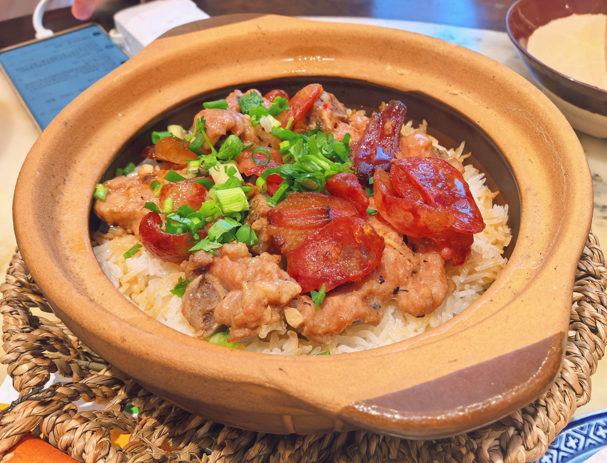
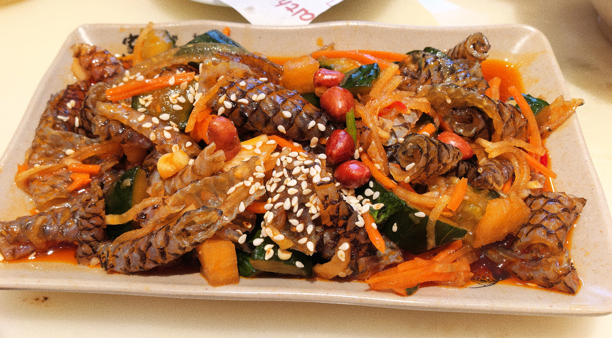
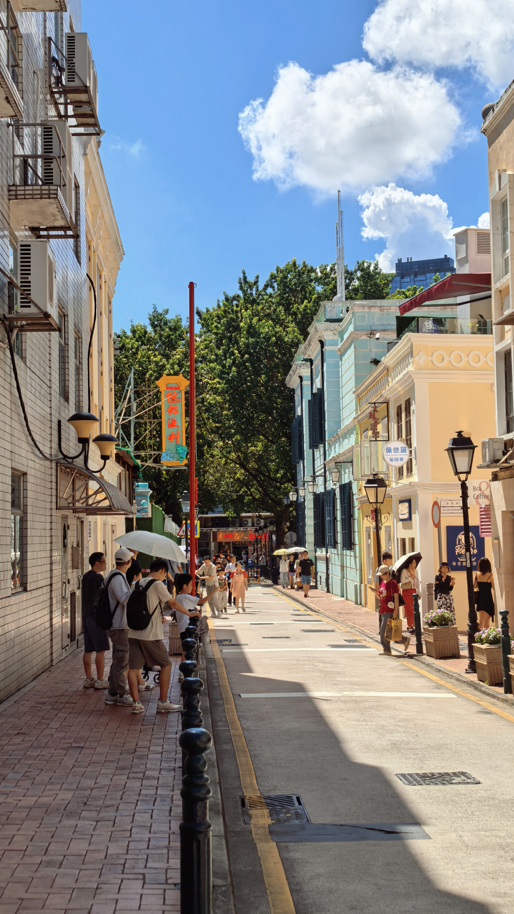
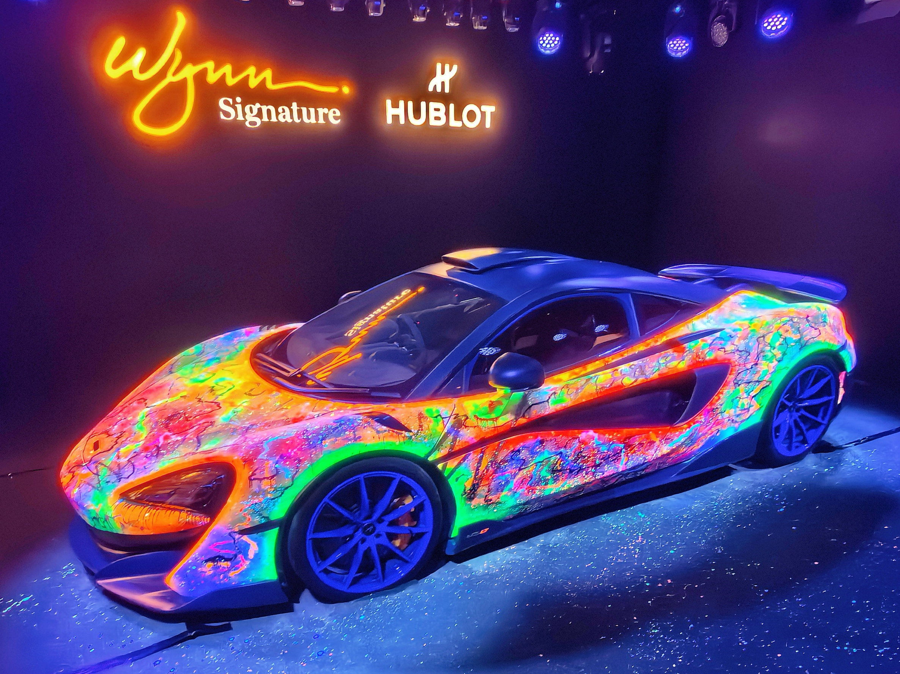
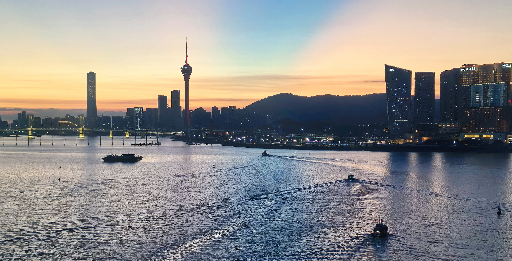

又到了一年一度的国庆假期，今年我由于工作调动的缘故，来到了东莞松山湖这边上班，因此，我决定趁此机会，在广东周边逛一逛，好好感受下东南沿海地区的乡土人情。

由于本人实在不擅长做旅行攻略，因此我找到了另外两位同事，并在他们的带领下开启了“无脑出游”模式。这里再次感谢这两位同事！\_(¦3」∠)\_

## Day 1｜顺德

旅行的第一站是顺德，这里隶属于广东省佛山市，以“美食之都”闻名。

早上，我们六点就起了床，简单收拾了下随身的行李，打了个顺风车就直奔目的地，然后便开始了“特种兵”的一天。

我们逛了顺德的一些寺庙和园林。这里的建筑风格很有特点，不同于北京的红墙黛瓦，这里的墙面由浅灰色的石砖堆砌而成，深青色的墙顶上刻有各式各样的壁画，从古代神话故事里的“八仙过海”，到《三国演义》里的“桃园三结义”，无不诉说着此地悠久的历史。

这里有一座府邸名叫“清晖园”，据说是以前生活在这里的大户人家的居住之所。园内，假山水榭、花木鱼虫以及亭台屋舍，应有尽有。不得不感慨，以前这些富贵人家的小日子过得可真雅致啊。


  
  
  


Anyway，我对这些古建筑其实并不太感兴趣，真正让我激动和印象深刻的，其实还是这里的美食——鱼皮、鱼蛋、煲仔饭、双皮奶、红豆沙、……


  
  


## Day 2｜澳门

第二天，通过珠海的横琴口岸，我们终于来到了此行的下一个目的地——澳门，一座文化多元、纸醉金迷的城市。

这里有许多被叫做“娱乐场”的地方，其实就是商场加赌场。这些娱乐场的装潢都特别的奢华，金光闪闪的饰物随处可见。此次来澳门，我虽没有亲身下场去体验下赌博的滋味，但是却收获了这辈子最奢华的拉屎体验（捂脸）。此外，令我印象最深刻的，莫过于威尼斯人的娱乐场中，在室内修建的威尼斯小镇。人造的天空高挂商场的穹顶，昏黄的灯光照耀着来往路人的脸庞，船桨轻轻划过水面的声音在人群的喧闹声中若隐若现。


  
  
  
  
  
  
  
  
  
  <!--  -->
  <!--  -->
  
  
  
  
  <!--  -->


中午，我们在类似于美食街的小巷子里，吃了一顿昂贵的午饭（价格基本上是大陆地区的三倍）。街边葡式风格的小楼上，绿植爬满了二层阳台外的围栏，暖色调的墙面给人一种温馨的感觉。要是能在二楼的阳台上，躺在摇椅里晒晒太阳、喝喝茶，那应该会非常惬意。


  
  <!--  -->


下午，我们参观了一场豪车展览，参与展览的每一辆车都价格不菲。其中，一款有着炫彩图纹的跑车着实惊艳到了我，不得不说这是真的炫酷啊！晚上，我们还参观了著名的“黄金树”，据说这树是用纯金打造的，价值上亿，着实是又狠狠地感受了一把资本的气息。


  
  
  
  
  
  
  
  <!--  -->


最后，分享几张澳门的夜景吧！


  
  
  
  
  
  


此情此景，不由得又让我想起了几句熟悉的歌词：

> “满载的渔舟回港了” \
> “余晖下风帆金色” \
> “满世界霓虹灯亮了” \
> “小小饭桌前已万家灯火”
