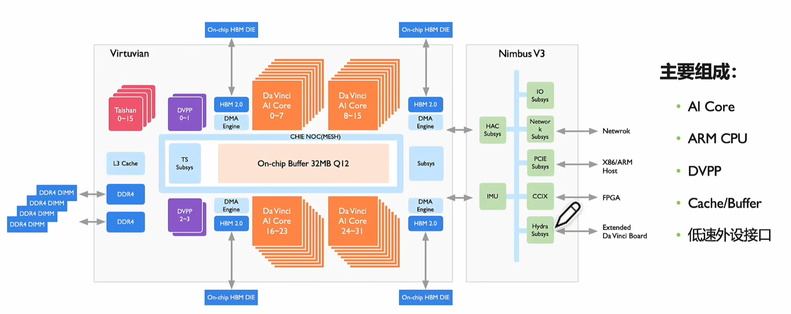
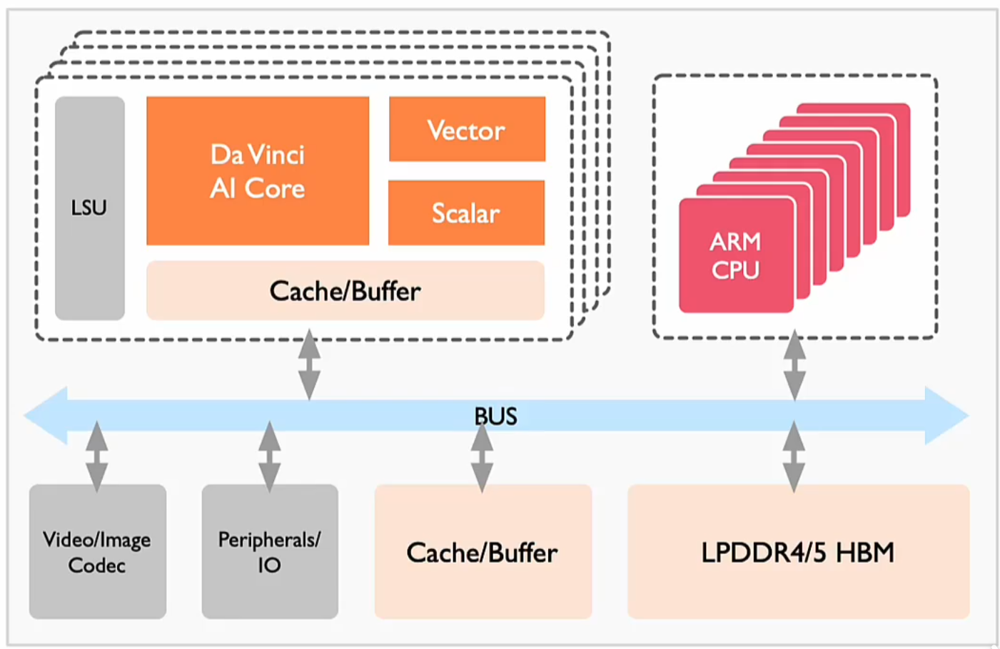
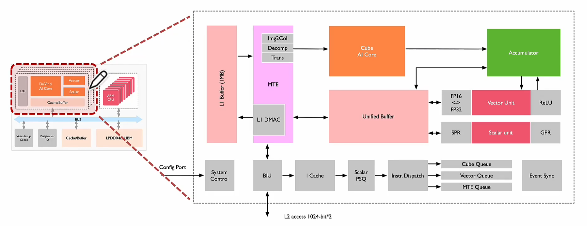
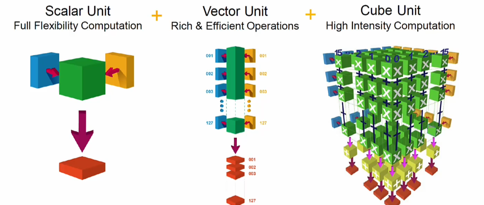
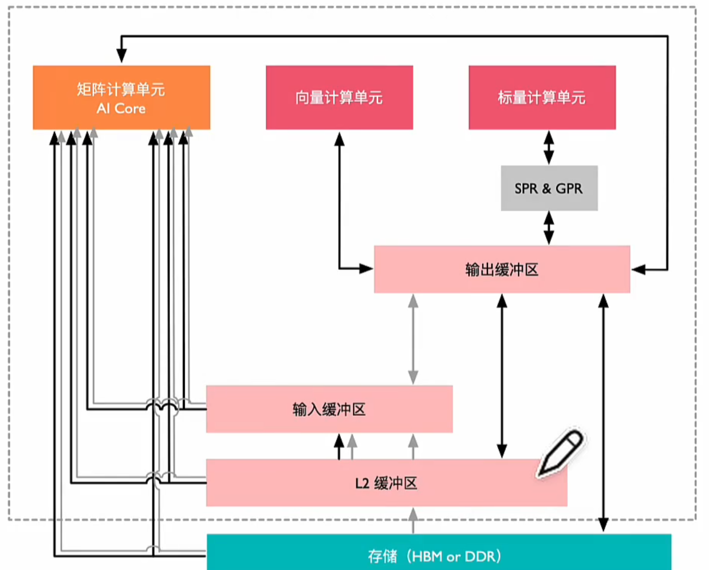
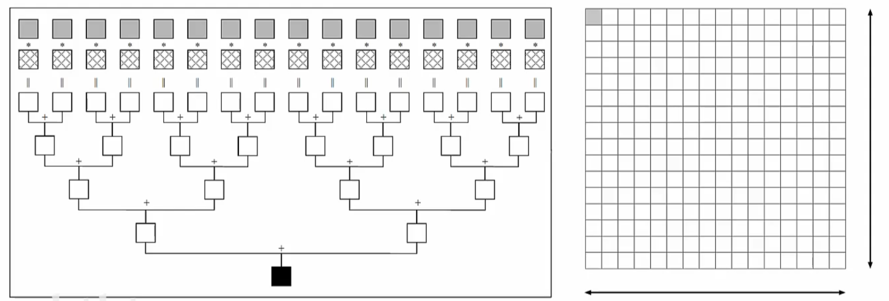
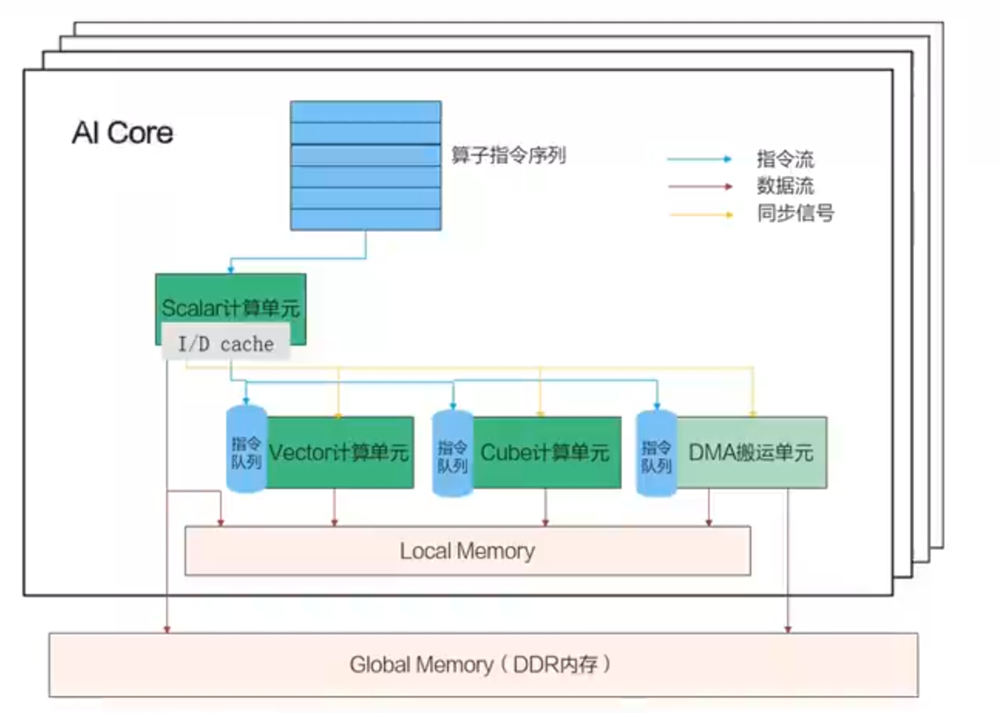
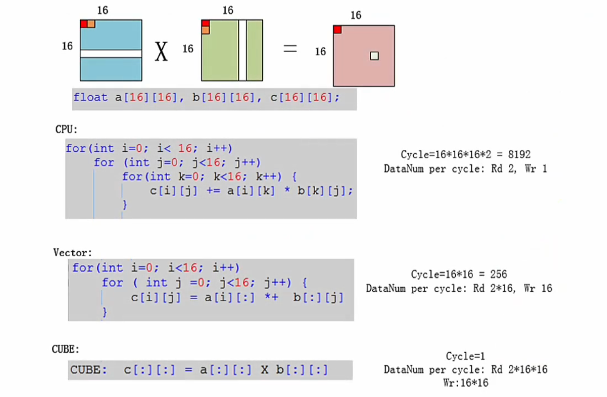
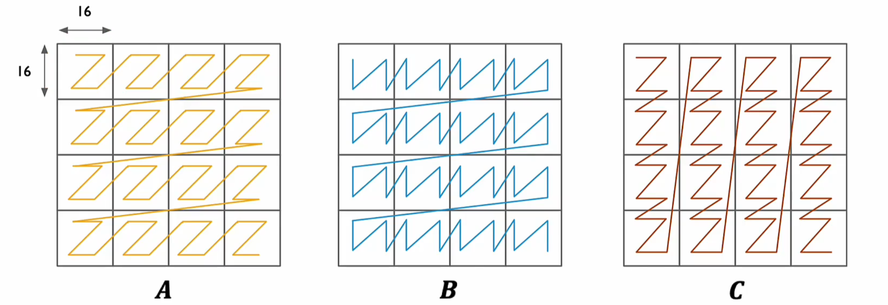
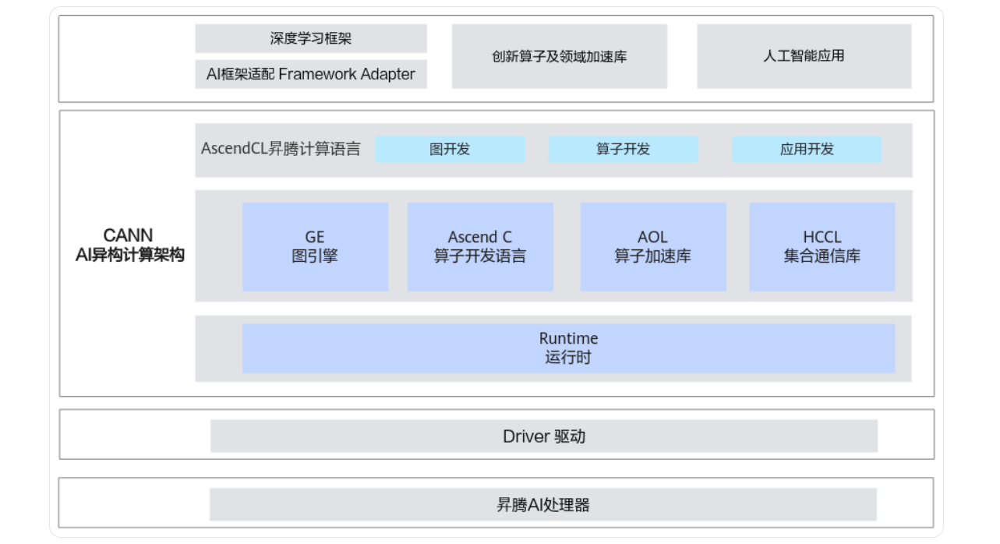

## 一、概述

昇腾 NPU 是专门用于 AI 训练/推理计算的 AI 专用处理器，其中的 AI Core 能够在很大程度上提高 AI 计算的效率。

本文将主要介绍 ASCEND NPU 的硬件架构 & 工作原理、AI Core 的计算模式以及异构计算平台 CANN 等内容。

## 二、NPU 硬件架构

### 2.1 NPU SOC 架构

#### 2.1.1 Ascend 310 架构

- AI Core：计算核心，负责执行矩阵、向量、标量计算密集的算子任务，采用达芬奇架构；
- AI CPU：承担非矩阵类复杂计算，即负责执行不适合跑在 AI Core 上的算子；
- TS Core：作为任务调度器（Task Scheduler，TS），以实现计算任务在 AI Core 上的高效分配和调度（专门服务于 AI Core 和 AI CPU，不承担任何其它的工作）；
- ARM CPU：控制芯片整体运行；
- DVPP：数字视觉预处理子系统，完成图像视频编解码；
- Cache & Buffer。

#### 2.1.2 Ascend 910 架构

- AI Core：32 个，上下各 16 个，中间放 buffer，方便更快地取数据；
- Taishan Core：一部分为 AI CPU，承担部分 AI 计算，一部分为 Ctrl CPU，负责 SoC 控制功能，两类 CPU 占用的核数由软件进行分配；
- TS CPU：负责任务调度，把算子任务切分之后，通过硬件调度器（HWTS）分发给 AI Core 或 AI CPU 执行计算；
- Nimbus：提供 PCIe 接口和 Host CPU 对接；提供 NIC 用于跨服务器传递数据；集成一个 ARM CPU 核，执行启动、功耗控制等硬件管理任务；
- Cache & Buffer。

### 2.2 NPU 达芬奇架构

NPU 的达芬奇架构中共包含 3 种类型的单元：

- 计算单元：包含矩阵计算单元（DaVinci Core）、向量计算单元（Vector）、标量计算单元（Scalar）；
- 存储系统：AI Core 片上存储单元和相应数据通路构成存储系统；
- 控制单元：计算过程提供指令控制，负责 AI Core 的运行。

#### 2.2.1 计算单元

- Cube Core：每次执行可以完成 fp16 的矩阵乘，如 C = A(16*16) * B(16*16)，更大的矩阵运算需要先对矩阵进行分块（在 L1 Buffer 中进行缓存）；
- Vector Unit：算力低于 Cube，灵活度高（如数学中的求倒数、平方根等），Vector 所有计算的源数据和目标数据都会存储在 Unified Buffer 中（Unified Buffer 再与 L1 Buffer 进行交互），并按 32 Byte 对齐；
- Scalar Unit：负责各类型标量数据运算和程序流程控制，算力最低，功能上类比小核 CPU，完成整个程序循环控制、分支判断、Cube/Vector 等指令地址和参数计算以及基本算术运算等；
- Accumulator（累加器）：把当前矩阵乘的结果与上一次计算的结果相加，可以用于完成卷积中增加 bias 等操作。

> 注意：AI Core 就是指 Cube Core，即矩阵计算单元。

#### 2.2.2 存储单元

- 存储控制单元（MTE）：作为 AI Core 内部数据通路传输控制器，负责 AI Core 内部数据在不同缓冲区间的读写管理，以及完成一系列的格式转换操作；
- 缓冲区：
  - 输入缓冲区（L1 Buffer）：AI Core 采用了大容量片上缓冲区设计，通过增大片上缓存的数据量来减少数据从片外搬运到 AI Core 中的频次，从而降低数据搬运过程中所产生的功耗和时延，有效控制整体计算耗能和提升性能；
  - 输出缓冲区（Unified Buffer）：用来存放神经网络中每层计算的中间结果，从而在进入下一层时方便获取数据。
- 寄存器（SPR/GPR）：寄存器资源主要是标量计算单元在使用。

> 上图中，HBM/DDR 和 L2 缓冲器都属于 AI Core 核外的数据存储系统。

数据通路是数据在 AI Core 中的流通路径，它有以下特点：

- 多进单出，可通过并行输入来提高数据流入的效率；
- 将多种输入数据处理完成后只生成输出特征矩阵，数据种类相对单一，单输出数据通路，可以节约芯片硬件资源。

#### 2.2.3 控制单元

- 系统控制模块：控制“任务块”（AI Core 中最小的任务计算粒度）的执行进程，在任务块执行完成后，系统控制模块会进行中断处理和状态申报。
- 指令缓存；
- 标量指令处理队列；
- 指令发射模块：根据指令类型分别发送指令到对应的执行队列中；
- 事件同步模块。

### 2.3 AI Core 电路结构

对于运算 C = A(`16*16`) * B(`16*16`)，矩阵 C 中的每一个元素都需要进行 16 次乘法与 15 次加法计算得到（一个矩阵计算子电路）。

在 AI Core 中，共有 256 个矩阵计算子电路，每一条指令都可以并行完成 256 个矩阵 C 中的元素的计算。

## 三、NPU 工作原理

### 3.1 NPU 并行计算架构

- 异步指令流：Scalar 计算单元读取指令序列，并把向量计算、矩阵计算、数据搬运指令发送给对应的指令队列，Vector 计算单元、Cube 计算单元、DMA 搬运单元异步地并行执行接收到的指令（“异步并行”：将串行的指令流分解）；
- 同步信号流：指令间可能会存在依赖关系，为了保证不同指令队列间的指令按照正确的逻辑关系执行，Scalar 计算单元也会给对应单元下发同步指令；
- 计算数据流：DMA 搬入单元把数据搬运到 Local Memory，Vector/Cube 计算单元完成数据计算，并把计算结果回写到 Local Memory，DMA 搬出单元把处理好的数据搬运回 Global Memory。

### 3.2 AI Core 计算模式

Cube 单元能够高效地执行 MAC（矩阵乘加）操作，目前支持的矩阵大小为 `16*16*16`。

> 注意：通常矩阵乘中两矩阵很大，因此数据是分块（Tiling）后送入 Cube 单元的，每送完一块，结果存放到累加器，最后得到结果。

在 CPU 的计算过程中，矩阵 A 按行扫描，矩阵 B 按列扫描。典型的存储方式是 A 和 B 都按照行方式进行存储（Row-Major），而内存读取按行读更方便，因此对 A 矩阵高效，对 B 矩阵低效。

为了提高内存读取的效率，NPU 将矩阵 B 的存储方式转成按列存储（Column-Major），通过改变矩阵存储的方式来提升矩阵计算的效率。

Cube Core 一条指令完成两个 16*16 矩阵的 MAC，相当于一个时钟周期进行 163 = 4096 个 MAC 运算。执行前将 A 按行、将 B 按列存放在 Input Buffer，并通过 Cube Core 计算得到 C，按行存放在 Output Buffer。

> 注意：矩阵 A 不需要转换，可以直接从 L1 Buffer 读取到 AI Core 里面；矩阵 B 需要预先读到 MTE 中进行转换），然后再读取到 AI Core 里进行计算。

矩阵的预处理：

- 分块（Tiling）：因为片上缓存容量有限，因此将整个矩阵 B 划分为多个子矩阵，并依次搬运到缓存中，最后得到结果矩阵 C；
- 填充（Padding）：A 和 B 都等分成同样大小的块（`16*16`），排不满的地方可以通过补 0 实现。

## 四、CANN 平台

### 4.1 整体架构

异构计算架构 CANN（Compute Architecture for Neural Networks）是华为针对 AI 场景推出的异构计算架构，向上支持多种 AI 框架，包括 MindSpore、PyTorch、TensorFlow 等，向下服务 AI 处理器与编程，发挥承上启下的关键作用，是提升昇腾 AI 处理器计算效率的关键平台。同时针对多样化应用场景，提供多层次编程接口，支持用户快速构建基于昇腾平台的AI应用和业务。

- 计算语言开发接口：
  - 应用开发接口：提供深度学习推理计算、图像预处理、单算子加速计算能力；
  - 图开发接口：提供统一网络构图接口；
  - 算子开发接口：Ascend C 是 CANN 在算子开发场景的编程语言，原生支持 C&C++ 标准规范，最大化匹配用户开发习惯。
- 计算服务层：
  - 昇腾算子库 AOL；
  - 昇腾调优引擎 AOE：用于在推理、训练等场景对模型、算子、子图等进行调优，充分利用硬件资源，提升网络性能。
- 计算编译层：
  - 图转换：各种模型编译器；
  - 图编译：图准备、图优化、图拆分、图编译；
  - Tensor Boost Engine（TBE）：算子融合、算子编译。
- 计算执行层：类似于 CUDA 的 runtime，提供 stream 管理、context 管理等功能；
- 基础服务层：资源管理、通信管理、设备管理、芯片 IP 驱动、公共服务。

> CANN 官方社区：[CANN 社区版 8.0.RC3.alpha002 开发文档](https://www.hiascend.com/document/detail/zh/CANNCommunityEdition/80RC3alpha002/quickstart/quickstart/quickstart_18_0004.html)。

### 4.2 Ascend C 算子编程

Ascend C 算子编程使用 C++ 语言和 Ascend C 类库 API 进行开发。

Ascend C 类库 API：

- 基本 API：计算 API、搬运 API、同步 API、……；
- 高阶 API：Matmul API、Conv API、Softmax API、……。

Ascend C 算子编程采用 SPMD（单程序多数据编程）模式，即一个核的算子程序被调用时，会启动 N 个实例，每个运行实例称为一个 block，它们都执行相同的代码，有相同的参数，但参与计算的数据不同。

> 注意：block 类似于线程（进程），而 block_idx 类似于 thread_id，算子程序需要使用 block_idx 来进行数据并行计算切分。

### 4.3 推理应用开发

- AMCT 模型压缩：支持量化、通道稀疏、张量分解，降低模型的数据量和计算量，提升计算性能；
  - 量化：将模型的权重和数据从浮点型转换为整型（比如：低精度 int8），从而生成更加轻量化的网络模型，减少数据和计算量；
  - 张量分解：分解卷积 Tensor，将一个大卷积转化成两个级联的小卷积，从而降低存储空间和计算量（张量分解处理后，需要重训练以保证模型精度）；
  - 稀疏：通过结构剪枝，对模型中的部分算子裁剪部分权重和参数，从而得到参数量和计算量更小的网络模型（稀疏处理后，需要重训练以保证模型精度）。
- ATC 模型转换工具：将开源框架的网络模型转换为适配昇腾 AI NPU 的 om 模型；
- AOE 智能调优工具：支持算子计算过程的自动寻优，提升整体网络的性能。
