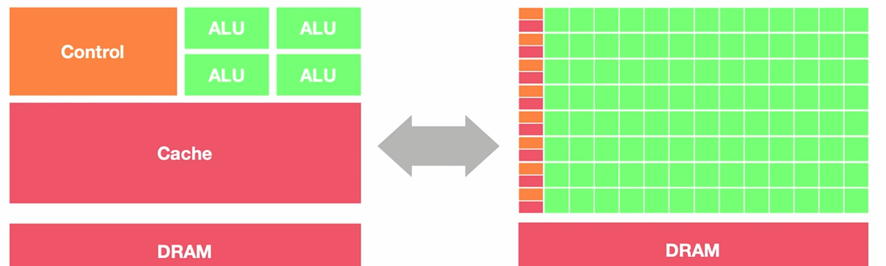
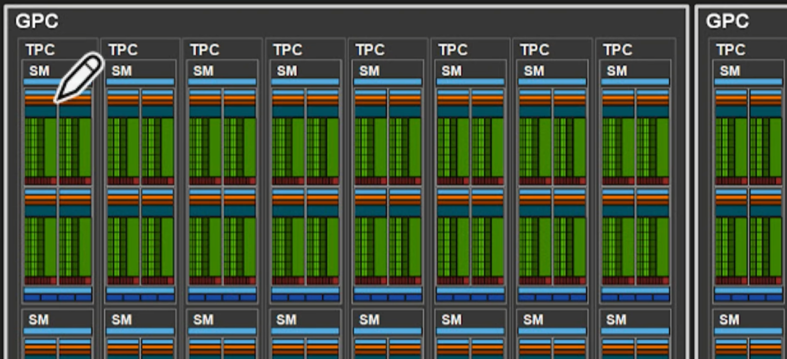
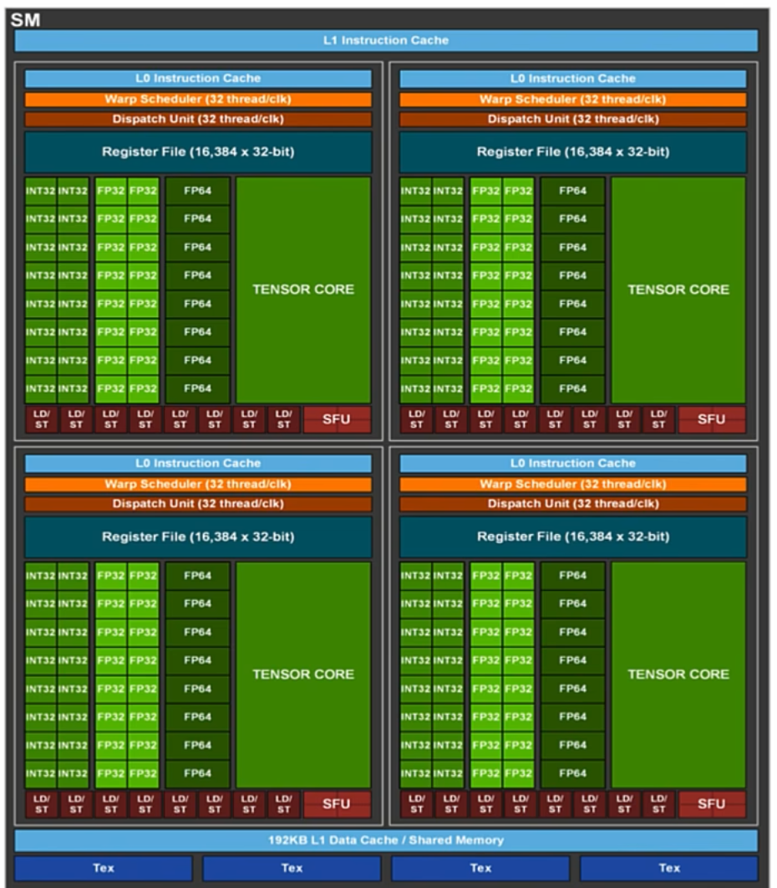
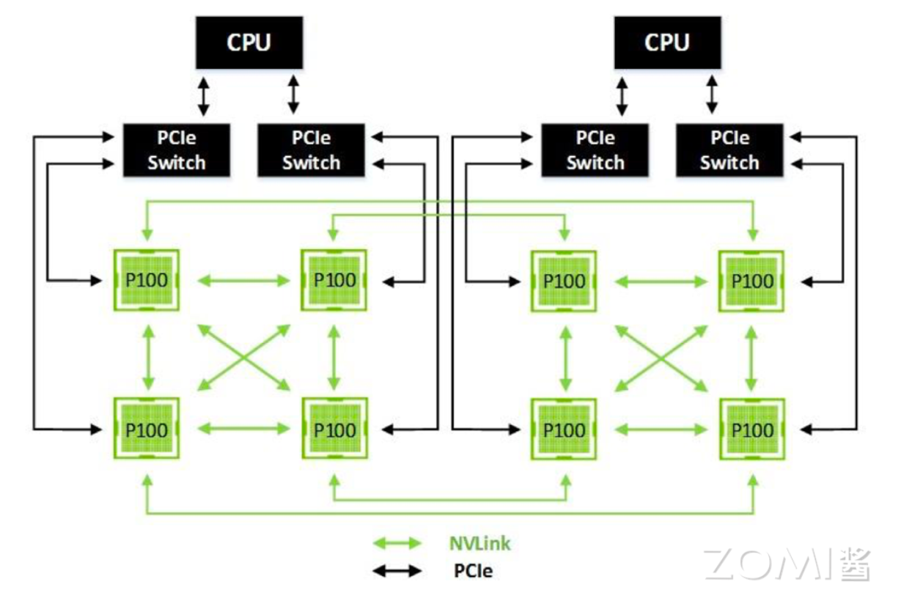
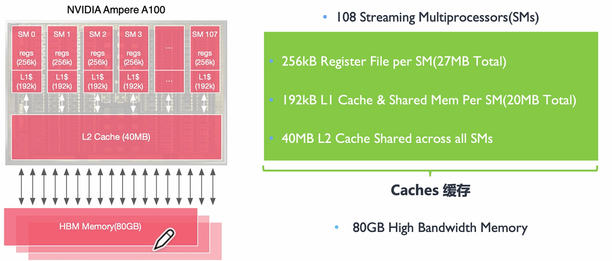
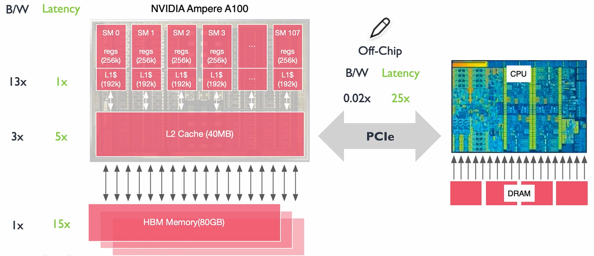
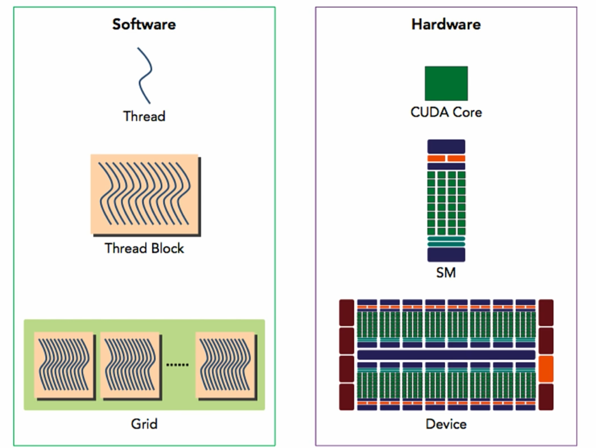
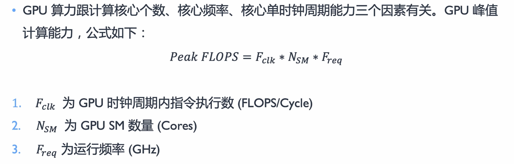

## 一、概述

随着大模型产业的发展，AI 训练 & 推理对算力的需求越来越大，AI 的计算也越来越离不开 GPU 的支持。

目前，用于 AI 计算的芯片可以分为：

- CPU（通用处理器）；
- GPU（通用图形处理器）；
- NPU / TPU（AI 专用处理器）。

那么 CPU 和 GPU 有什么区别呢？

从硬件设计上来看，GPU 的 DRAM 时延（数据搬运、指令执行的延迟）远高于 CPU，但 GPU 的线程数远高于 CPU（有非常多的线程，为大量大规模任务并行而去设计的）。

关注重点：

- CPU：降低延迟、并发（Concurrency，能够处理多个任务的功能，但不一定是同时）；
- GPU：最大化吞吐量、并行度（Parallelism，同时可以执行多少任务）。

总结：

- CPU：希望在一个线程里完成所有的工作（串行，优化线程的执行速率和效率）；
- GPU：利用多线程对循环进行展开，来提高硬件整体的利用率（并行，用足够多的线程去解决延迟的问题）。

> 参考资料：[AI System (chenzomi12.github.io)](https://chenzomi12.github.io/)。

## 二、GPU 硬件架构

### 2.1 发展历史

- Fermi 架构：提出了首个完整的 GPU 计算架构；
- Kepler 架构；
- Maxwell 架构；
- Pascal 架构：提出了 NVLink；
- Volta 架构：将 CUDA Core 进行了拆分，分离了 FPU 和 ALU；独立线程调度：每个线程都有独立的 PC（Program Counter）和 Stack；提出了 Tensor Core：针对深度学习提供张量计算核心，专门针对卷积运算进行加速；
- Turing 架构：提出了 RT Core（Ray Tracing Core），用于三角形与光线的求交；
- Ampere 架构：提出 NVSwitch，单卡之间通过 NVLink 互联，多卡之间通过 NVSwitch 互联；
- Hopper 架构。

Hopper 架构的 GPU 如下：


### 2.2 硬件单元

GPU 几乎主要由计算单元 ALU 组成，仅有少量的控制单元和存储单元，因此具有强大的计算能力。



> 上图中，左边为 CPU，右边为 GPU。

在 GPU 的硬件架构中，包含以下单元：

- GPC：Graph Possessed Cluster，图像处理簇；
- TPC：Texture Possessed Cluster，纹理处理簇；
- SM：Stream Multiprocessors，流式多处理器；
- HBM：High Band Memory，高带宽处理器。



一个 GPC 包含多个 TPC，一个 TPC 包含多个 SM，一个 SM 包含多个 Block、Thread 以及各种 CUDA Tensor Core。

### 2.3 SM

SM（流式多处理器）的核心组件包括：CUDA 核心、共享内存、寄存器等，它包含许多为线程执行数学运算的 Core，是 NVIDIA 的核心，每一个 SM 都可以并发地执行数百个线程。

具体地，SM 包括以下单元：

- CUDA Core：向量运行单元（FP32-FPU、FP64-DPU、INT32-ALU）；
- Tensor Core：张量运算单元（FP16、BF16、INT8、INT4，专门针对 AI 的矩阵计算）；
- Special Function Units：特殊函数单元，SFU，超越函数和数学函数；
- warp Scheduler：线程束调度器；
- Dispatch Unit：指令分发单元；
- Multi Level Cache：多级缓存（L0/L1 Instruction Cache、L1 Data Cache & Shared Memory）；
- Register File：寄存器堆；
- Load/Store：访问存储单元（LD/ST，负责处理数据）。



后来，CUDA Core 演变为了单独的 FP32、FPU、INT32-ALU。

### 2.4 Tensor Core

Tensor Core 可以支持混合精度运算。混合精度是指在底层硬件算子（Tensor Core）层面，使用半精度（FP16）作为输入和输出，使用全精度（FP32）进行中间结果计算从而不损失过多精度的技术。


每个 Tensor Core 每周期能执行 `4*4*4` GEMM，即 64 个 FMA。


Tensor Core 可以通过 Warp 把多个线程聚合起来一起进行计算和控制。最终对外提供一个 `16*16*16` 的 API 给到 CUDA。

### 2.5 NVLink

NVLink 让单台服务器里面的 GPU 可以进行数据的互联，是用于 CPU 和 GPU 之间进行通信的 PCIe 的带宽的 3 倍，避免了数据通过 PCIe 回传到 CPU 的内存里面，从而减少了数据传输的延迟，实现了整个网络的拓扑互联。



### 2.6 NVSwitch

单卡之间通过 NVLink 互联，多卡之间通过 NVSwitch 互联。

## 三、GPU 工作原理

### 3.1 缓存机制

**GPU 的多级缓存**



**HBM 的作用是什么？**

HBM（High Bandwidth Memory，高带宽内存）：显存，GPU 里的主内存。

越靠近 SM 的缓存，数据搬运的延迟越低，因此把数据存在离 SM 越近的地方，将更有利于提高计算的效率。在实际计算中，我们总是希望尽快将当前缓存里的数据计算完并将结果返回，然后去换下一批数据上来。如果 GPU 里没有自己的 HBM，那么每一次计算都需要去 CPU 里读取数据（通过 PCIe），延迟太高。



因此，并不是算力越高，计算的效率就越高，还需考虑数据传输的效率（带宽）等因素，这里引入“计算强度”的概念。

**什么是“计算强度”？**

假设你往 L1 cache 里面传了一个字节，这个字节参与了 8 个时钟周期的运算，则计算强度就是 8。每种算法都有一个对应的计算强度，这个值越低，就越受制于内存带宽（需要更频繁地搬运、刷新数据）。

因此，只有线程数足够多，才能让整个系统的内存处于忙碌的状态。

下面对各级内存的性能进行了对比：

| Data Location | Bandwitch (GB/sec) | Compute Intensity | Latency (ns) | Threads Required |
| ------------- | ------------------ | ----------------- | ------------ | ---------------- |
| L1 Cache      | 19400              | 8                 | 27           | 32738            |
| L2 Cache      | 4000               | 39                | 150          | 37500            |
| HBM           | 1555               | 100               | 404          | 39264            |
| NVLink        | 300                | 520               | 700          | 13125            |
| PCIe          | 25                 | 6240              | 1470         | 2297             |

从上图中可以看到，计算强度越低的地方，需要的线程数和带宽就越高。

计算强度与矩阵大小的关系如下：


随着参与计算的矩阵不断变大，GPU 里的内存就会逐渐空闲下来（不是指内存的容量降低，而是指内存的搬运变慢），因为此时 GPU 的计算单元需要花费更多的时间去对矩阵进行运算。

因此，AI 的计算需要找到一个平衡点（计算与带宽），以匹配矩阵计算的强度。不管算得有多快，如果内存来不及搬运，那么超额的算力也是没用的。

GPU 的解决方法：

- 通过超配的线程来掩盖时延；
- 通过多级缓存来平衡计算和带宽的 Gap；
- 通过 Tensor Core 来增加峰值算力（Tensor Core：专门用于矩阵计算，以提高计算的强度，可以提升单芯片浮点运算的能力）。

### 3.2 线程机制

GPU 里提供了大量的线程，超配的线程数可以支持对不同层级的数据进行搬运和计算。

在一个 SM 中包含了大量的 warp（线程束），每 4 个 warp 可以并发地执行。


**什么是 warp？**

从逻辑上看，所有的线程是并行的；但从硬件的角度看，并不是所有的线程都能在同一时刻去执行。因此，GPU 使用 warp 来对线程进行批量管理。

warp 是 SM 的基本执行单元，一个 warp 包含 32 个并行的 Thread，这 32 个 Thread 执行于 SIMT 模式（所有 Thread 以锁同步的方式执行同一条指令，但每个 Thread 会使用各自的数据执行指令分支）。

**GPU 的线程分级**

在 AI 计算中，不是所有的计算都可以支持线程独立运算，有些计算模式的数据之间互相依赖，线程之间需要进行配合。——线程分层执行。


GPU 中的线程包含以下 3 个层次：

- Grid（网格）表示所有要执行的任务；
- 一个 Grid 中包含了很多具有相同 Thread（线程）数量的 Block（块）；
- 一个 Block 中的多个 Thread 之间独立执行，可以通过本地数据共享 Local Data Share 同步交换数据。

这样，在同一个 Block 中，可以同时执行大量相关的操作，并且超配的 Block 数也可以弥补数据处理的延迟。

## 四、CUDA 平台

### 4.1 基本概念

CUDA（Compute Unified Device Architecture）具有以下两层意义：

- 是一种并行计算架构（Parallel Computing Architecture）：用于控制 GPU 里各种并行的硬件；
- 是一种编程模型（Programming Model）：基于 LLVM 构建了 CUDA 编译器，方便开发者使用 C/C++ 和 Python 进行开发。

CUDA 实现了软硬件的解耦。

### 4.2 程序架构

主设概念：主机程序（Host）和设备程序（Device）之间可以进行通信（数据拷贝）。Device 通过 GPU 进行并行操作，计算完成后将结果传递给 CPU 进行处理。


- Host 部分的代码在 CPU 上执行（.c/cpp 文件）；
- Device 部分的代码在 GPU 上执行（.cu 文件），当遇到需要并行处理的部分，CUDA 就会将程序编译成 GPU 能执行的程序，并传送到 GPU，这个部分叫做 kernel。

示例代码（cuda_device.cu）：

```c++
#include <iostream>
#include <math.h>

// __global__是变量声明符，作用是将add()函数变成可以在GPU上运行的函数（kernel）
__global__
void add(int n, float *x, float *y)
{
    for(int i = 0; i < n; i++)
    {
        y[i] = x[i] + y[i];
    }
}

int main(void)
{
    int N = 1<<25;
    float *x, *y;
    
    // 在cuda里开辟内存
    cudaMallocManaged(&x, N*sizeof(float));
    cudaMallocManaged(&y, N*sizeof(float));
    
    // initialize x and y arrays on the host
    for (int i = 0; i < N; i++)
    {
        x[i] = 1.0f;
        y[i] = 2.0f;
    }
    
    // 在GPU上执行kernel函数
    add<<<1, 1>>>(N, x, y);
    
    // CPU需要等待cuda上的代码运行完毕，才能对数据进行读取
    cudaDeviceSynchronize();
    
    // 释放cuda内存
    cudaFree(x);
    cudaFree(y);
    
    return 0;
}
```

**线程分级**：

执行一个 kernel 时，所有的线程都会封装在一个 Grid 里面。同一个 Grid 里面的线程可以共享全局内存（Global Memory），即 `__global__` 里的数据都是共享的。

Block 间并行执行，并且无法通信，也没有执行顺序。每个 Block 中有一个共享内存（Shared Memory），同一个 Block 里的 Thread 是可以同步的，通过共享内存进行通讯和数据之间的传输。

CUDA 并行程序，会被多个 Thread 同时执行。


CUDA 与 GPU 硬件的对应关系：

- 一个 Block 线程块只在一个 SM 上通过 warp 进行调度；
- 一旦在 SM 上调起了 Block 线程块，就会一直保留到执行完 kernel；
- 一个 SM 可以同时保存多个 Block 线程块，块间并行地执行。



## 五、算力计算


