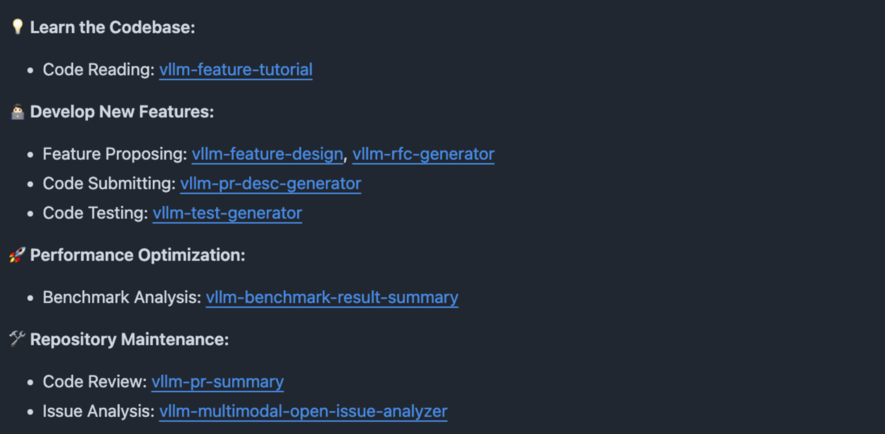

## 一、引言

[vLLM](https://github.com/vllm-project/vllm) 是目前最流行的大模型推理框架之一，凭借着 PagedAttention 等核心技术在工业界广泛落地。然而，作为一个高速迭代的大型开源项目，vLLM 的代码库庞大、模块繁多，对新贡献者来说上手成本极高——光是读懂一个 Feature 的实现路径，往往就需要数天时间。

随着 Coding Agent 越来越普及，在参与 vLLM 社区开发的过程中，我开始尝试使用 Claude Code 来辅助日常工作：读代码、写测试、做 Code Review、分析 Issue 等，发现效果还不错。相比于纯“古法编程”，我的工作效率确实提升了不少。

因此，我整理了自己平时在 vLLM 社区工作的 Workflow 以及一些常用的 Skill，放到了 [vllm-dev-skills](https://github.com/shen-shanshan/vllm-dev-skills) 这个仓库中，分享给同样想做 or 正在做 vLLM 社区贡献的朋友。

## 二、项目介绍

这个仓库按开发流程将 Skill 分为三大类：



### 2.1 代码学习类

**`vllm-feature-tutorial`：读懂一个 vLLM 模块，只需一条指令。**

**痛点**：vLLM 的模块设计复杂，看一段代码往往要在十几个文件之间跳来跳去，还要同时理解 CUDA Kernel、Python 接口、调度逻辑多个层次。

**Skill 效果**：输入一个 Feature 名称（如 `Chunked Prefill`、`Prefix Caching`），该 Skill 会生成一篇包含以下内容的中文深度解析文档：

- **背景与动机**：为什么要有这个功能？解决了什么问题？
- **核心数据结构与类**：附带 Mermaid 类图；
- **执行流程**：从 API 调用到底层实现的完整调用链，附带 Mermaid 流程图；
- **关键代码走读**：逐段解释核心实现逻辑；
- **与其他模块的交互关系**：依赖了哪些组件，被哪些模块调用。

这个 Skill 目前是我使用频率最高的一个，尤其在接手一个不熟悉的 Feature 时，能节省大量阅读时间。

### 2.2 特性开发类

**`vllm-feature-design`：从需求到实现的全流程辅助。**

**适用场景**：你有一个新 Feature 的想法（或被分配了一个任务），但还没有清晰的实现路径。

**Skill 输入**：Feature 描述 + 相关 PR/Issue 链接 + 参考资料。

**Skill 输出**：

1. **核心代码实现**（不含测试）——包括新增文件、修改点、关键函数实现；
2. **Markdown 设计文档**——包含架构图、数据流、模块改动说明、权衡分析。

> 注意：这个 Skill 的定位是"辅助设计"而非"完全自动化"，实际 PR 还需要开发者仔细 Review 并调整。

**`vllm-rfc-generator`：生成规范的 RFC 提案。**

vLLM 社区对大型架构变更要求提交 RFC 文档。这个 Skill 能根据你的想法生成符合社区规范的 RFC 草稿，但由于 RFC 内容高度依赖深度领域知识，目前评分较低，更多作为起草辅助工具使用。

**`vllm-pr-desc-generator`：告别手写 PR 描述。**

输入一个 PR 的代码变更，自动生成符合 vLLM PR 模板（Purpose / Test Plan / Test Result）的规范描述。对于修改量大、涉及多个文件的 PR 尤其实用。

### 2.3 测试与维护类

**`vllm-test-generator`：自动生成测试用例。**

给定一个函数、类或场景描述，生成对应的：

- **单元测试**：覆盖正常路径、边界条件、异常路径；
- **端到端测试**：模拟真实推理请求，验证系统行为。

`vllm-ascend-test-generator`：是专门为华为昇腾适配版本（vllm-ascend）定制的变体，了解昇腾硬件特性和该项目的测试规范。

**`vllm-benchmark-result-summary`：快速对比性能数据。**

将两份 vLLM Serving Benchmark 的输出文本（修改前/后）粘贴给 Skill，它会自动：

- 解析各项指标（吞吐量、P50/P99 延迟、TTFT 等）；
- 计算百分比变化，标注改善/退步；
- 给出简短的性能变化摘要。

**`vllm-pr-summary`：PR Review 提效工具。**

输入一个 vLLM PR 的编号或链接，生成包含以下内容的分析报告：

- PR 目的与背景；
- 代码变更分析（含架构/流程 Mermaid 图）；
- 潜在风险点与 Review 建议；
- 测试覆盖评估。

适合快速了解一个 PR 做了什么，或者在 Review 时作为辅助参考。

**`vllm-multimodal-open-issue-analyzer`：多模态相关待处理 issue 搜集与整理。**

自动拉取并分类整理 vLLM 仓库中与多模态相关的 Open Issue，按问题类型（Bug、Feature Request、性能等）分组，便于快速了解社区当前的痛点和待解决问题。

## 三、使用体验

以下是一些我在实际开发中的使用体验：

- **读代码阶段**：接到一个 EPD 相关的任务，用 `vllm-feature-tutorial` 生成文档后，20 分钟内完成了对整个模块的基本认知，而之前纯手动阅读需要至少半天；
- **开发阶段**：用 `vllm-feature-design` 辅助设计实现方案，生成的代码框架准确度约 60-70%，还需要手动调整细节，但起点比从零开始高很多；
- **提 PR 阶段**：`vllm-pr-desc-generator` 生成的 PR 描述基本不需要大改，节省了不少写文档的时间；
- **Review 阶段**：`vllm-pr-summary` 在快速浏览社区 PR 时很有用，特别是需要了解某个 PR 背景但不想仔细读代码的场景。

## 四、快速开始

1. 安装 Claude Code CLI（参考 [官方文档](https://docs.anthropic.com/en/docs/claude-code)）；
2. Clone 本仓库，将 `skills/` 目录中的 Skill 文件放置到 Claude Code 的 Skill 目录（`~/.claude/skills/`）；
3. 在 Claude Code 中使用 `/Skill名称` 调用对应 Skill。

```bash
# 示例：生成 Chunked Prefill 的技术解析文档
/vllm-feature-tutorial

# 示例：分析 vLLM 某个 PR
/vllm-pr-summary
```

## 五、一些思考

在使用这些 Skill 的过程中，我有几点感受：

1. **AI 辅助开发的价值在于降低认知负担，而不是替代思考**。Skill 生成的内容是起点，不是终点，开发者的判断和领域知识依然不可替代；
2. **标准化的工作流越清晰，AI 发挥越稳定**。像 PR 描述、RFC 模板这类有固定格式的任务，AI 效果最好；越开放、越需要创造性判断的任务，效果越依赖提示词质量；
3. **Skill 的复用价值随使用次数递增**。单次节省的时间可能不多，但在高频重复的开发流程中，积累效益相当可观。

## 六、后续计划

- 持续补充新 Skill，覆盖更多开发场景；
- 优化现有 Skill 的提示词，提高输出质量和稳定性；
- 探索 Multi-Agent 协作模式，例如让多个 Skill 联动完成端到端的 Feature 开发流程。

欢迎感兴趣的朋友 Star、Fork，也欢迎提 Issue 或 PR 贡献新的 Skill！
