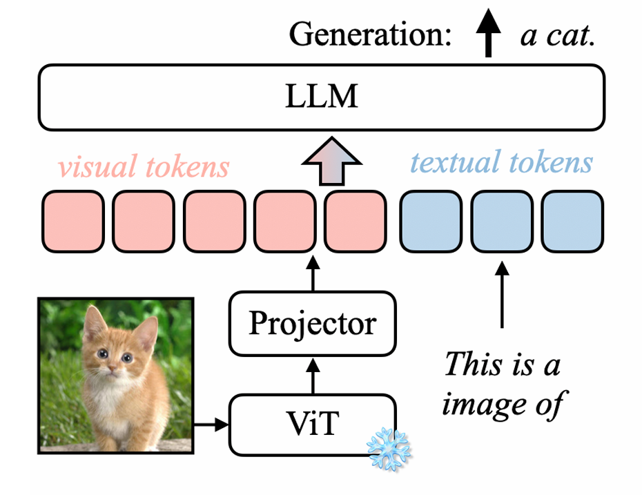
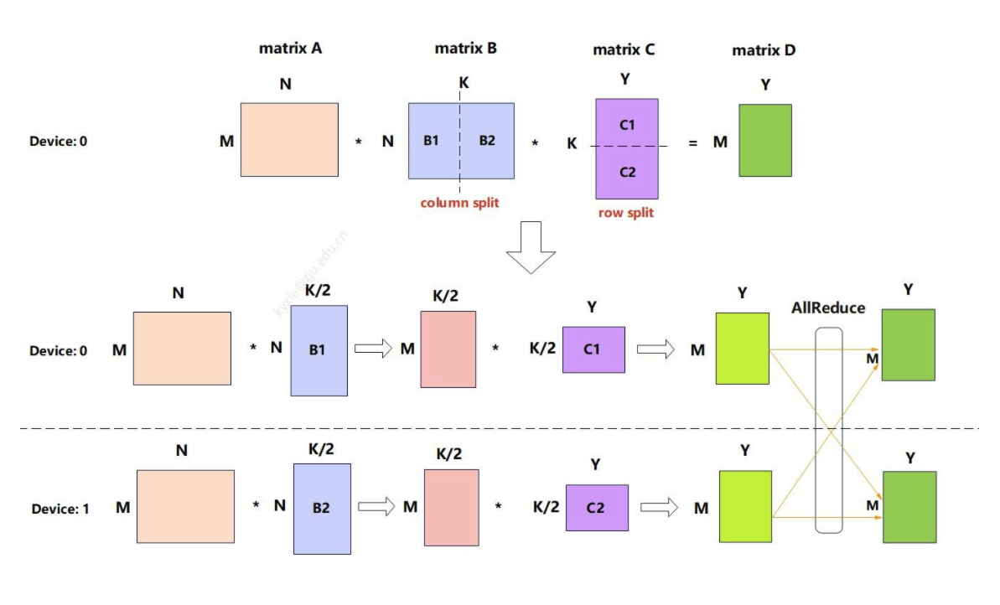
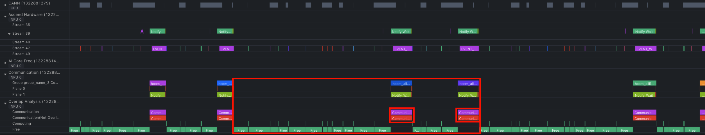
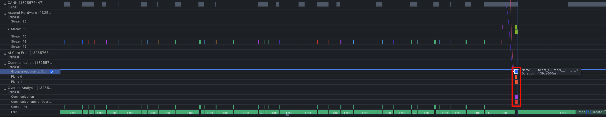
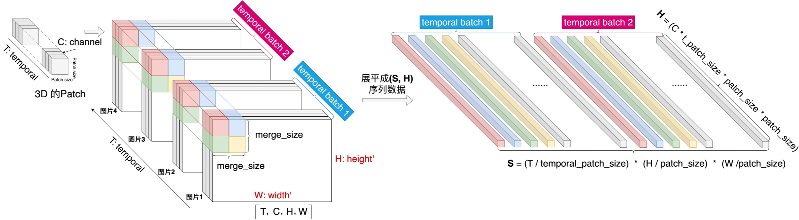
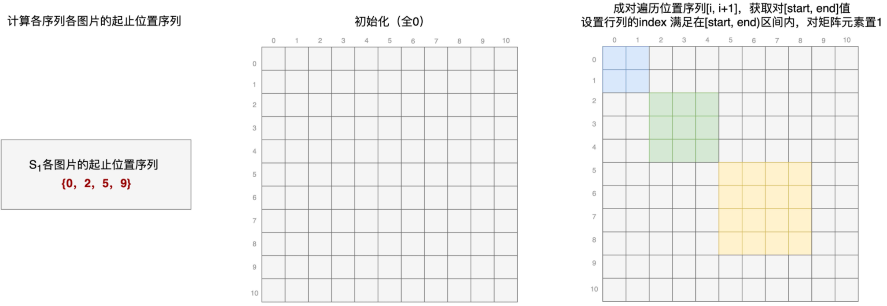

## 一、引言

在多模态处理的 Pipeline 中，ViT（Vision Transformer）和 DiT（Diffusion Transformer）是最常见的处理模块。其中，ViT 在多模态模型中的角色类似于自然语言建模中的 Tokenizer 组件，负责对图像进行视觉特征编码，产出图像的特征序列，只不过 ViT 的编码过程本身也采用了 Transformer 模型结构。

目前，以 vLLM 和 SGLang 为首的开源推理框架针对纯语言模型的特性和优化已愈发完善，而随着多模态模型的快速发展，涌现出了诸如 VL、Omni、TTS 以及 Diffusion 等各式各样的多模态模型，这些开源推理框架针对多模态理解和生成的推理技术还有待完善。

本文将以 vLLM 为例，分享我在工作中学习并积累到的一些针对 ViT 模块的性能优化手段。

## 二、多模态推理概述

### 2.1 多模态模型的分类

目前，根据模型输入和输出所支持的模态，多模态模型可以分为：

- **多模态理解模型**：输入为“文本/图像/视频/音频”，输出为“文本”，模型的任务是理解而不是创造图像或视频。一般由 ViT + 自回归的 LLM 组成，比如：Qwen3-VL、Intern3-VL、DeepSeek-OCR 等；
- **多模态生成模型**：输入为“文本/图像/视频/音频”，输出为“图像/视频/音频”，这些模型一般理解能力较弱，但生成图像或视频的能力很强。一般由 DiT 作为视觉等多模态生成的组件，比如：Stable Diffusion 等；
- **多模态理解与生成统一模型**：输入为“文本/图像/视频/音频”，输出为“文本/图像/视频/音频”，模型不再区分 Encoder 和 Generator，而是将所有模态都看作是 Token，统一放到同一个表示空间中进行处理。一般由自回归的 LLM + DiT 组成，包括多种模型架构，比如：Qwen3-Omni、Qwen-Image、BAGLE 等。

关于“多模态理解与生成统一模型”，让我们更进一步，再来看看 Qwen3-Omni、Qwen-Image、BAGLE 这三条技术路线的区别：

- **Qwen3-Omni**：以 LLM 作为主结构，采用 Thinker–Talker 架构，其中 Thinker 负责思考（跨模态理解、推理），Talker 负责表达，Codec 支持低延迟流式语音生成；
- **Qwen-Image**：以 DiT 作为主结构用于多模态生成，以 LLM 作为多模态理解组件，跨模态推理能力弱，但图像生成能力更强；
- **BAGLE**：以 LLM 作为主结构，以 DiT 作为视觉等多模态生成的组件，是一种统一生成世界模型，可以直接预测多模态 Token，理解能力和生成能力都比较强。

目前，vLLM 主要聚焦的是多模态的理解能力，而与多模态生成相关的能力则放到了 [vLLM-Omni](https://github.com/vllm-project/vllm-omni) 项目中。vLLM-Omni 是一个 vLLM 主仓的扩展项目，聚焦全模态理解和生成能力，感兴趣的读者可以去 GitHub 上看看。

### 2.2 多模态理解模型的推理流程

本文将主要聚焦于“多模态理解模型”，以 Qwen-VL 系列模型为例，其推理流程大致如下：

1. **多模态输入预处理**：
    - **(1) 提取图像输入**：vLLM 从请求的 JSON Payload 中将多模态输入（这里以图像为例）提取为 Python 对象；
    - **(2) 统一输入格式**：vLLM 的 Preprocessor 将图像数据转换成模型能够识别的输入格式（像素值 Tensor），处理步骤包括：Resize、Pad、归一化等；
2. **多模态输入编码**：
    - **(1) 图像切块并做卷积**：vLLM 先将输入图像按 `(patch_size, patch_size)` 切分为许多固定大小的 Patch（即图像 Token），再将相邻的 `(merge_size, merge_size)` 个 Patch 按顺序放到一起，便于后续 PatchMerger 做特征压缩；然后，将这些 Patch 展平为 1D 向量，即 `flatten_patches`，其 Shape 为 `(num_patches, num_channels * patch_size * patch_size)`，同时生成 `grid_thw` 用于记录每张图片切 Patch 后在时空维度上的 Patch 数量；最后，通过 Patch Embedding（3D 卷积操作）将 `flatten_patches` 映射为 `hidden_states`，其 Shape 为 `(num_patches, hidden_size)`；
    - **(2) 计算 2D-RoPE**：根据 `grid_thw` 计算 2D-RoPE，得到 `rotary_pos_emb_cos` 和 `rotary_pos_emb_sin`；
    - **(3) 图像特征编码**：ViT Encoder（Attention）对 `hidden_states` 进行编码（需要先对 Q/K 做 Rotary Embedding），生成图像特征序列；
    - **(4) 图像特征压缩**：ViT PatchMerger（MLP Projector）对图像特征进行压缩，将每 `(merge_size, merge_size)` 个图像特征映射为一个输入表征；
3. **文本输入预处理**：
    - **(1) 提取文本输入**：vLLM 使用 Huggingface Tokenizer 提供的 `apply_chat_template()` 将文本从 JSON 格式转换为 ChatLM 格式（如：`<|im_start|>...<|im_end|>`）；
    - **(2) 更新模态占位符**：根据 ViT 输出的 Token 数量，调整 Prompt 中为图像特征预留的模态占位符 `|image_pad|` 的数量；
    - **(3) 文本特征映射**：Tokenizer 将文本 Token 映射为 `input_ids` 并做词表 Embedding；
4. **文本输入与图像特征合并**：将输入 Prompt 中为图像特征预留的模态占位符 `|image_pad|` 替换为我们编码过后的视觉 Embedding；
5. **LLM Prefill**：将合并后的整个输入喂给语言模型，让它去做 Prefill 计算，生成初始的 KV Cache；
6. **LLM Decode**：语言模型自回归地生成后续 Token，并更新 KV Cache。

关于 ViT 模块的更多原理和细节可以参考这篇文章：

- [多模态技术梳理：ViT 系列](https://zhuanlan.zhihu.com/p/26719287825)

关于 Qwen-VL 系列模型的更多原理和细节可以参考这几篇文章：

- [多模态技术梳理：Qwen-VL 系列](https://zhuanlan.zhihu.com/p/25267823390)
- [Qwen2-VL 源码解读：从准备一条样本到模型生成全流程图解](https://zhuanlan.zhihu.com/p/28205969434)
- [万字长文图解 Qwen2.5-VL 实现细节](https://zhuanlan.zhihu.com/p/1921289925552210138?share_code=oQnxmXt37SUD&utm_psn=1921301797538076351)
- [深度研读 Qwen3-VL：当视觉模型学会“慢思考”与 256K 超长视野](https://zhuanlan.zhihu.com/p/1980240971909337328?share_code=n5piaWev0MEt&utm_psn=1980718678996707264)

### 2.3 多模态推理的性能瓶颈

以 VL 模型为例，对于短输出请求（即 `max_completion_tokens` 较小的请求），在其推理的整个 Pipeline 中，耗时主要集中在**输入预处理**、**ViT 编码**以及 **LLM Prefill** 这三个阶段。其中，**ViT 模块为 Compute-Bound**（类似于 LLM Prefill，不需要自回归地读 KV Cache），直接对整个输入进行计算并生成对应的视觉特征。稍后我们将介绍针对 ViT 模块的一些常见性能优化手段。

另外，在整个推理引擎层面，vLLM 通过**将预处理进程与模型实际推理进程分离**（异步处理、互相掩盖）、**视觉预处理 Cache**、**视觉 Embedding Cache 跨请求共享**以及 **EPD（Encoder-Prefill-Decode）分离**等手段极大地提升了多模态推理的性能。关于这一部分，后面有机会再另写文章做详细的介绍。

## 三、常见 ViT 性能优化手段

### 3.1 使用 ViT Encoder DP 代替 TP 减少通信开销

当我们需要加载的模型比较大时，一张卡可能放不下整个权重，这时我们就会用 TP（Tensor Parallel）切分权重并放到不同的卡上。通过这种方式，每张卡上的计算量减少了，因此计算延迟会更低，但缺点是引入了额外的通信开销。

一种经典的切分方式是先“列切”，中间各自做计算，然后再“行切”，最后做一次 AllReduce。通过这种方式，避免了多次 AllGather，只需最后做一次 AllReduce，并且中间值的计算量和存储大小减半。

以 Attention 计算为例，当采用 TP 时，一般会对 `qkv_proj` 做列切（在 vLLM 中使用 `QKVParallelLinear` 实现，包含对 MQA/GQA 的特殊处理），对 `out_proj` 做行切（在 vLLM 中使用 `RowParallelLinear` 实现），最后接 AllReduce 操作。

上述这种组合模式就是[《LLM 推理并行优化的必备知识》](https://zhuanlan.zhihu.com/p/1937449564509545940)这篇文章中介绍的“场景四”，关于 TP 切分的更多方式和分析也可以参考这篇文章。

**对于 ViT Encoder 来说，由于其参数量较少，使用 TP 切分带来的收益并不大，反而会引入额外的通信开销。**

如下图所示，红框内的部分为一个 ViT Block，每层都会做两次 AllReduce。

- **第一次 AllReduce**：对 Attention 的输出做 `out_proj`，采用行切的方式，然后做第一次 AllReduce；
- **第二次 AllReduce**：MLP 的 `gate_up_proj` 做列切，`down_proj` 做行切，然后做第二次 AllReduce。

**ViT Encoder DP Mode：**

为了减少通信开销，vLLM 引入了一种单独对 ViT Encoder 使用 DP（Data Parallel），LLM 部分仍然使用 TP 的机制，可以避免 TP 模式下每层两次的通信操作。在多 Batch 场景下，使用 ViT DP 可以在 Forward 前把图像数据 Shard 到多张卡上，中间过程不需要再通信，只需在最后调用一次 AllGather 来收集每张卡上的结果。

具体地，vLLM 提供了 `ColumnParallelLinear`、`QKVParallelLinear` 以及 `RowParallelLinear` 等线性层，其内部实现了针对 TP 场景下的权重 Shard 逻辑。在 ViT Encoder DP 场景下，vLLM 可以通过从用户配置中获取是否 `use_data_parallel` 配置，并传入这些线性层的 `disable_tp` 参数来禁用权重 Shard。

另外，通过使用 `run_dp_sharded_mrope_vision_model()` 方法封装 ViT 的处理流程，vLLM 实现了 DP Shard 的视觉模型推理，专门用于支持 MRoPE 的视觉模型。

`run_dp_sharded_mrope_vision_model()` 方法的核心功能包括：

- **负载均衡**：根据每张图像的 Patch 数量（而非图像数量）将图像分配到不同的 GPU 上，确保各 GPU 的计算负载尽可能均衡（因为这些模型支持动态分辨率输入，即不同图像可能有不同的 Patch 数量）；
- **分片处理**：每个 TP Rank 只处理分配给它的图像子集，避免重复计算；
- **结果聚合**：通过 `tensor_model_parallel_all_gather()` 收集所有 Rank 的输出，并恢复到原始图像顺序。

**🌰 举个例子：**

假设有 4 张图像，它们的 Patch 数量分别为 `[1000, 100, 200, 50]`，共有 2 张 GPU。在这种情况下，ViT Encoder DP Mode 的处理流程如下：

1. 负载均衡分配：
    - `gpu_0`：`image_0`（计算量：1000 个 Patch）；
    - `gpu_1`：`image_1/2/3`（计算量：100 + 200 + 50 = 350 个 Patch）；
2. 两张 GPU 各自独立处理被分配的图像数据；
3. 使用 AllGather 收集两张卡上的结果；
4. 恢复原始输入顺序：`[image_0, image_1, image_2, image_3]`。

该特性由 PR [#22742](https://github.com/vllm-project/vllm/pull/22742) 引入，可以通过 `--mm-encoder-tp-mode data` 开启。以 Qwen2.5-VL-72B 为例，PR 中的 Benchmark 结果表明开启 ViT DP 后，TTFT 减少了大约 55%，整体吞吐提升了大约 47%。

关于该特性的更多信息可以参考 vLLM 的官方文档：[Batch-level DP for Multi-Modal Encoders](https://docs.vllm.ai/en/stable/configuration/optimization/?h=mm_encoder_tp_mode#batch-level-dp-for-multi-modal-encoders)。

### 3.2 使用 img2col 算法优化卷积计算

以 Qwen-VL 系列模型为例，其 ViT 计算的第一步就是做 Patch Embedding，输入为已经按 `(patch_size, patch_size)` 切好的 `flatten_patches`，其 Shape 为：

- **图像输入**：`(Number of patches, Number of channels * patch_size * patch_size)`
- **视频输入**：`(Number of patches, Number of channels * temporal_patch_size * patch_size * patch_size)`

通过 Patch Embedding，`flatten_patches` 会被转换成 `hidden_states`，从而便于后续 ViT Encoder 做进一步的处理，其 Shape 为 `(num_patches, hidden_size)`。

这一步本质上是一个 `kernel_size` = `stride` 的 3D 卷积运算，但是可以通过将卷积核的权重转换为一个二维矩阵，然后输入和这个二维矩阵直接做一个大的矩阵乘得到最终的结果。通过这种方式，极大地提升了卷积计算的性能，这就是“**img2col 算法**”。

关于该算法的更多原理和细节，可以参考我之前写的这篇文章：



目前，通过调用 PyTorch 提供的 `F.conv3d` 接口（其底层会用到已经优化过的 CuDNN 算子），我们直接就能获得较好的性能收益。

### 3.3 使用 Cos/Sin Cache 优化 RoPE 计算

在 Qwen-VL 系列模型中，其 ViT 模块引入了 2D-RoPE 相对位置编码，使模型对长序列建模有更好的泛化能力。这里之所以用 2D-RoPE 而不是 3D-RoPE，是因为 ViT 的主要作用是负责提供单图/单帧上的特征，而时间维度上的关联性，则由主模型中的 3D-MRope 负责。

具体地，以 Qwen2.5-VL 为例，其 2D-RoPE 的计算流程如下：

1. **初始化时预计算 Cos/Sin 缓存**：vLLM 中的 `RotaryEmbeddingBase` 类提供了一种 Cos/Sin Cache 机制——在创建 `RotaryEmbedding` 模块时，它会根据我们传入的 `base` 和 `max_position` 等参数，提前计算好 Cos/Sin Freq 并存入一个 1D Cache，其 Shape 为 `(max_position, rotary_dim)`，Cos 和 Sin 各占一半，即 `rotary_dim // 2`；
2. **为每张图像/视频计算 2D 空间位置 ID**：根据输入的 `grid_thw`，计算每个 Patch 的 `hpos_ids` 和 `wpos_ids`，然后做 Spatial Merge 分组重排，使相邻的 Merge Unit 在序列中连续。`spatial_merge_size=2` 意味着相邻的 `2 × 2 = 4` 个 Patch 最终会被合并为一个 LLM Token，这里将它们在序列中排列到一起（调换顺序并做 `flatten()`），便于后续 PatchMerger 做特征压缩；接着将 `hpos_ids` 和 `wpos_ids` 拼接，然后将 T 帧的位置也全部拼接，得到当前图像/视频的 `pos_ids`，其 Shape 为 `(t * h * w, 2)`，每一行都是一个 Patch 的位置 `(hpos_id, wpos_id)`；
3. **从 Cos/Sin Cache 中查表，分别编码 H 和 W**：从 Cache 中获取前 `max(h, w)` 个位置的值，切成两半就得到 Cos Freq 和 Sin Freq，其 Shape 为 `(max(h, w), rotary_dim // 2)`。然后，为每个 Patch 同时查其 `hpos_id` 和 `wpos_id` 对应的 cos 值，比如：当前 Patch 的位置为 `(2, 3)`，那么就会分别查到 Cos Freq 中的第 3 个和第 4 个值（索引从 0 开始），然后将这两个值拼接到一起得到 `cos_combined`，其 Shape 为 `(t * h * w, rotary_dim)`。**这就是 2D-RoPE 的核心——前 `rotary_dim // 2` 维用 H 位置的 Cos Freq 编码，后 `rotary_dim // 2` 维用 W 位置的 Cos Freq 编码，即用 H 和 W 各自独立的位置频率拼接成完整的 `rotary_pos_emb_cos`，`rotary_pos_emb_sin` 的计算同理**；
4. **重排 Cos/Sin Freq 值**：包括按 Spatial Merge Unit 分组重排、按窗口注意力顺序重排；
5. **多图/多视频拼接**：遍历 `grid_thw` 中的每一个元素（即每个图像/视频的 `(t, h, w)`，单位是 Patch 数量），执行上述步骤 1-4，得到当前图像/视频的 `rotary_pos_emb_cos` 和 `rotary_pos_emb_sin`。然后，将每个图像/视频的 `rotary_pos_emb_cos` 拼接到一起，得到最终的 `rotary_pos_emb_cos`，其 Shape 为 `(num_patches_all, rotary_dim)`，`rotary_pos_emb_sin` 的计算同理；
6. **在每个 VisionBlock 中将 RoPE 应用到 Q/K**。

> NOTE：这一段有点抽象，可以参考 vLLM 的代码来更好地理解上述流程：[vllm/model_executor/models/qwen2_5_vl.py](https://github.com/vllm-project/vllm/blob/main/vllm/model_executor/models/qwen2_5_vl.py)。

基于该 Cos/Sin Cache 机制，当 ViT Encoder 在后续推理中需要用到 Cos/Sin Freq 时，就可以直接从这个 Cache 中获取已经计算好的 Cos/Sin Freq，从而避免了重复的计算并提升了推理的性能。

### 3.4 使用异步拷贝掩盖 H2D 同步流

当一个序列中包含多张图片时，ViT Attention 需要保证多个图片的计算是相互隔离的。这可以通过计算 `cu_seqlens` 来记录序列中每个图片的起止 Token 位置，这样后续在 ViT Attention 中我们就可以根据 `cu_seqlens` 来构建二维的 Attention Mask 矩阵。

在 vLLM 中，ViT Attention 的 Kernel 要求 `cu_seqlens` 必须要放到 GPU 上。如果我们在每次调用算子之前，才临时去计算该 Tensor 并拷贝到 GPU 上，这会导致大量的重复计算（因为在每一步推理中，`cu_seqlens` 在每个 Layer 上都是相同的），并且会频繁触发 H2D 同步流，从而导致非常严重的 Host 开销，非常影响推理的性能。

为了解决这个问题，vLLM 的 ViT 模块会在进入 VisionBlock 之前提前计算好 `cu_seqlens` 并通过异步拷贝的方式将其从 CPU 拷贝到 GPU 上，形如：`xxx.to(self.device, non_blocking=True)`，从而可以掩盖掉 H2D 同步流带来的开销。另外，`cu_seqlens` 会在 VisionBlock 的所有 Layer 间传递和共享，减少了冗余的计算。通过这种方式，我们减少了 ViT 推理关键路径上的重复操作，从而提高了整体的性能。

### 3.5 使用融合算子减少 Host 侧 Kernel Launch 开销

在 ViT 的计算过程中，会涉及到 RMSNorm、RoPE 以及 SwiGLU 等算子，如果完全使用小算子拼接去实现，会造成严重的 Host 侧 Kernel Launch 开销，导致 GPU 的利用率不高。

在这种情况下，可以考虑对这些操作接入融合算子，每个融合算子只需下发一次，从而可以更好地压榨 GPU 的性能。关于融合算子的具体实现细节，本文不做讨论。

### 3.6 Ascend NPU 特定优化

ViT Attention 可以使用 FlashAttention 来加速计算，对于 Ascend NPU 而言，我们可以通过将输入 Q/K/V 的最后一维 Padding 到 128 来提升硬件的计算效率。

**这是因为：**

- **Ascend NPU 的计算核心（AI Core）的向量计算“宽度”刚好适合 128**。AI Core 里的向量单元（Vector Unit）是 SIMD（Single Instruction Multiple Data），即一条指令同时算很多元素。其向量寄存器一次处理一大块数据，工程上常见的 Tile 一般是 64/128 个 FP16（128/256 B），如果 `head_dim` = 128（256 B，FP16），一次向量操作就正好可以算完一整行。
- **内存搬运也刚好对齐**。FlashAttention 的瓶颈往往不是算力，而是显存带宽。Ascend 从 HBM 搬数据到 AI Core 时，是整块搬运，常见的数据块大小是 128/256/512 B，如果 `head_dim` = 128（256 B，FP16），能够完美打满带宽利用率；
- **Attention kernel 的计算块（Tile）通常就是 128**。FlashAttention 的核心不是逐 Token 算，而是分块算，常见的 Tile 就是 128。如果 `head_dim` ≠ 128，则会引入额外的 Tile Padding、Vector Mask 以及逻辑判断，从而导致性能降低。

**总结：**

- `head_dim` = 128 → 硬件满载
- `head_dim` ≠ 128 → Padding + Mask + 带宽浪费

**也就是说，“128”是向量计算宽度、内存搬运大小以及 Kernel Tile 的最佳交集。**

> NOTE：本小节以上内容参考 AI 回答，仅供参考。

根据 Qwen3-VL 的 Benchmark 结果，我们发现与原始输入（`head_dim` = 80）相比，将输入 Padding 到 128 之后的 NPU FlashAttention Kernel 性能提升了大约 19.78%。

原始输入（`head_dim` = 80）：

Padding 输入（`head_dim` = 128）：

另外，虽然我们在调用 Kernel 之前引入了额外的 Q/K/V Padding 操作，从而带来了多余的开销，但经验证端到端的推理性能仍是有收益的。

## 四、总结

本文以当前主流多模态模型的分类和推理流程作为引入，深入介绍了 vLLM 推理引擎中针对 ViT 模块的一些常见性能优化手段。上述优化主要为 ViT 内部的优化，并不包括整个推理引擎层面的优化（后面有空再单独介绍）和算子的优化（我也不会）。通过这些优化，极大地提升了多模态理解模型在 vLLM 上的推理性能。

另外，还不会看 vLLM Profiling 的小伙伴，可以参考下面这两篇文章：

- [GPU/NPU 推理 Profiling 阅读引导（上）](https://mp.weixin.qq.com/s/xNKdTl5cUPnpVe3OQ3wXKg)
- [GPU/NPU 推理 Profiling 阅读引导（下）](https://mp.weixin.qq.com/s/Qv15u-dw3jWz3IFCaBnS9A)

## 五、参考资料

- [An Image is Worth 16x16 Words: Transformers for Image Recognition at Scale](https://arxiv.org/pdf/2010.11929)
- [多模态技术梳理：ViT 系列](https://zhuanlan.zhihu.com/p/26719287825)
- [多模态技术梳理：Qwen-VL 系列](https://zhuanlan.zhihu.com/p/25267823390)
- [Qwen2-VL 源码解读：从准备一条样本到模型生成全流程图解](https://zhuanlan.zhihu.com/p/28205969434)
- [万字长文图解 Qwen2.5-VL 实现细节](https://zhuanlan.zhihu.com/p/1921289925552210138?share_code=oQnxmXt37SUD&utm_psn=1921301797538076351)
- [深度研读 Qwen3-VL：当视觉模型学会“慢思考”与 256K 超长视野](https://zhuanlan.zhihu.com/p/1980240971909337328?share_code=n5piaWev0MEt&utm_psn=1980718678996707264)
- [LLM 推理并行优化的必备知识](https://zhuanlan.zhihu.com/p/1937449564509545940)
- [vLLM Official Doc: Batch-level DP for Multi-Modal Encoders](https://docs.vllm.ai/en/stable/configuration/optimization/?h=mm_encoder_tp_mode#batch-level-dp-for-multi-modal-encoders)
- [vLLM 多模态推理｜卷积计算加速](https://zhuanlan.zhihu.com/p/1974125856852034422)
- [通俗理解 RoPE、2D-RoPE、M-RoPE](https://zhuanlan.zhihu.com/p/1948048954689295110)
- [GPU/NPU 推理 Profiling 阅读引导（上）](https://mp.weixin.qq.com/s/xNKdTl5cUPnpVe3OQ3wXKg)
- [GPU/NPU 推理 Profiling 阅读引导（下）](https://mp.weixin.qq.com/s/Qv15u-dw3jWz3IFCaBnS9A)
