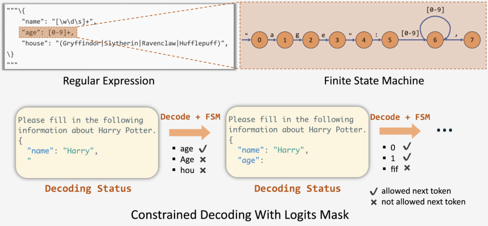
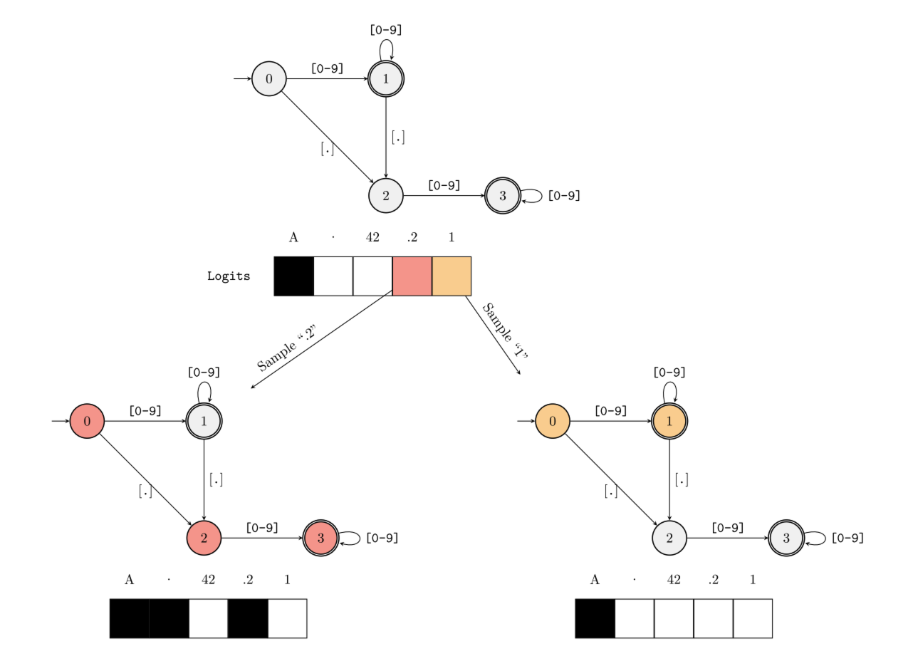
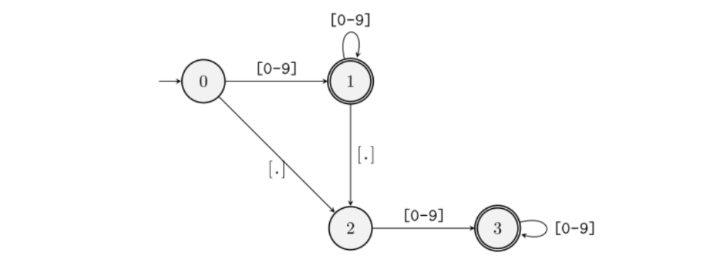
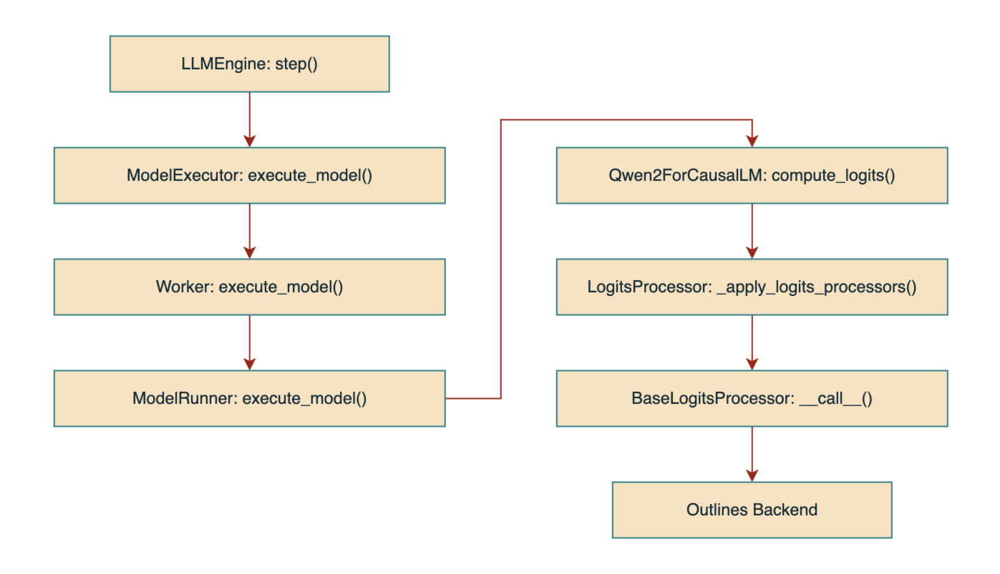
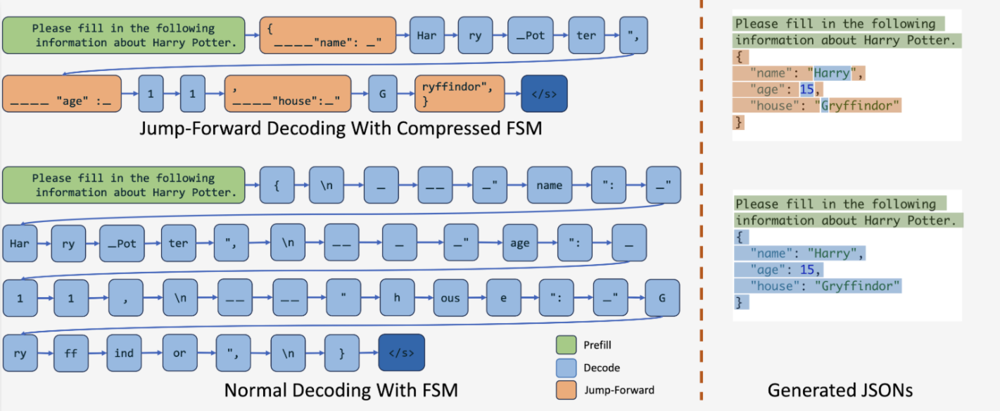

## 一、引言

目前，在大模型推理领域中，Guided Decoding 技术广泛用于生成一些特定格式的输出，如：SQL、JSON 等。本文将基于 vLLM 以及 Outlines 后端，深入解析 Guided Decoding 背后的技术原理。

## 二、什么是 Guided Decoding？

一般来说，LLM 的输出通常是一段符合人类表达习惯的文本序列，这让我们可以利用 LLM 来回答问题或是创作内容。然而，当我们需要 LLM 的输出符合特定的格式（如：JSON、SQL、正则表达式等）时——例如希望 LLM 根据我们的需求生成查询数据库的 SQL 语句，通过微调的方法通常很难达到我们预期的效果。这时，就需要用到 Guided Decoding 技术，它可以通过影响模型输出层的 Logits 分布（施加 Mask 过滤不满足要求的 Token）来达到规范模型输出格式的效果。

**🌰 举个例子：**

我们可以向 LLM 输入一个 Prompt 以及对应的格式数据：

```python
# Guided decoding by JSON using Pydantic schema
class CarType(str, Enum):
    sedan = "sedan"
    suv = "SUV"
    truck = "Truck"
    coupe = "Coupe"


class CarDescription(BaseModel):
    brand: str
    model: str
    car_type: CarType


json_schema = CarDescription.model_json_schema()


prompt = ("Generate a JSON with the brand, model and car_type of"
          "the most iconic car from the 90's, think in 100 tokens")
```

此时，LLM 就会根据我们的要求生成一个 JSON 格式的输出：

```json
content: {
    "brand": "Levels",
    "model": "racing equation",
    "car_type": "sedan"
}
```

## 三、Outlines 原理详解

目前，实现了 Guided Decoding 支持的后端有 `outlines`、`xgrammar` 以及 `lm-format-enforcer` 等，下面将以 Outlines 为例，深入介绍 Guided Decoding 背后的实现原理。

**Outlines 的核心技术点包括：**

- **基于 FSM（Finite-State Machine，有限状态机）**，实现了当前输入与对应状态的匹配，并可以根据状态转移函数确定对应的 Mask；
- **建立了 FSM 的状态与其可接受 Token 的 Map**，并为这些 Token 建立索引，从而避免了在每次 Decode 中遍历整个 Vocabulary 进行匹配，加快了匹配的速度。



下面，为了让大家更快速、更直观地理解 Outlines 的原理，本文将尽力避免大段公式和算法的罗列，而是尽量使用具体的例子进行讲解。

### 3.1 FSM 的工作原理

**🌰 举个例子：**

假设我们需要模型输出一个浮点小数，即输出需要匹配的正则表达式为 `([0-9]*)?\.?[0-9]*`，并给定一个仅包含 `A`、`.`、`42`、`.2` 和 `1` 的 Vocabulary。

> “正则表达式”符号说明：
>
> - `*`：匹配前面的子表达式零次或多次；
> - `?`：匹配前面的子表达式零次或一次；
> - `.`：匹配除换行符 `\n` 之外的任何单字符；
> - `\.`：匹配小数点符号 `.`（需要使用 `\` 进行转义）。

当 LLM 开始 Decode 时，FSM 位于初始状态（`0`，用整数表示不同的状态），根据状态 `0` 的转移函数可知，当前状态可以接受的字符模式为 `[0-9]` 和 `[.]`，而在我们所给的词表中，只有 `A` 不符合，此时 FSM 会针对词表 `['A', '.', '42', '.2', '1']` 生成一个值为 `[0, 1, 1, 1, 1]` 的 Mask，即模型在本轮迭代进行采样时会排除掉 `A`（图中用黑色表示），如下图所示。



接下来，有两种情况：

1. **模型本轮的采样值为 `.2`（图中用红色表示）**，此时 `.2` 同时满足从状态 `0` 过渡到状态 `2` 再到状态 `3` 的条件，因此 FSM 的当前状态会跳转到状态 `3` 并生成下一次采样的 Mask。由于状态 `3` 可接受的字符模式仅为 `[0-9]`，只有 `42` 和 `1` 满足，因此此时的 Mask 为 `[0, 0, 1, 0, 1]`；
2. **模型本轮的采样值为 `1`（图中用黄色表示）**，同理，此时 FSM 会跳转到状态 `1` 并生成对应的 Mask，其值为 `[0, 1, 1, 1, 1]`。

不断循环此过程，最终就能得到满足该正则表达式的输出。

> 补充：在 vLLM 的实现中，其 Mask 使用 `0` 表示接受的 Token，用 `-inf`（负无穷）表示要排除的 Token，然后再将输出的 Logits 分布与 Mask 相加，从而达到屏蔽不满足要求的 Token 的效果。

### 3.2 FSM 的构建过程

在了解了 Outlines 中 FSM 的基本工作原理之后，接下来我们再看下，针对一个给定的正则表达式与 Vocabulary，Outlines 是如何构建这个 FSM 的。

FSM 的构建过程主要分为两步：

1. **收集每个 Token 能够匹配的状态转换路径**：给定一个 Token，遍历所有状态，并从每一个状态开始，看是否存在能够完整接受该 Token 的路径，若存在，则将该路径记录到该 Token 对应的列表中；若不存在这样一条路径，则跳过当前状态，继续收集以下一个状态作为开始状态的可能路径；
2. **收集每个状态能够接受的所有 Token**：遍历每一个 Token，并针对该 Token 执行步骤一，获取该 Token 能够匹配的状态转换路径，然后遍历每一条路径并取路径中的第一个节点（开始状态），将该状态与该 Token 进行绑定（将该 Token 添加到该状态的集合中）。

**🌰 举个例子：**

这里我们继续使用上面的例子进行说明：



**对于 Token `A`，遍历每个状态：**

1. 从状态 `0` 开始，不满足，pass；
2. 从状态 `1` 开始，不满足，pass；
3. 从状态 `2` 开始，不满足，pass；
4. 从状态 `3` 开始，不满足，pass。

**对于 Token `.`，遍历每个状态：**

1. 从状态 `0` 开始，可以转换到状态 `2`，记录路径 `0 -> 2`；
2. 从状态 `1` 开始，可以转换到状态 `2`，记录路径 `1 -> 2`；
3. 从状态 `2` 开始，不满足，pass；
4. 从状态 `3` 开始，不满足，pass。

此时，我们可以收集到对于 Token `.`，其所能匹配到的所有状态转换路径集合：

```
0 -> 2
1 -> 2
```

然后，将每条路径的起始状态与该 Token 进行绑定（一个 HashMap）：

```
状态 0 <-> set(".")
状态 1 <-> set(".")
```

**对于 Token `42`，遍历每个状态：**

1. 从状态 `0` 开始，可以转换到状态 `1`，记录路径 `0 -> 1`；
2. 从状态 `1` 开始，可以转换到状态 `1`，记录路径 `1`；
3. 从状态 `2` 开始，可以转换到状态 `3`，记录路径 `2 -> 3`；
4. 从状态 `3` 开始，可以转换到状态 `3`，记录路径 `3`。

Token `42` 能匹配到的所有路径集合如下：

```
0 -> 1
1
2 -> 3
3
```

同理，将所有起始状态与该 Token 进行绑定：

```
状态 0 <-> set(".", "42")
状态 1 <-> set(".", "42")
状态 2 <-> set("42")
状态 3 <-> set("42")
```

**对于 Token `.2`，遍历每个状态：**

1. 从状态 `0` 开始，记录路径 `0 -> 2 -> 3`；
2. 从状态 `1` 开始，记录路径 `1 -> 2 -> 3`；
3. 从状态 `2` 开始，不满足，pass；
4. 从状态 `3` 开始，不满足，pass。

绑定状态与 Token：

```
状态 0 <-> set(".", "42", ".2")
状态 1 <-> set(".", "42", ".2")
状态 2 <-> set("42")
状态 3 <-> set("42")
```

**对于 Token `1`，遍历每个状态：**

1. 从状态 `0` 开始，记录路径 `0 -> 1`；
2. 从状态 `1` 开始，记录路径 `1`；
3. 从状态 `2` 开始，记录路径 `2 -> 3`；
4. 从状态 `3` 开始，记录路径 `3`。

绑定状态与 Token：

```
状态 0 <-> set(".", "42", ".2", "1")
状态 1 <-> set(".", "42", ".2", "1")
状态 2 <-> set("42", "1")
状态 3 <-> set("42", "1")
```

最后，我们就得到了每个 FSM 状态能够匹配的所有 Token 集合。

在实际过程中，当 LLM 生成的内容进行到某一个状态时（比如：状态 `2`），Outlines 就能快速通过该 Map 获取到当前状态所能接受生成的 Token 集合（`42` 和 `1`），搜索的时间复杂度为 `O(1)`，并生成下一步 Decode 的 Mask（为 `[0, 0, 1, 0, 1]`，即过滤掉了其它 3 个 Token）。

### 3.3 总结

**Outlines 的优缺点：**

- **优点：不会引入额外的推理延迟**。FSM Map 的构建过程会在真正进行 Decode 之前就完成，因此并不会给实际运行时的推理过程引入太多额外的延迟（引入的额外计算仅包括生成 Mask 等，几乎可以忽略）；
- **缺点：会引入额外的内存占用**。保存并加载这个 Map 会带来额外的内存占用，因此在实际应用中，我们需要对推理速度和内存占用这两方面做一个权衡。

另外，Outlines 不仅可以支持使用正则表达式来限定模型的输出，还支持 **CFGs（Context-Free Grammars，上下文无关文法）**，比如：JSON、SQL 以及 Python 等语言。关于 CFGs 生成的原理，这里不再详细展开，感兴趣的读者可以自行阅读 Outlines 的[<u>论文</u>](https://arxiv.org/abs/2307.09702)与[<u>源码</u>](https://github.com/dottxt-ai/outlines)。

## 四、vLLM Guided Decoding 源码解读

目前，vLLM 的 Guided Decoding 功能支持 `outlines`、`xgrammar` 以及 `lm-format-enforcer` 这三种后端。下面，我们将使用 `Qwen2.5-7B-Instruct` 模型，并基于 `outlines` 后端，详细讲解 Guided Decoding 的整体流程及其代码实现。

### 4.1 加载 LogitsProcessor

当 `LLMEngine` 初始化时，会在 `_build_logits_processors()` 方法中调用 `get_local_guided_decoding_logits_processor()` 方法获取当前可用后端对应的 `LogitsProcessor`（位于 `vllm/model_executor/guided_decoding` 目录下）。

此时，需要传入 Guided Decoding 相关的参数 `GuidedDecodingParams`，这些参数位于 `SamplingParams` 中，可以在启动 vLLM 时进行指定。最后，所有被成功加载的各种 `LogitsProcessor` 都会被存放到 `SamplingParams` 中。

部分代码如下：

```python
# llm_engine.py
def _build_logits_processors(..., sampling_params, ...):

    logits_processors = []

    if sampling_params.guided_decoding is not None:
        # ...
        guided_decoding = sampling_params.guided_decoding
        # ...
        processor = get_local_guided_decoding_logits_processor(
            guided_params=guided_decoding,
            tokenizer=tokenizer,
            model_config=self.model_config,
            reasoning_backend=self.decoding_config.reasoning_backend,
        )
        if processor:
            logits_processors.append(processor)
    
    # ...

    sampling_params.logits_processors.extend(logits_processors)
    return sampling_params
```

`GuidedDecodingParams` 包含的参数如下：

```python
# sampling_params.py
@dataclass
class GuidedDecodingParams:
    """One of these fields will be used to build a logit processor."""
    json: Optional[Union[str, dict]] = None
    regex: Optional[str] = None
    choice: Optional[list[str]] = None
    grammar: Optional[str] = None
    json_object: Optional[bool] = None
    """These are other options that can be set"""
    backend: Optional[str] = None
    whitespace_pattern: Optional[str] = None
```

其中，前 5 个参数用于指定模型输出需要匹配的模式，剩下 2 个参数为一些可选配置。

### 4.2 整体推理流程

当初始化完成后，vLLM 会开启一个循环并不断调用 `step()` 方法执行推理，每一次调用就是一个迭代。

部分代码如下：

```python
# llm.py
def _run_engine(...):
    # ...
    while self.llm_engine.has_unfinished_requests():
        step_outputs = self.llm_engine.step()
        # ...
    
    return outputs
```

在 `step()` 方法中，vLLM 的整体调用链路如下：



其中，与 Guided Decoding 有关的核心处理逻辑都被封装到了 `BaseLogitsProcessor` 的 `__call__()` 方法中，这样就可以直接通过 `logits_processor(...)` 的方式来进行调用。

### 4.3 计算 Mask

具体地，`BaseLogitsProcessor: __call__()` 的部分代码（`#...` 代表省略）及其说明如下：

```python
from outlines.fsm.guide import (CFGGuide, CFGState, Generate, Guide,
                                RegexGuide, Write)


class BaseLogitsProcessor:

    def __init__(self, guide: Guide, reasoner: Optional[Reasoner]):
        self._guide: Guide = guide
        self._fsm_state: DefaultDict[int, Union[int, CFGState]] = defaultdict(int)
        # ...

    def __call__(self, input_ids: List[int],
                 scores: torch.Tensor) -> torch.Tensor:
        """Use the FSM to bias the logits before sampling the next token."""
        # ...

        seq_id = hash(tuple(input_ids))

        if len(input_ids) > 0:
            last_token = input_ids[-1]
            last_seq_id = hash(tuple(input_ids[:-1]))
            # 根据前一个 FSM 状态以及当前输入的 Token，从 Outlines 获取下一个状态
            # _fsm_state 是一个 Map：序列哈希 <--> FSM 状态
            self._fsm_state[seq_id] = self._guide.get_next_state(
                state=self._fsm_state[last_seq_id], token_id=last_token)
        
        # ...

        # 从 Outlines 获取当前状态所能接受的 Token 集合
        instruction = self._guide.get_next_instruction(
            state=self._fsm_state[seq_id])
        allowed_tokens = instruction.tokens

        # 使用 -torch.inf 初始化 Mask
        mask = torch.full((scores.shape[-1], ),
                          -torch.inf,
                          device=scores.device)
        
        # ...

        # 将 Mask 中 allowed_tokens 的位置设为 0，其余为 -torch.inf（即要被过滤的）
        mask.index_fill_(0, allowed_tokens, 0)
        
        # 将 Mask 应用到模型输出上：
        # 1.对于可接受的 Token：原本的概率 + Mask(0)，概率不变
        # 2.对于不接受的 Token：原本的概率 + Mask(负无穷)，概率为 0
        scores.add_(mask)

        return scores
```

总结：Guided Decoding 通过一个 Mask 机制实现了筛除模型生成的不满足当前格式限制的 Token 的效果。

### 4.4 支持 Reasoning

目前，vLLM 还支持在 Reasoning 时，仅对最后的结果 `content` 执行 Guided Decoding 逻辑，而不影响原本推理部分的内容 `reasoning_content`。

具体的代码可以参考这个 [<u>PR</u>](https://github.com/vllm-project/vllm/pull/12955)，由 [<u>Ce Gao</u>](https://github.com/gaocegege) 实现，感兴趣的读者可以自行了解，这里不再详细展开。

## 五、SGLang Jump-Forward Decoding

使用 FSM 实现 Guided Decoding 还有一个缺点——即只能逐个 Token 计算 Mask。然而，在 Guided Decoding 中，有一些特定的 Token 组合是绑定在一起的，对于这些 Token，其实没必要再一个一个地去生成，而是可以一次 Decode 直接生成几个 Token 的组合，从而可以加速 Guided Decoding 的推理过程。

为了解决上述问题，SGLang 提出了一种基于 **Compressed Finite State Machine** 的 **Jump-Forward Decoding**。即当生成一些特定的 Token（后续模式固定且可预测，如：`{`）时，该算法可以在一次 Decode 中将连续的几个 Token 直接生成。



具体地，Compressed FSM 通过先分析 FSM（根据用户给定的正则表达式生成），识别其中一些没有分支的节点（即只由一条边连接），并将这些路径上的节点合并，从而可以通过一次跳转（Decode），跨越多个状态（Token），直到下一个具有分支的节点，从而极大地提高了 Guided Decoding 的效率。

更多细节可以参考 SGLang 的[<u>论文</u>](https://arxiv.org/abs/2312.07104)和[<u>代码</u>](https://github.com/sgl-project/sglang)。

## 六、参考资料

- [<u>Robust Text-to-SQL Generation with Execution-Guided Decoding</u>](https://arxiv.org/abs/1807.03100)
- [<u>Efficient Guided Generation for Large Language Models</u>](https://arxiv.org/abs/2307.09702)
- [<u>vLLM Docs | Structured Outputs</u>](https://docs.vllm.ai/en/stable/features/structured_outputs.html#structured-outputs)
- [<u>vLLM GitHub</u>](https://github.com/vllm-project/vllm)
- [<u>Fast JSON Decoding for Local LLMs with Compressed Finite State Machine</u>](https://lmsys.org/blog/2024-02-05-compressed-fsm/)
- [<u>SGLang: Efficient Execution of Structured Language Model Programs</u>](https://arxiv.org/abs/2312.07104)
