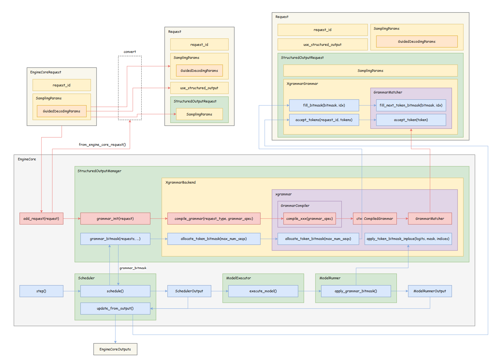
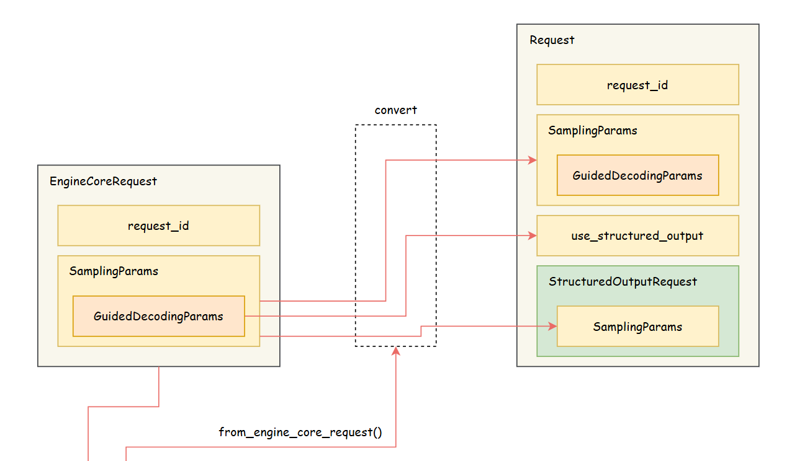

## 一、引言

**Guided Decoding**，又叫 **Structured Output**，是大模型推理领域中非常重要的一个特性，主要用于引导大模型输出符合某种特定格式（如：SQL、Json）的结果，以便更好地将大模型落地到具体的应用场景中。

在我的上一篇文章中，简要地介绍了 Guided Decoding 的原理，并详细分析了 vLLM 中相关代码的实现（V0），文章链接如下：



自从 vLLM **v0.8.x** 之后，**V1 Engine** 将作为 vLLM 启动时的默认选项。关于 V1 Engine 的系统设计以及具体的优化点，我将会在之后逐步梳理并分享出来（~~如果有空的话~~）。而在本文中，我将针对 V1 Engine，分享 Structured Output 模块的整体设计与具体实现。

## 二、V1 Engine 整体架构

在介绍 Structured Output 模块的设计之前，让我们先来看下 vLLM V1 Engine 的整体架构。在 V1 中，vLLM 将不同类型的 CPU 密集型操作拆分到了两个相互独立的进程中，以便能够异步执行不同的 CPU 操作，减少了不同步骤之间相互等待的时间，因此能够更好地压榨硬件的计算性能。


- `Process 0` 主要负责请求的预处理（如：参数校验）、Tokenization 以及 Detokenization 等操作；
- `Process 1` 主要负责请求的调度和推理执行等操作。

在优化前（V0），`Process 0` 和 `Process 1` 中的操作顺序执行，因此存在许多 CPU 空闲等待的时间，而在 V1 中则是并行执行上面两个进程中的操作，因此极大地提升了整体的推理效率。

## 三、V1 Engine 整体流程

接下来，让我们再看一下 V1 Engine 的整体推理流程：


> 高清图片链接：[<u>link</u>](https://github.com/shen-shanshan/cs-self-learning/tree/master/Open_Source/Projects/vLLM/Features/Guided_Decoding/posts/vLLM%E5%AD%A6%E4%B9%A0%E7%AC%94%E8%AE%B0%E2%80%94%E2%80%94Guided_Decoding_V1/images)，画图不易，走过路过欢迎点一个 Star！

- `LLMEngine` 属于 `Process 0`，主要用于与推理引擎外部进行交互（如：接收用户请求、输出推理结果等）。vLLM 的离线推理引擎 `LLM` 和在线推理引擎 `AsyncLLM` 都是基于 `LLMEngine` 的封装；
- `EngineCore` 属于 `Process 1`，是推理引擎的核心，包含了请求调度、模型前向推理等关键实现。

### 3.1 LLMEngine 整体流程


1. 当一个新的 prompt 输入到 vLLM 后，`LLMEngine` 会调用 `Processor` 的 `process_inputs()` 方法，对输入数据进行一些校验和预处理。其中，有一个步骤叫做 `_validate_structured_output()`，会对 Structured Output 后端的设置进行检查（目前 V1 只支持 **engine-level** 的后端，即全局只能使用同一个后端，不允许针对不同的请求使用不动的后端进行处理），并判断输入内容是否能被转换成 Structured Output 后端能够识别的语法；
2. `LLMEngine` 调用 `step()`，并通过 `get_output()` 方法从 `EngineCoreClient` 获取推理结果（`EngineCoreClient` 是 `LLMEngine` 中专门用于与 `EngineCore` 进行通信的类）；
3. `LLMEngine` 调用 `OutputProcessor` 中的 `process_outputs()` 方法，对推理结果进行后处理，比如：Detokenization、准备 `RequestOutput` 对象以及终止已经生成结束符的请求。

### 3.2 EngineCore 整体流程

当 `LLMEngine` 调用 `make_client()` 方法创建 `EngineCoreClient` 时，可以根据配置创建不同的 `EngineCoreClient`，用户可以选择继续使用 V0-style 的 Engine，也可以采用 V1-style（本文仅讨论 V1）。当使用 V1 Engine 时，会创建一个新的进程，运行 `EngineCoreProc` 中的 `run_engine_core()` 方法，并开启一个 busy loop。


`run_busy_loop()` 主要分为两步：

1. `_process_input_queue()`：处理来自 `EngineCoreClient` 的请求。当有新的请求到来时，调用 `add_request()` 方法：（1）将 `EngineCoreRequest` 转换为 `Request`；（2）异步编译 Structured Output Grammar；（3）将请求添加到 `Scheduler` 中；
2. `_process_engine_step()`：执行调度和推理。


> 注意：本文主要聚焦于 Structured Output 特性，前面只是大致介绍下 V1 Engine 的整体情况，更多具体的内容（如：调度流程、解码算法等）后面有空再单独写文章进行分享。

## 四、Structured Output 代码实现

了解了 V1 Engine 的整体架构和推理流程之后，下面我们将以 **XGrammar** 后端为例，梳理 Structured Output 具体的代码实现。



> 高清图片链接：[<u>link</u>](https://github.com/shen-shanshan/cs-self-learning/tree/master/Open_Source/Projects/vLLM/Features/Guided_Decoding/posts/vLLM%E5%AD%A6%E4%B9%A0%E7%AC%94%E8%AE%B0%E2%80%94%E2%80%94Guided_Decoding_V1/images)，画图不易，走过路过欢迎点一个 Star！

### 4.1 请求预处理

当一个新的请求从 `EngineCoreClient` 发送到 `EngineCore` 时，是以 `EngineCoreRequest` 的形式。`EngineCore` 会先通过 `Request.from_engine_core_request()` 方法将其转换为 `Request` 形式，在这一步中，会创建 `StructuredOutputRequest` 对象并将 `SamplingParams` 传递给它。而在 `SamplingParams` 中就包含了用户设置的 `GuidedDecodingParams`。



若 `GuidedDecodingParams` 为空，则代表不使用 Structured Output，因此会将 `use_structured_output` 设置为 `False`，反之则为 `True`。`GuidedDecodingParams` 的部分内容如下：

```python
@dataclass
class GuidedDecodingParams:
    """One of these fields will be used to build a logit processor."""
    json: Optional[Union[str, dict]] = None
    regex: Optional[str] = None
    choice: Optional[list[str]] = None
    grammar: Optional[str] = None
    json_object: Optional[bool] = None
    """These are other options that can be set"""
    backend: Optional[str] = None
    whitespace_pattern: Optional[str] = None

    @property
    def backend_name(self) -> str:
        """
        Return the backend name without any options.
        For example if the backend is "xgrammar:no-fallback", returns "xgrammar"
        """
        return (self.backend or "").split(":")[0]
```

一个简单的使用示例（根据文字判断感情，并输出对应的选项）如下：

```python
# Guided decoding by Choice (list of possible options)
guided_decoding_params_choice = GuidedDecodingParams(
    choice=["Positive", "Negative"])
sampling_params_choice = SamplingParams(
    guided_decoding=guided_decoding_params_choice)
prompt_choice = "Classify this sentiment: vLLM is wonderful!"

llm = LLM(model="Qwen/Qwen2.5-3B-Instruct", max_model_len=100)

choice_output = generate_output(prompt_choice, sampling_params_choice, llm)
```

### 4.2 异步编译 Grammar

`StructuredOutputManager` 是 `EngineCore` 中的一个组件，当 `Request` 转换完成后，会调用 `StructuredOutputManager` 中的 `grammar_init()` 方法。


`grammar_init()` 的主要步骤如下：

1. 将 engine-level backend 设置到 `StructuredOutputManager` 中；
2. 通过 backend 调用 `compile_grammar()` 方法，并开始异步编译语法。编译完成后，会生成一个 `CompiledGrammar` 对象，然后利用该对象创建 `GrammarMatcher` 对象，最后将这些内容打包为一个 `XgrammarGrammar` 对象放到 `Request` 的 `StructuredOutputRequest` 属性中。


上述流程的部分代码如下：

```python
class StructuredOutputManager:
    """Engine-level manager for structured output requests."""

    def grammar_init(self, request: Request) -> None:
        if request.structured_output_request is None:
            return

        # 根据 sampling_params 设置对应的 backend
        if self.backend is None:
            backend_name = request.sampling_params.guided_decoding.backend_name
            if backend_name == "xgrammar":
                self.backend = XgrammarBackend(self.vllm_config)

        grammar = self.executor.submit(self._async_create_grammar, request)  
        # 异步调用：self.backend.compile_grammar(...)

        request.structured_output_request.grammar = grammar


class XgrammarBackend(StructuredOutputBackend):

    def compile_grammar(self, request_type: StructuredOutputOptions,
                        grammar_spec: str) -> StructuredOutputGrammar:
        # 根据不同的 request_type 调用对应的 compile_xxx()
        if request_type == xxx:
            ctx = self.compiler.compile_xxx(grammar_spec)

        return XgrammarGrammar(
            matcher=xgr.GrammarMatcher(ctx),
            vocab_size=self.vocab_size,
            ctx=ctx,
        )
```

> 注意：在 V1 Engine 中，每一个 Structured Output 后端都需要实现两个类——`StructuredOutputBackend` 和 `StructuredOutputGrammar`，在这两个抽象类中定义了每个后端应该实现的接口。其中，`StructuredOutputBackend` 是 **engine-level** 的 backend，而 `StructuredOutputGrammar` 是 **request-level** 的 backend，即前者是整个推理引擎共用的后端，而后者存在于 `Request` 对象中，只负责对自己所属的请求进行处理。

### 4.3 分配 bitmask 并更新 FSM 状态

当前置准备完成后，`EngineCore` 就会调用 `step()` 方法进行请求调度和模型推理。


`step()` 的主要步骤如下：

1. `Scheduler` 调用 `schedule()` 方法对请求进行调度。其中，会调用 `StructuredOutputManager` 的 `grammar_bitmask()` 方法：
   1. 调用 XGrammar 后端的 `allocate_token_bitmask()` 方法，为当前 batch 中的所有请求准备下一个 token 的 bitmask（bitmask 的具体作用在上一篇文章中有做解释）；
   2. 针对每一个设置了 Structured Output 的请求，调用 `GrammarMatcher` 中的 `fill_next_token_bitmask()` 方法为它们填充 bitmask。
2. `Scheduler` 调度完成后生成调度结果 `SchedulerOutput`，并调用 `ModelExecutor` 开始执行推理（调用链路：`ModelExecutor` -> `Worker` -> `ModelRunner`）。其中，`ModelRunner` 会调用 `apply_grammar_bitmask()` 方法将 bitmask 应用到模型输出的 logits 上，从而起到 Guided Decoding 的效果。该方法底层调用的是 XGrammar 后端中的 `apply_token_bitmask_inplace()` 方法；
3. 最后，`Scheduler` 根据之前生成的调度结果 `SchedulerOutput` 以及模型推理输出的结果 `ModelRunnerOutput` 更新状态并生成 `EngineCoreOutputs` 结果，返回给 `EngineCoreClient`。其中，每一个 `use_structured_output = True` 的请求都会调用自己的 `XgrammarGrammar` 对象，调用 `GrammarMatcher` 中的 `accept_token()` 方法，使对应的 FSM 接受新生成的 token 并向前跳转到下一个状态。

上述流程中涉及的部分 XGrammar API 的说明如下：

```python
def allocate_token_bitmask(batch_size: int,
                           vocab_size: int) -> Tensor:
    '''
    Allocate the bitmask for the next token prediction. The bitmask is an int32
    tensor on CPU with shape (batch_size, ceil(vocab_size / 32)).
    Users who have their own needs to manage CUDA memory can construct the tensor
    with get_bitmask_shape and bitmask_dtype themselves.
    '''


def fill_next_token_bitmask(bitmask: Tensor,
                            index: int = 0,
                            debug_print: bool = False) -> bool:
    '''
    Fill the bitmask for the next token prediction. The input bitmask can be
    generated by allocate_token_bitmask, and must be on CPU. bitmask[index] will
    be filled with the next token bitmask.
    This method does not change the matcher state.
    '''


def apply_token_bitmask_inplace(logits: Tensor,
                                bitmask: Tensor,
                                vocab_size: Optional[int] = None,
                                indices: Optional[List[int]] = None) -> None:
    '''
    Apply the bitmask to the logits in-place. The bitmask is a 01 bitwise compressed
    tensor, where 0 means the token is masked and 1 means the token is not masked.
    It can be generated by allocate_token_bitmask and filled by fill_next_token_bitmask.
    After applying the bitmask, the masked logits will be set to -inf.
    '''


def accept_token(token_id: int,
                 debug_print: bool = False) -> bool:
    '''
    Accept one token and update the state of the matcher.
    '''
```

到此为止，我们就介绍完了 vLLM 是怎么将一个 Structured Output 的请求转换为对应格式的输出的。

## 五、总结

目前，vLLM 的 V1 Engine 还在积极开发中（变动频繁），其 Structured Output 特性也还只支持 `xgrammar` 和 `guidance` 后端。本文中介绍的内容，仅代表写下这篇文章时代码的状态（`v0.8.4`），后续 Structured Output 模块如果还有比较大的调整，再考虑另写文章进行分享。

另外，目前我的工作就是全职参与 vLLM 社区的开发和维护，后续我还会持续分享更多关于 vLLM 最新进展的学习笔记，欢迎大家持续关注～

## 六、参考资料

- [<u>vLLM V1: A Major Upgrade to vLLM's Core Architecture</u>](https://blog.vllm.ai/2025/01/27/v1-alpha-release.html)
- [<u>vLLM Docs | Structured Outputs</u>](https://docs.vllm.ai/en/stable/features/structured_outputs.html#structured-outputs)
- [<u>vLLM GitHub</u>](https://github.com/vllm-project/vllm)
- [<u>XGrammar API Reference</u>](https://xgrammar.mlc.ai/docs/api/python/index.html)
