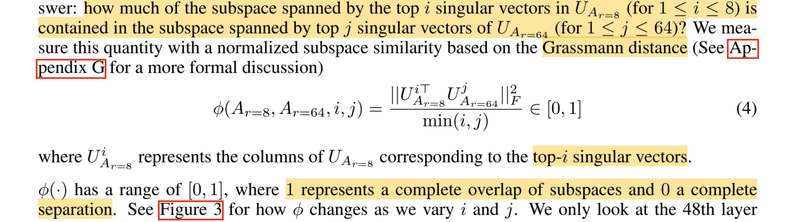
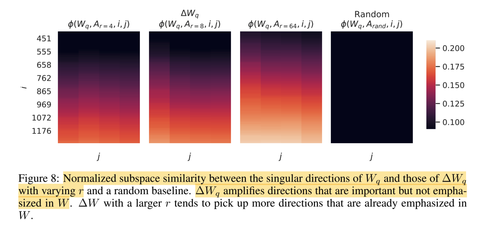



## 一、概述

**LoRA**（Low-Rank Adaptation，低秩适配器）是目前非常热门的大模型微调技术之一，网上已经有许多关于其原理的分析和讲解，本文将着重从 LoRA 背后的数学原理进行解读。

## 二、背景介绍

### 2.1 基本概念

**大模型微调（Fine-tuning）**：基于已经训练好的预训练模型，针对特定的下游任务，在特定领域的数据集上进行二次训练，以提升模型在特定任务上的表现。

- **全量微调**：在下游任务的训练中，对预训练模型的每一个参数都做更新（训练代价昂贵）；
- **局部微调**：冻结（不更新）预训练模型的权重，只对部分增量权重进行训练，从而有效降低训练的代价（实用性更高）。

### 2.2 研究现状

在 LoRA 微调技术出现之前，现有的大模型微调技术存在以下缺点：

- **Adapter Tuning**：在模型中添加额外的 Adapter 层，并只针对这些 Adapter 的权重进行训练。这将导致模型整体的层数变深，从而使模型的训练/推理耗时增加（因为新增的 Adapter 层与模型中的其它层是串行的，无法充分利用硬件能力进行并行计算）；
- **Prefix Tuning**：对输入数据增加前缀（prefix），并只针对这些 prefix token 进行训练（prefix 的作用是引导模型提取输入中的特定信息，进而更好地生成结果）。这将导致输入数据中有效信息的减少，因为一般输入数据的长度是固定的，而增加的 prefix 将会占用原本输入数据的空间，从而使输入文字表达力下降。

## 三、LoRA 基本原理

### 3.1 LoRA 模型结构

LoRA 使用 \\(\mathbf{A}\\) 和 \\(\mathbf{B}\\) 两个与原模型并行的低秩矩阵来代替原本的增量权重矩阵 \\(\mathbf{\Delta W}\\)，从而可以在保证模型性能的同时，有效降低需要训练的参数量。

对于输入 \\(\mathbf{x}\\)，模型的输出 \\(\mathbf{h}\\) 为：

$$
\mathbf{h} = \mathbf{W}\mathbf{x} + \mathbf{\Delta W}\mathbf{x} \approx \mathbf{W}\mathbf{x} + \mathbf{B}\mathbf{A}\mathbf{x}
$$

其中 \\(\mathbf{W}、\mathbf{\Delta W} \in \mathbb{R}^{d \times d}\\)，\\(\mathbf{A} \in \mathbb{R}^{r \times d}\\)（初始化为正态分布），\\(\mathbf{B} \in \mathbb{R}^{d \times r}\\)（初始化为零），\\(r\\) 为矩阵 \\(\mathbf{\Delta W}\\) 的秩。

### 3.2 LoRA 的优点

- **节约内存**：在训练时，需要更新的权重数量从 \\(d \times d\\) 下降到了 \\(2 \times d \times r\\)，显著降低了模型微调对硬件性能的要求；
- **保证性能**：在推理时，可以将 LoRA 的权重直接合并到预训练权重中，从而可以保证推理的速度不受影响；
- **灵活易用**：针对不同的下游任务，用户可以训练不同的 LoRA，并且在微调完成后，只需要保存新增的这一部分权重（不同任务间共享预训练模型的权重），相比于存储整个模型的权重，只需要极少的内存。

## 四、LoRA 的数学原理与论文实验分析

简单介绍完了 LoRA 的基本原理，下面将针对以下几个问题进行分析和说明，这些问题也是我在刚开始学习 LoRA 时产生的疑惑。

- 为什么可以将 \\(\mathbf{\Delta W}\\) 拆分为 \\(\mathbf{A}\\) 和 \\(\mathbf{B}\\)？这样做为什么是有效的？
- \\(r\\) 作为一个超参数，它的取值是如何影响 LoRA 的表现的？
- \\(\mathbf{A}\\) 和 \\(\mathbf{B}\\) 为什么要这样初始化？

### 4.1 SVD 定理

**为什么可以将 \\(\mathbf{\Delta W}\\) 拆分为 \\(\mathbf{A}\\) 和 \\(\mathbf{B}\\)？这样做为什么是有效的？**

在回答这个问题之前，我们需要先了解一个基本概念——**SVD（Singular Value Decomposition，奇异值分解）**。

对于一个非零的 \\(m \times n\\) 实矩阵 \\(\mathbf{M} \in \mathbb{R}^{m \times n}\\)，我们可以将其表示为以下三个实矩阵乘积形式的运算：

$$
\mathbf{M} = \mathbf{U}\mathbf{Σ}\mathbf{V}^{T}
$$

其中 \\(\mathbf{U}\\) 是 \\(m\\) 阶正交矩阵，\\(\mathbf{V}\\) 是 \\(n\\) 阶正交矩阵，\\(\mathbf{Σ}\\) 是由降序排列的对角线元素组成的 \\(m \times n\\) 矩形对角矩阵。

$$
\mathbf{Σ} = diag(\sigma\_{1}, \sigma\_{2}, ..., \sigma\_{p}) \\\
\sigma\_{1} \geq \sigma\_{2} \geq ... \geq \sigma\_{p} \geq 0
$$

\\(\mathbf{U}\mathbf{Σ}\mathbf{V}^{T}\\) 称为矩阵 \\(\mathbf{M}\\) 的奇异值分解，\\(\sigma\_{i}\\) 称为矩阵 \\(\mathbf{M}\\) 的奇异值，\\(\mathbf{U}\\) 的列向量称为左奇异向量，\\(\mathbf{V}\\) 的列向量称为右奇异向量。

> “正交矩阵”：
>
> - 每两行/列之间互相正交（线性无关），且都是单位向量；
> - 是方阵；
> - 元素都是实数；
> - 其转置矩阵同时也是其逆矩阵。

矩阵 \\(\mathbf{M}\\) 的奇异值分解一定存在，但不一定唯一。

上面的矩阵分解方式又叫做**完全奇异值分解**，而实际中更加常用的则是其紧凑形式和截断形式。

**紧奇异值分解：**

设有 \\(m \times n\\) 实矩阵 \\(\mathbf{M}\\)，其秩为 \\(r\\)，则有紧奇异值分解为：

$$
\mathbf{M} = \mathbf{U}\_{r}\mathbf{Σ}\_{r}\mathbf{V}^{T}\_{r}
$$

其中 \\(\mathbf{U}\_{r}\\) 是 \\(m \times r\\) 矩阵，\\(\mathbf{V}\_{r}\\) 是 \\(n \times r\\) 矩阵，\\(\mathbf{Σ}\_{r}\\) 是 \\(r\\) 阶对角矩阵。矩阵 \\(\mathbf{U}\_{r}\\) 由完全奇异值分解中 \\(\mathbf{U}\\) 的前 \\(r\\) 列构成，矩阵 \\(\mathbf{V}\_{r}\\) 由完全奇异值分解中 \\(\mathbf{V}\\) 的前 \\(r\\) 列构成，矩阵 \\(\mathbf{Σ}\_{r}\\) 由完全奇异值分解中 \\(\mathbf{Σ}\\) 的前 \\(r\\) 个对角线元素构成。

**截断奇异值分解：**

与“紧奇异值分解”类似，只不过这里只保留最大的 \\(k\\) 个奇异值（\\(k < r\\)）及其对应的奇异向量，有：

$$
\mathbf{M} \approx \mathbf{U}\_{k}\mathbf{Σ}\_{k}\mathbf{V}^{T}\_{k}
$$

在实际应用中，常常需要对矩阵的数据进行压缩，将其近似表示，奇异值分解提供了一种方法。**奇异值分解是在平方损失（弗罗贝尼乌斯范数）意义下对矩阵的最优近似**。紧奇异值分解对应着无损压缩，截断奇异值分解对应着有损压缩。

因此，SVD 的原理告诉我们，**可以用低秩矩阵来近似地表达原矩阵**。

> “弗罗贝尼乌斯范数”：
> $$
> \lVert A \rVert\_{F} = \bigg( \sum\_{i = 1}^{m}\sum\_{j = 1}^{n} (a\_{ij})^{2} \bigg)^{\frac{1}{2}}, \mathbf{A} \in \mathbb{R}^{m \times n}
> $$
> “奇异值分解在统计中的主要应用为主成分分析（PCA）。数据集的特征值（在 SVD 中用奇异值表征）按照重要性排列，降维的过程就是舍弃不重要的特征向量的过程，而剩下的特征向量张成空间为降维后的空间。”

具体地，在 LoRA 中，将矩阵 \\(\mathbf{U}\\) 和 \\(\mathbf{Σ}\\) 合并为了一个矩阵 \\(\mathbf{B} \in \mathbb{R}^{m \times k}\\)，将矩阵 \\(\mathbf{V}^{T}\\) 表示为了矩阵 \\(\mathbf{A} \in \mathbb{R}^{k \times n}\\)，从而可以用更少的数据量来表示矩阵 \\(\mathbf{\Delta W}\\)。

在实际微调中，由于事先并不知道矩阵 \\(\mathbf{\Delta W}\\) 中具体的值（除非我们先全参微调一遍，但是这样的话就没必要用 LoRA 了），我们无法直接计算出 \\(\mathbf{\Delta W}\\) 的 SVD 分解结果，因此论文作者将秩 \\(r\\) 作为一个超参数，并让模型在训练中自己去学习矩阵 \\(\mathbf{A}\\) 和 \\(\mathbf{B}\\) 的值。

### 4.2 论文实验分析

#### 4.2.1 实验一：不同微调方法的效果对比

在论文中，作者将 LoRA 与其它微调方法在多种场景下的表现进行了对比，如下图所示：

**实验结论：LoRA 在显著降低了微调参数量的同时，还能在大部分场景下保证最优的性能。**

#### 4.2.2 实验二：不同 \\(r\\) 对微调效果的影响

**\\(r\\) 作为一个超参数，它的取值是如何影响 LoRA 的表现的？**

作者对比了当 \\(r\\) 取不同值时，对模型不同的层应用 LoRA 的效果，如下图所示：

可以看出：

- 当我们同时对 \\(\mathbf{W}\_{q}\\) 和 \\(\mathbf{W}\_{v}\\) 应用 LoRA 时，哪怕取了一个很小的 \\(r=1\\)，其效果也超过了单独对 \\(\mathbf{W}\_{q}\\) 应用 LoRA 且 \\(r=64\\) 时的表现；
- 在同一行（同样的 Weight Type）内，取 \\(r=1\\) 与 \\(r=64\\) 的结果差异不大。

**实验结论：增量权重矩阵 \\(\mathbf{\Delta W}\\) 的秩可能很小，因此我们能够用秩很小的两个矩阵来近似表达该矩阵。**

到此为止还没完，作者还做了更进一步的实验，来证明 LoRA 这种分解方式的有效性。 **(´･\_･`)**

#### 4.2.3 实验三：\\(\mathbf{\Delta W}\\) 的左奇异矩阵 \\(\mathbf{U}\\) 不同子空间的相似度对比

作者对比了 \\(\mathbf{U}\_{A\_{r=8}}\\) 和 \\(\mathbf{U}\_{A\_{r=64}}\\) 不同维度子空间的相似度，其中 \\(\mathbf{U}\_{A\_{r=8}}\\) 为 \\(r=8\\) 时矩阵 \\(\mathbf{A}\\) 的左奇异矩阵，\\(\mathbf{U}\_{A\_{r=64}}\\) 同理。

子空间相似度的计算方式：

> 这里的 \\(\lVert ... \rVert\_{F}\\) 为上面提到的“弗罗贝尼乌斯范数”。

实验结果如下图所示（图 3 和图 4 分别为图 1 和图 2 的左下角部分）：

这个图可能比较难理解，下面举例进行说明：

当 \\(i=1\\) 时，\\(j\\) 从 \\(1\\) 取到 \\(64\\)，发现颜色都比较浅（相似度高），说明当 \\(r=8\\) 时，\\(\mathbf{\Delta W}\\) 分解出的矩阵 \\(\mathbf{A}\_{r=8}\\) 的左奇异矩阵 \\(\mathbf{U}\_{A\_{r=8}}\\) 的第一个左奇异向量表示的特征（或者说信息）与 \\(\mathbf{A}\_{r=64}\\) 的前 64 个左奇异向量组成的子空间表示的特征重合度很高，即**高秩矩阵（\\(r=64\\)）的大部分信息都已经包含在了低秩矩阵（\\(r=8\\)）的前几维子空间中**。

**实验结论：越靠前的奇异向量（奇异值按降序排序）包含的信息越多（或者说越重要），不管 \\(r\\) 取多大，前几维（如 \\(r<8\\)）子空间表示的信息都是差不多的，越后面（如 \\(8<r<64\\)）的子空间包含的有效信息越少，噪声越多，再次证明了用低秩矩阵近似表达高秩矩阵的有效性**。

#### 4.2.4 实验四：\\(\mathbf{\Delta W}\\) 与 \\(\mathbf{W}\\) 不同子空间的相似度对比

与实验三类似，作者还比较了 \\(\mathbf{\Delta W}\\) 与 \\(\mathbf{W}\\) 不同维度子空间的相似度，如下图所示：

其中，\\(i\\) 表示使用预训练权重矩阵 \\(\mathbf{W}\\) 的前 \\(i\\) 个左奇异向量组成的子空间，\\(j\\) 表示使用 \\(\mathbf{\Delta W}\\) 的前 \\(j\\) 个左奇异向量组成的子空间（\\(j \leq r\\)）。

可以看出，\\(\mathbf{W}\\) 中靠前（靠上）的奇异向量组成的子空间与 \\(\mathbf{\Delta W}\\) 的子空间相似度并不高，反而是 \\(\mathbf{W}\\) 中最后的一些奇异向量与 \\(\mathbf{\Delta W}\\) 中的奇异向量有较高的相似度。

**实验结论：\\(\mathbf{\Delta W}\\) 中学习到的特征都是原来预训练权重矩阵中没有被强调的部分，说明 \\(\mathbf{\Delta W}\\) 能够有效学习到针对特定下游任务、区别于原特征的新特征，证明了 LoRA 在微调方面的有效性。**

> 说明：这里只挑了论文中我比较感兴趣的几个实验来进行分析，对于论文中的其它实验，感兴趣的读者可以自行阅读论文进行了解。

### 4.3 缩放因子 \\(\alpha\\)

LoRA 引入了一个超参数 \\(\alpha\\)，可以看作是学习率，同时也代表了 LoRA 对从特定下游任务学习而来的特征的放大程度，有：

$$
\mathbf{h} = \mathbf{W}\mathbf{x} + \mathbf{\Delta W}\mathbf{x} \approx \mathbf{W}\mathbf{x} + \frac{\alpha}{r}\mathbf{B}\mathbf{A}\mathbf{x}
$$

在实际微调中，一般先随机设置一个 \\(r\\)，并让 \\(\alpha = r\\)，然后保持 \\(\alpha\\) 不变，通过不断调整 \\(r\\) 的值来调整微调的效果。

## 五、参考资料

- [<u>LoRA: Low-Rank Adaptation of Large Language Models</u>](https://arxiv.org/abs/2106.09685)
- [<u>《统计学习方法》</u>](https://book.douban.com/subject/33437381/)
- [<u>图解大模型微调系列之：大模型低秩适配器 LoRA（原理篇）</u>](https://zhuanlan.zhihu.com/p/646831196)
