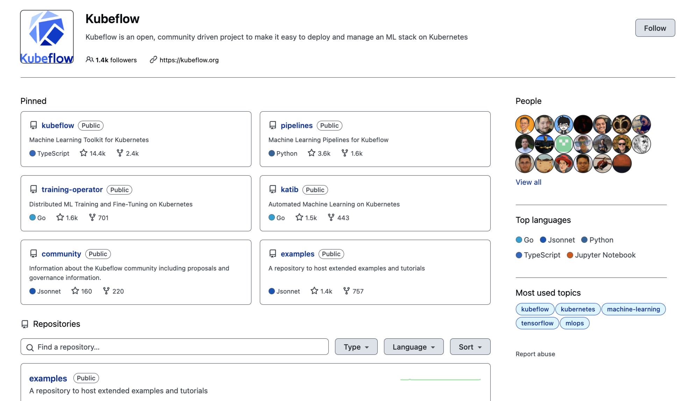

## 一、大模型开发全流程

当我们训练大模型时，一般会经过 **pre-training** 和 **post-training** 两个阶段。其中，pre-training 阶段一般会先使用海量数据来训练 base 大模型，再通过增量预训练来为模型注入领域知识；而 post-training 阶段则主要包括监督微调和偏好对齐两个步骤，使我们训练的大模型能够更好地适应某些特定的任务，并符合人类的表达习惯和价值观。


**pre-training：**

- **预训练（Pre-Training）**：利用海量数据、大量算力通过无监督训练得到基座模型。预训练后的模型具备强大的语言生成能力，但由于它主要是无监督训练的结果，可能不会直接适应具体的任务（如问答、对话），需要进一步的微调；
- **增量预训练（Continued Pre-Training）**: 一般垂直大模型是基于通用基座大模型进行二次的训练，为了给模型注入领域知识，就需要用领域内的语料进行继续预训练。

**post-training：**

- **监督微调（Supervised Fine-Tuning, SFT）**：这一阶段是对基座模型进行微调，让模型能够适用于特定任务；
- **偏好对齐（Reinforcement Learning from Human Feedback, RLHF）**：这一阶段通过引入人类反馈进一步优化模型的生成质量，使其生成的回答更符合用户的期望和人类的价值观（对齐人类偏好）。由于直接从人类获取反馈的成本较高，通常会先训练一个奖励模型（Reward Model，RM）来代替人类打分，这样可以在 RL 的框架下实现大规模的自动优化。

了解了大模型开发的整体流程，下面将重点对大模型微调相关的知识进行介绍。

## 二、什么是大模型微调

大模型微调一般指的是监督微调（SFT），即使用特定下游任务的数据继续训练“预训练模型（基座模型）”，使得模型能够满足特定下游任务的性能标准。

**示例一：将大模型微调为一个可以将德语翻译为英语的模型。**

我们需要使用大量输入为德语、输出为英语的带标签数据来训练 base 大模型，这样经过微调后的大模型就可以很好地用于将德语翻译为英语的任务。


**示例二：开源模型为了能够直接使用，一般会提供经过问答任务微调的版本，即 Chat 模型。**


## 三、为什么需要大模型微调

- **提升特定任务表现**：预训练模型虽然具有广泛的语言理解能力，但在特定任务（如情感分析、问答系统、机器翻译等）上的表现可能不尽如人意。通过在特定任务的数据上进一步训练，使模型能够更好地理解和执行该任务；
- **领域适应性**：预训练模型可能在一些通用领域表现良好，但在特定领域（如医学、法律、金融等）中可能难以准确理解专业术语和内容结构。通过微调，可以让模型更好地适应这些领域的语言特点，提高在这些领域中的应用效果；
- **数据稀缺性**：对于一些数据稀缺的任务或领域，获取大量标签数据可能比较困难。微调允许在有限的数据集上进行有效训练，从而在数据稀缺的情况下也能取得较好的性能；
- **防止过拟合**：预训练过程中模型可能会过度拟合于无监督学习的任务（如下一个词预测），而在特定任务中表现不佳。通过微调，可以让模型专注于特定任务的数据，这有助于减少过拟合的风险，提高模型在该任务上的泛化能力；
- **成本效益**：与使用 prompt 来引导模型行为相比，微调通常可以更高效地优化模型的表现。微调后的模型通常可以更直接地执行任务，减少了对复杂提示的依赖。同时，微调可以在更小的模型上实现类似于大型模型的性能，从而降低推理的计算成本和延迟，比如与使用通用的 GPT-3.5 模型相比，经过微调的小型模型（如LLaMA-7B）在成本效益上可能更具优势，尤其是在特定任务的执行上。

## 四、大模型微调的方法有哪些

整体上，根据微调参数量的不同，大模型微调的方法可以分为以下两类：

- **全量参数微调（Full Fine-tuning，FFT）**：对预训练模型的所有参数进行更新，训练速度较慢，消耗机器资源较多；
- **参数高效微调（Parameter-Efficient Fine-Tuning，PEFT）**：只对部分参数进行更新，训练速度快，消耗机器资源少。

此外，还有一种不需要更新模型权重就可以完成微调的方法，叫做 **In-Context Learning**，通过在输入的 prompt 中提供与任务相关的上下文和例子，从而让模型能够更好地了理解我们的意图。

**最新进展**：

在 OpenAI 最新的发布会中，还提出了一种叫做 **RFT（Reinforcement Fine-Tuning）** 的微调技术，能够以奖励驱动的方式不断完善大模型所掌握的知识，更多细节可以参考这篇文章：[<u>What Is OpenAI's Reinforcement Fine-Tuning?</u>](https://www.datacamp.com/blog/reinforcement-fine-tuning)。

### 4.1 FFT 的优缺点

**优点：**

- **提升特定任务性能**：全参微调可以对所有模型参数进行优化，从而在某些任务上获得更好的性能。

**缺点：**

- **训练成本高**：全参微调所需要计算的参数量与预训练相同，随着模型规模变得越来越大，这使得在消费级硬件上进行全量微调变得不可行；
- **灾难性遗忘**：用特定训练数据去微调可能会把这个领域的表现变好，但也可能会把原来表现好的别的领域的能力变差。

### 4.2 PEFT 的优缺点

**优点：**

- **降低训练成本**：减少计算消耗，缩短训练时间，降低对硬件性能的要求；
- **保证模型性能**：针对特定下游任务，能够在一定程度上保证模型的表现和性能；
- **节省存储空间**：降低存储占用，大部分的参数都可以在不同任务之间共享，只需额外保存经过不同任务微调后更新的参数。

**缺点：**

- **特定任务性能有限**：可能无法达到全参数微调在某些特定任务上的性能水平。

因此，在实际应用中，我们应该根据具体任务的要求和可用资源情况，在服务效率和模型质量之间做出权衡。对于资源有限或对训练时间有严格要求的场景，使用 PEFT 会是一个比较好的选择；而对于需要最佳性能的任务，使用 FFT 可能会更加合适。

### 4.3 PEFT 的分类

- **Addition-based methods**：在预训练模型的基础上，新增参数或网络层，并只对这些新增的参数进行训练和更新；
  - **Adapters**：在 transformer 中的 attention 和 ffn 层后增加 Adapter；
  - **Soft Prompts**：
    - **Soft Prompt Tuning**：为输入的 embedding 增加可训练的 soft prompt 参数；
    - **Prefix Tuning**：为 transformer 的输入增加可训练的 prefix 参数；
- **Selective methods**：通过一定的算法和策略，选择预训练模型中的部分参数进行训练和更新；
- **Reparametrization-based methods**：利用低秩矩阵来近似地表达预训练模型需要更新的参数；
  - **LoRA**；
  - **QLoRA**；
  - **DLoRA**；
  - **LongLoRA**；
  - **GLoRA**；
  - **AdaLoRA**；
  - **LoRA-FA**；
  - **VeRA**；
  - **Delta-LoRA**；
  - **LoRA+**；
  - **LoRA-drop**；
  - ……
- **Hybrid methods**：根据实际情况，可以对上述方法进行组合，从而达到更好的效果。

目前比较主流的几种参数高效微调方法包括：Prompt Tuning、Prefix Tuning、LoRA、QLoRA 等。

论文[<u>《Scaling Down to Scale Up: A Guide to Parameter-Efficient Fine-Tuning》</u>](https://arxiv.org/abs/2303.15647)中展示了各类参数高效微调方法及其所属的类别，如下所示：


该论文中还对比了各类参数高效微调方法的表现和性能，如下所示：


## 五、各类微调方法的原理是什么

### 5.1 In-Context Learning

**核心原理：**

当我们无法直接获取到模型并修改其权重（比如：直接通过 API 或用户接口访问模型）时，就可以使用 In-Context Learning 的方式来让模型更好地适应于特定的任务。

In-Context Learning 通过在输入的 prompt 中提供与任务相关的上下文和例子，从而让模型能够基于我们提供的上下文，更好地生成我们期望得到的结果。

> "Based on intuition from prompting, we believe that having a proper context can steer the LLM without changing its parameters."

**示例：将大模型微调为一个可以将德语翻译为英语的模型。**

我们在输入的上下文中给出一些将德语翻译为英语的例子，然后再输入一句德语，这样模型就能更好地理解我们的意图，知道现在要做的是将输入的德语翻译为对应的英语。


**优点：**

- 当我们没有足够的带标签数据用于监督微调时，通过 In-Context Learning，只需少量的样例，就能提升模型对于特定任务的表现；
- 当我们无法直接获取到模型并修改其权重时，通过 In-Context Learning，无需额外对模型进行微调，就可以快速地进行尝试和验证。

**缺点：**

- 相比于直接更新模型的权重进行微调，In-Context Learnin 的效果有限，模型在特定任务上的表现上不如 FFT 和 PEFT。

### 5.2 Soft Prompt Tuning

**核心原理：**

Soft Prompt Tuning 可以看作是 Prefix Tuning 的简化版本，它给每个任务定义了自己的 soft prompt，并将其拼接到数据上作为输入（在输入 embedding 层加入一段定长的可训练的向量，在微调的时候只更新 soft prompt 这部分的参数）。

示例代码：

```python
x = EmbeddingLayer(input_ids)
x = concatenate([soft_prompt_tensor, x], dim=seq_len)
output = model(x)
```

> 其中，`soft_prompt_tensor` 具有与 embedded inputs 同样的特征维度，将两者拼接过后，就相当于是增加了输入的长度。

### 5.3 Prefix Tuning

**核心原理：**

Prefix Tuning 通过对输入数据增加前缀（prefix）来做微调，即在输入 token 之前构造一段任务相关的 virtual tokens 作为 prefix，训练的时候只更新 prefix 这部分的参数，每个下游任务都可以单独训练一套 prefix token。


示例代码：

```python
def transformer_block_with_prefix(x):
    soft_prompt = FullyConnectedLayers(soft_prompt)  # prefix
    x = concatenate([soft_prompt, x], dim=seq_len)
    x = SelfAttention(x)
    x = LayerNorm(x + residual)
    residual = x
    x = FullyConnectedLayers(x) 
    x = LayerNorm(x + residual)
    return x
```

**为什么增加 prefix 可以影响模型生成的结果？**

感性地理解一下，prefix 的作用是引导模型提取输入中的特定信息，进而更好地生成结果。


另外，我们还可以针对不同的下游任务，训练不同的 prefix 并对其进行保存。这样当我们需要切换不同的下游任务时，只需要加载不同的 prefix 参数，就可以实现模型功能的快速切换。


**缺点：**

- 微调的效果存在上限，模型的表现并不一定会随着 prefix 长度的增加而提高；
- 由于模型的输入长度一般是固定的，而增加了 prefix 之后，留给原始文字数据的空间就少了，因此可能会降低原始文字中 prompt 的表达能力。

### 5.4 Adapter Tuning

**核心原理：**

Adapter Tuning 通过在 transformer 中的 multi-head self-attention 和 fully connected layers 后增加 Adapter 进行微调。其中，Adapter 中的第一个 fully connected layer 将高维的输入映射为了一个低维的表示，第二个 fully connected layer 再将其映射回高维的空间中，这样就能有效降低训练时需要更新的参数量。

微调时，只更新 Adapter 部分的权重，原模型的参数是冻结的。


> 注意：新增的 Adapter 与原模型中的层是顺序串行的关系。

示例代码：

```python
def transformer_block_with_adapter(x):
    residual = x
    x = SelfAttention(x)
    x = FullyConnectedLayers(x)  # Adapter
    x = LayerNorm(x + residual)
    residual = x
    x = FullyConnectedLayers(x)
    x = FullyConnectedLayers(x)  # Adapter
    x = LayerNorm(x + residual)
    return x
```

**缺点：**

- 添加了 Adapter 后，模型整体的层数变深，会拖慢模型训练和推理的速度。

**小结：**

- FFT 成本太高；
- Prefix Tuning 难训且会减少原始训练数据中的有效文字长度；
- Adapter Tuning 存在训练和推理延迟。
  
为了解决以上问题，LoRA 系列微调方法便应运而生了。

### 5.5 LoRA

关于 LoRA（Low-Rank Adaptation，低秩适配器）的相关原理，请参考我之前写的这篇文章：



### 5.6 QLoRA

**核心原理：**

QLoRA（Quantized LoRA）的核心工作其实是模型量化，通过将预训练模型进行 NF4 量化，再结合 LoRA 的方式进行微调，可以大幅减少训练时显存的占用。


QLoRA 有一个 NF4 的存储数据类型和 BF16 的计算数据类型。在进行前向和反向传播时，我们需要将存储数据类型反量化为计算数据类型，但是计算梯度时我们只计算添加的适配器的梯度，这一点和 LoRA 是一致的。

- 预训练模型的参数：进行 NF4 量化；
- LoRA 的参数：保持 BF16 的精度。

**核心工作：**

- **四位标准浮点数量化（4-bit Normal Float Quantization）**：结合了分位数量化和分块量化；
- **双重量化（Double Quantization）**：对模型进行了两次量化，其中第二次量化只作用在第一次量化产生的量化常数上，可以进一步节约显存占用；
- **分页优化（Paged Optimizer）**：使用 CPU 内存代替 GPU 显存保存部分梯度参数。

**优缺点：**

- 优点：显存占用下降。由于原模型参数经过了量化，在计算时占用的内存减少了；
- 缺点：训练时间增加。由于引入了量化和反量化的计算过程，在训练时需要消耗更多的时间。

**量化分位数的计算：**

1. 根据每个块的特征的绝对值的最大值，我们为每个块保存一个量化常数（每个块中的特征取绝对值后的最大值）；
2. 计算每个张量的量化值（实际值/该块的量化常数）；
3. 在 Q（normal_map）中找到与每个张量最接近的值，并将其量化为该值对应的索引值。

`normal_map` 的计算：

```python
from scipy.stats import norm
import torch

def create_normal_map(offset=0.9677083, use_extra_value=True):
    if use_extra_value:
        # one more positive value, this is an asymmetric type
        v1 = norm.ppf(torch.linspace(offset, 0.5, 9)[:-1]).tolist() # 正数部分
        v2 = [0]*(256-15) ## we have 15 non-zero values in this data type
        v3 = (-norm.ppf(torch.linspace(offset, 0.5, 8)[:-1])).tolist() #负数部分
        v = v1 + v2 + v3
    else:
        v1 = norm.ppf(torch.linspace(offset, 0.5, 8)[:-1]).tolist()
        v2 = [0]*(256-14) ## we have 14 non-zero values in this data type
        v3 = (-norm.ppf(torch.linspace(offset, 0.5, 8)[:-1])).tolist()
        v = v1 + v2 + v3

    values = torch.Tensor(v)
    values = values.sort().values
    values /= values.max()
    assert values.numel() == 256
    return values


Q = create_normal_map()
# Q = [-1.0, -0.6961928009986877, -0.5250730514526367, -0.39491748809814453, -0.28444138169288635, -0.18477343022823334, -0.09105003625154495, 0.0, 0.07958029955625534, 0.16093020141124725,0.24611230194568634, 0.33791524171829224, 0.44070982933044434, 0.5626170039176941, 0.7229568362236023, 1.0]
```

**示例：**

假设一个张量有 16 个值，被分成了 4 块：

```python
input_blocked_tensor = [[-1.28645003578589, -1.817660483275528, 9.889441349505042, 0.010208034676132627],
                        [-15.009014631551885, 1.4136255086268115, -7.815595761491153, 10.766760590950263], 
                        [-0.731406153917959, 3.468224595908726, 2.445252541840315, -8.970824523299282], 
                        [-9.641638854625175, 7.696158363188889, -5.323939281255154, 5.97160401402024]]
```

根据每个块的特征的绝对值的最大值，我们为每个块保存一个量化常数，它的计算方式是每个块中特征的绝对值中最大的那个：

```python
c1 = max(|-1.28645003578589|, |-1.817660483275528|, |9.889441349505042|, |0.010208034676132627|) = 9.889441349505042
c2 = max(|-15.009014631551885|, |1.4136255086268115|, |-7.815595761491153|, |10.766760590950263|) = 15.009014631551885
c3 = max(|-0.731406153917959|, |3.468224595908726|, |2.445252541840315|, |-8.970824523299282|) = 8.970824523299282
c4 = max(|-9.641638854625175|, |7.696158363188889|, |-5.323939281255154|, |5.97160401402024|) = 9.641638854625175
```

计算张量的量化值：例如第一个值 `-1.28645003578589`，它除以这个块的量化常数 `c1` 后得到 `-0.13008318572517502`，我们可以在 `Q` 中找到与它最接近的值是 `-0.09105003625154495`，这个值在 `Q` 中对应的索引是 `6`，因此这个值被量化后的值是 `6`。

```python
Q = [-1.0, -0.6961928009986877, -0.5250730514526367, -0.39491748809814453,
     -0.28444138169288635, -0.18477343022823334, -0.09105003625154495, 0.0,
     0.07958029955625534, 0.16093020141124725,0.24611230194568634, 0.33791524171829224,
     0.44070982933044434, 0.5626170039176941, 0.7229568362236023, 1.0]
```

同理我们可以得到这个输入张量所有的值量化后的结果：

```python
[[6, 5, 15, 7],
 [0, 8, 2, 14],
 [6, 11, 10, 0],
 [0, 14, 2, 13]]
```

在模型保存时，除了要保存量化后的值，我们还要保存每个块对应的量化常数，因为这个值在我们进行反量化时需要用到。

在反量化时，我们以量化结果作为索引，从 `Q` 中查找到它对应的分位数，再乘以为每个块保存的量化常数 `ci`，便可以得到最终结果。

```python
[[-0.9004339933799617, -1.8273060011889755, 9.889441349505042, 0.0],
 [-15.009014631551885, 1.1944218804231184, -7.880829111886221, 10.850869732860506],
 [-0.816793898052648, 3.0313783372030603, 2.2078302737800004, -8.970824523299282],
 [-9.641638854625175, 6.970488722350373, -5.062564734402345, 5.424549965245643]]
```

**解决了什么问题？**

如果我们粗暴的使用 round 操作去映射到低精度的更近的值，我们可能造成大量的数据都被量化到同一个数上，这样特征之间的差异性在量化过程中就被丢失了。使用分位数将张量分成了大小相同的若干个块，这样我们得到更加均匀的量化特征，这也就是分位数量化。每两个分位数的中点便是模型量化到这个区间映射的值。

**双重量化：**

QLoRA 的双重量化是指对量化常数再做一次 8 bit 的量化，在进行量化常数的量化时，QLoRA 以每 256 个量化常数为一组再做一次量化。在进行反量化时我们也需要进行两次反量化才能把量化后的值还原。

好处：减少了存储量化常数带来的额外显存占用。

**分页优化：**

QLoRA 的分页优化其实就是当显存不足时，将保存的部分梯度检查点转移到 CPU 内存上，和计算机的内存数据转移到硬盘上的常规内存分页一个道理。

### 5.7 总结

**How to use and finetune pre-trained LLMs?**

总结一下，当我们经过预训练得到 base 大模型之后，还需要进行以下操作：

1. **增量预训练**：注入领域知识；
2. **监督微调**：适配特定下游任务（各类微调方法百花齐放）；
3. **偏好对齐**：使模型生成的结果符合人类偏好。


<!--

## 六、大模型微调的框架有哪些

- **huggingface/transformers**：提供了丰富的预训练模型和微调工具，支持大多数主流的 NLP 任务（如文本分类、序列标注、生成任务等），适合进行快速实验和生产部署；
- **huggingface/peft**：huggingface 开源的微调基础工具；
- **modelscope/ms-swift**：modelscope 开源的轻量级微调框架，以中文大模型为主，支持各类微调方法；可以通过执行脚本进行微调，也可以在代码环境中一键微调；自带微调数据集和验证数据集，可以一键完成微调和验证；
- **hiyouga/LLaMA-Factory**：全栈微调工具，支持海量模型和各种主流微调方法；支持通过脚本微调、基于 Web 端微调（使用简单）；自带基础训练数据集；除微调外，支持增量预训练和全量微调；
- **NVIDIA/Megatron-LM**：NVIDIA 开发的大模型训练框架，支持大规模的预训练和微调，适用于需要极高性能和规模的大模型训练和微调。

**总结：**

- 快速实验选择 transformers；
- 普通规模选择 LLaMA-Factory；
- 超大规模选择 Megatron-LM。

## 七、如何在生产环境中进行微调

### 7.1 微调实践

**整体架构和组件：**


- **Helm Char**：管理集群和训练配置；
- **PyTorchJob（with multiple workers）**：执行微调（分布式训练）；
- **PVC（Persistent Volume Claim）**：存储训练数据和模型数据；
- **Secret**：管理鉴权相关配置；
- **Data Access Pod**：……。

以上实践案例是基于 Kubeflow 提供的平台和组件进行实现的，下面将对 Kubeflow 进行介绍。

### 7.2 Kubeflow

**整体介绍：**

> "Kubeflow is a community and ecosystem of open-source projects to address each stage in the machine learning (ML) lifecycle with support for best-in-class open source tools and frameworks. Kubeflow makes AI/ML on Kubernetes simple, portable, and scalable."



Kubeflow 包括：

- **Kubeflow Platform**：AI 模型开发部署全流程工作平台；
- **Standalone Kubeflow Components**：可独立使用的各类组件。

Kubeflow Platform：

> "The Kubeflow Platform refers to the full suite of Kubeflow components bundled together with additional integration and management tools. Using Kubeflow as a platform means deploying a comprehensive ML toolkit for the entire ML lifecycle."

Standalone Kubeflow Components：

> "The Kubeflow ecosystem is composed of multiple open-source projects that address different aspects of the ML lifecycle. Many of these projects are designed to be usable both within the Kubeflow Platform and independently. These Kubeflow components can be installed standalone on a Kubernetes cluster. It provides flexibility to users who may not require the full Kubeflow Platform capabilities but wish to leverage specific ML functionalities such as model training or model serving."

Kubeflow Overview Diagram：


Kubeflow Ecosystem：


**使用 Kubeflow 进行微调：**

> "Once user executes train API, Training Operator creates PyTorchJob with appropriate resources to fine-tune LLM."
>
> "Storage initializer InitContainer is added to the PyTorchJob worker 0 to download pre-trained model and dataset with provided parameters."
>
> "PVC with ReadOnlyMany access mode attached to each PyTorchJob worker to distribute model and dataset across Pods."


> "The [<u>PyTorchJob</u>](https://www.kubeflow.org/docs/components/training/user-guides/pytorch/) is a Kubernetes custom resource to run PyTorch training jobs on Kubernetes. The Kubeflow implementation of the PyTorchJob is in the training-operator."

-->

## 六、参考资料

- [<u>Scaling Down to Scale Up: A Guide to Parameter-Efficient Fine-Tuning</u>](https://arxiv.org/abs/2303.15647)
- [<u>Prefix-Tuning: Optimizing Continuous Prompts for Generation</u>](https://arxiv.org/abs/2101.00190)
- [<u>LoRA: Low-Rank Adaptation of Large Language Models</u>](https://arxiv.org/abs/2106.09685)
- [<u>李航《统计学习方法》</u>](https://book.douban.com/subject/33437381/)
- [<u>QLoRA: Efficient Finetuning of Quantized LLMs</u>](https://arxiv.org/abs/2305.14314)
- [<u>浅谈 DeepLearning 的浮点数精度 FP32/FP16/TF32/BF16……</u>](https://medium.com/@averyaveavi/%E6%B7%BA%E8%AB%87deeplearning%E7%9A%84%E6%B5%AE%E9%BB%9E%E6%95%B8%E7%B2%BE%E5%BA%A6fp32-fp16-tf32-bf16-%E4%BB%A5llm%E7%82%BA%E4%BE%8B-9bfb475e50be)
- [<u>LongLoRA: Efficient Fine-tuning of Long-Context Large Language Models</u>](https://arxiv.org/abs/2309.12307)
- [<u>New LLM Pre-training and Post-training Paradigms</u>](https://magazine.sebastianraschka.com/p/new-llm-pre-training-and-post-training)
- [<u>Finetuning Large Language Models</u>](https://magazine.sebastianraschka.com/p/finetuning-large-language-models?utm_source=publication-search)
- [<u>Using and Finetuning Pretrained Transformers</u>](https://magazine.sebastianraschka.com/p/using-and-finetuning-pretrained-transformers?utm_source=publication-search)
- [<u>Practical Tips for Finetuning LLMs Using LoRA</u>](https://magazine.sebastianraschka.com/p/practical-tips-for-finetuning-llms?utm_source=publication-search)
- [<u>LLM 微调理论</u>](https://qiankunli.github.io/2023/10/29/llm_finetune_theory.html)
- [<u>GPT 是如何炼成的：大模型微调基础概念指北</u>](https://www.lixueduan.com/posts/ai/04-finetune-concept/)
- [<u>图解大模型微调系列之：大模型低秩适配器 LoRA（原理篇）</u>](https://zhuanlan.zhihu.com/p/646831196)
- [<u>图解大模型微调系列之：大模型低秩适配器 LoRA（源码解读与实操篇）</u>](https://zhuanlan.zhihu.com/p/654897296)
- [<u>图解 Fine-tuning：LoRA 系列微调技术概述</u>](https://zhuanlan.zhihu.com/p/990958034)
- [<u>QLoRA（Quantized LoRA）详解</u>](https://zhuanlan.zhihu.com/p/666234324)
- [<u>LongLoRA - 高效微调长上下文的 LLMs</u>](https://zhuanlan.zhihu.com/p/659226557)
- [<u>LLM 长 context 微调技巧 - LongLora</u>](https://zhuanlan.zhihu.com/p/658043624)
- [<u>LoRA、QLoRA、LoRA+、LongRA、DoRA、MaLoRA、GaLore方案都知道吗？</u>](https://zhuanlan.zhihu.com/p/8954237216)
- [<u>LLM 微调实践</u>](https://qiankunli.github.io/2024/07/28/llm_finetune_practice.html)
- [<u>Fine Tuning a LLM Using Kubernetes with Intel® Xeon® Scalable Processors</u>](https://huggingface.co/blog/dmsuehir/llama2-fine-tuning-k8s)
- [<u>How to Fine-Tune LLMs with Kubeflow</u>](https://www.kubeflow.org/docs/components/training/user-guides/fine-tuning/)
- [<u>LLM Fine-Tuning with Training Operator - Architecture</u>](https://www.kubeflow.org/docs/components/training/reference/fine-tuning/)
- [<u>LLM Fine-Tuning with the Training Operator</u>](https://www.kubeflow.org/docs/components/training/explanation/fine-tuning/)
