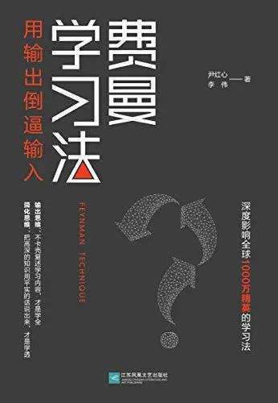
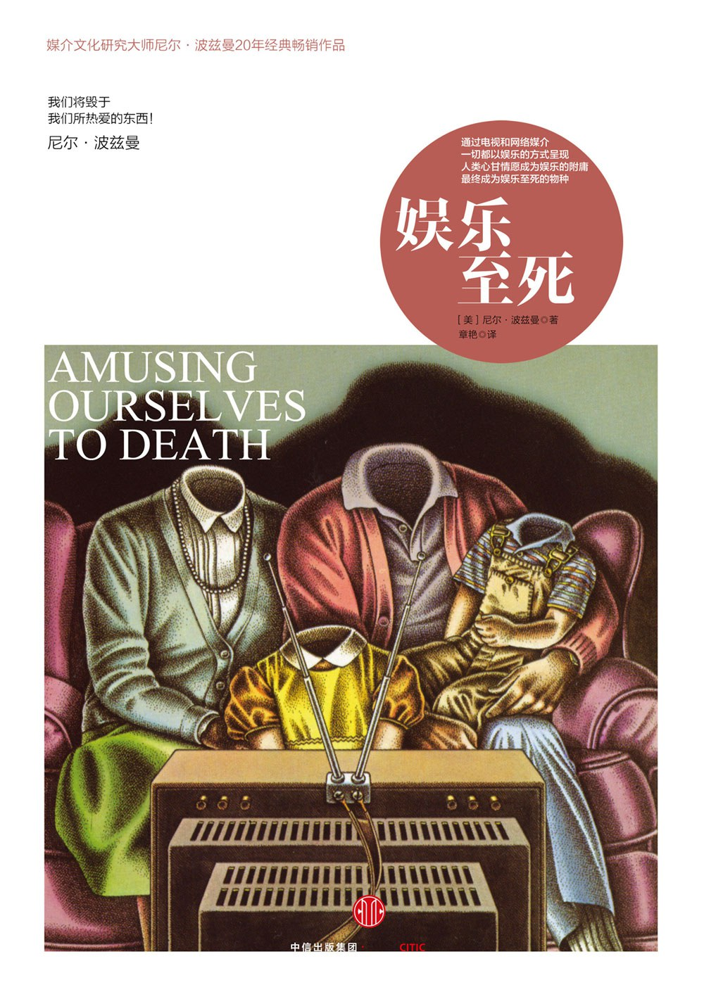
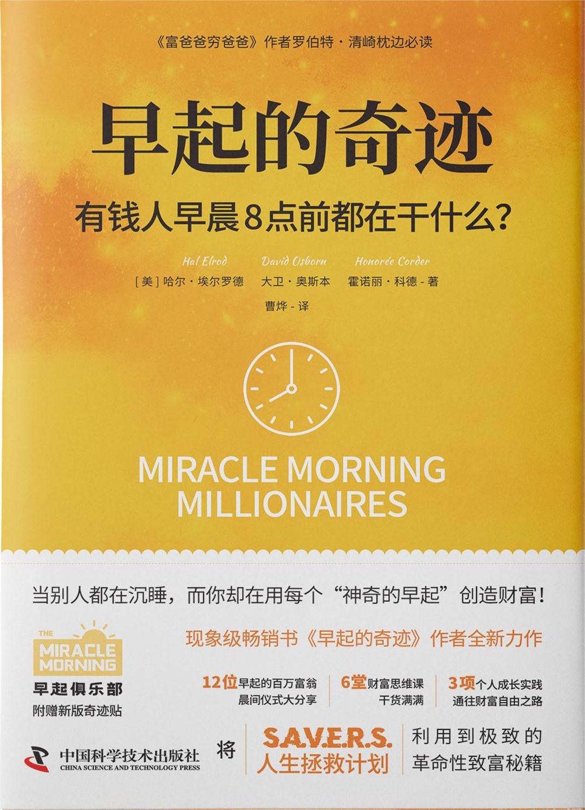
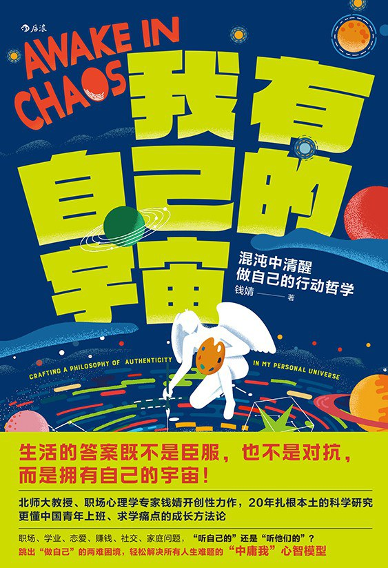
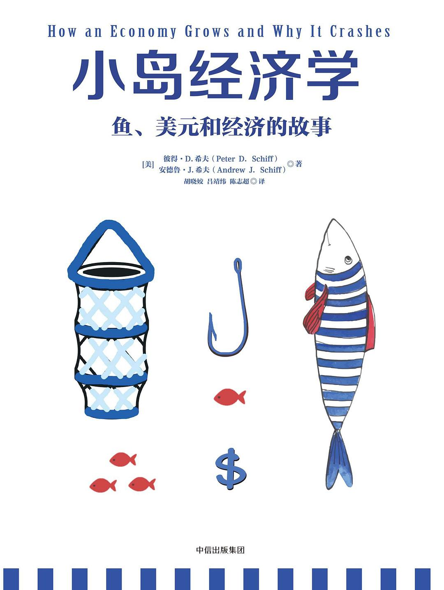

## 一、引言

今天是 2025 年的第四天，回望 2024，过去这一年我走得很艰辛、很漫长，但有时暮然回首，又好像就在昨天，时光就这样在不知不觉间悄然溜走了。这一年我读了不少书，并且有刻意在工作之余去看一些与专业无关的书，比如：心理学、经济学以及个人成长等类型的书，也养成了写读书笔记的习惯，会在读完一本好书之后抽时间去记录一些自己的感受和想法。另外，过去这一年我在职场上经历了比较大的变动，是开始入门 MLSys 方向的第一年，有太多的东西需要学习，也收获了不少新的技能。总而言之，2024 年是我开始飞速成长的一年，不管是职业技能上，还是认知水平和心理成熟度上，曾经让我感到困惑和迷茫的许多问题都从书中或多或少地找到了答案，也明白了不少做人的道理。

下面将对我在 2024 年间读过的书做一个罗列和总结。

## 二、我的 2024 年度书单




总结：这是一本介绍阅读方法论的书，讲述了如何做好读书笔记、如何系统化地阅读以及如何挑选适合自己的书等内容，从而实现高质量的阅读。书中介绍的许多方法，经本人亲身实践后效果不错，值得借鉴，但也不必完全照搬书中的做法（太过繁琐耗时），可以根据自身情况适当调整。




总结：这是一本介绍学习方法论的书，经典中的经典，其“以输出带动输入”的核心思想让我获益匪浅，也改变了自己过去曾经低效的学习方式。另外，书中提到了要有“作品意识”，要学会将自己的所学打造成产品，通过与外部积极地互动，来不断地完善自己，并以此获得持续的正反馈。




总结：深度学习经典入门书籍，绰号“鱼书”，以通俗易懂的方式对深度学习的基本原理进行了讲解，好评没得说。




总结：这是一本研究大众媒体文化的心理学书籍，通过对比过去的纸质阅读时代与现在的视频时代，讲述了人们的注意力是如何逐渐被科技进步牵着鼻子走，并逐渐丧失独立思考能力的。今天，各类短视频盛行，我有时也会在不知不觉间“着了道”，通过阅读这本书，能够引发我们对当下这个“快文化”时代的思考。




总结：这是一本非常好的财商教育类书籍，书中提到了什么是“资产”，什么是“负债”，而对于年轻人应该如何逐步积累起自己的“资产”项，书中给出了不少有用的建议。另外，本书不仅仅只是一本教我们怎么去理财的书籍，还包括了许多关于人生和职业发展的思考，强烈推荐刚毕业初入职场的年轻人可以读读看。




总结：这是一本全面的个人成长类书籍，从“早冥读写跑”五个方面，介绍了在日常生活中，我们应该如何实现自我提升和不断进步。此外，本书对许多底层原理进行了深入的分析，让我明白了许多做人做事的道理，提升了我的认知，开拓了我的眼界。




总结：这是一本介绍 Java 项目依赖管理的书籍，读这本书时，我正苦于解决 Spring 项目的依赖升级和冲突。通过阅读本书，我对 Spring 项目复杂的依赖管理的原理和方式有了深入且全面的了解，推荐 Java 后端程序员可以看看。




总结：这是一本关于如何实现早睡早起的个人成长类书籍，每天早上比平时早起 1-2 个小时，并将这些时间用于看书、运动和学习，你将收获一个更加积极向上的精神状态，开启不一样的生活。从今年夏天开始，我也断断续续地有按照书中的方法去尝试，虽然没能一直坚持，但是在每一个早起的日子中，我确实拥有了一份更加积极乐观的心态，希望自己明年能更多地坚持早睡早起的生活。




总结：这是一本关于昼夜节律的人体健康类书籍，本书对人类的睡眠规律、睡眠类型以及如何实现高效睡眠的方法进行了深入地介绍。其中，“90 分钟睡眠周期”的理论让我对自己的睡眠时间有了更多地了解和掌控，推荐长期睡眠质量不佳的人可以一看。




总结：这是一本关于年轻人职场问题的心理学书籍，作者是北师大的一名老师，通过长期与青年朋友对话，让她对当代年轻人的处境，对当代学生的迷茫和困惑有了深入的了解，并写下了这本书。书中提到的不少问题，都是我在职场中曾亲身经历过的，通过阅读本书，让我在面对这些问题时，能够更加清晰和理智地去做出判断和取舍，认清自己想要的是什么并积极付出实践。




总结：这是一本关于勇气的心理学书籍，书中通过青年与老者对话的形式，深入探讨了自卑、自由以及幸福等人生话题，以浅显易懂地方式讲述了“阿德勒心理学”的核心思想。如果你正处于人生中的困境，那么这本书值得一看，它能让你找回直面生活的勇气。




总结：这本书适合初学者刚入门 PyTorch 时，快速掌握其核心原理与基本用法，不过更细节的东西还是更推荐直接去看 PyTorch 的官方文档。




总结：这是一本通俗易懂的经济学书籍，通过讲故事的方式，以一个小岛作为故事的开始，逐步理清了一个国家的经济发展历程，并对“量化宽松政策”、“通货膨胀”以及“房地产泡沫”等许多经济现象进行了深入的分析和讲解，对于想要了解经济学相关知识的非专业人士，这本书是一个不错的选择。





## 三、总结与展望

2024 是充实而又忙碌的一年，希望在 2025 年里，自己能少玩点手机，在工作之余能抽出更多的时间去阅读，去读更多类型的书，在此立下 flag。
