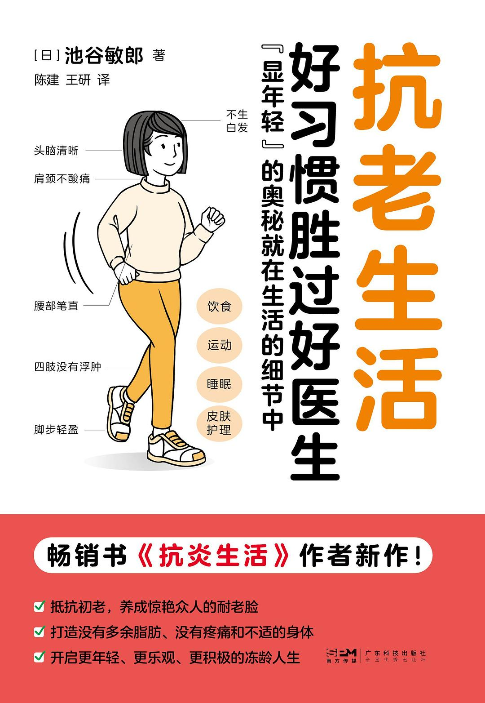

## 一、引言

……

## 二、我的 2025 年度书单




总结：本书以经典名著《柳林风声》作为故事的背景，讲述了主人公蛤蟆先生在历经生活的波折之后陷入了抑郁，并在朋友们的建议下去做心理咨询的故事。书中提出了三种“自我状态”，能够帮助我们更好地理解自己的行为和情绪，进而让我们可以用理性而不是情绪化的方式来行事。




总结：本书以“一骑红尘妃子笑，无人知是荔枝来”作为背景，以一个小人物的视角，描绘了唐代官场里的明争暗斗，也展现了主角李善德从一开始刚接到任务时的绝望到后来的勇敢和冷静，再到最后的心灰意冷的心境变化，是一本扣人心弦的历史小说。




总结：




总结：本书的故事围绕着一家以提供烦恼咨询服务而闻名的杂货店展开，店主浪矢雄治通过真挚的回答，帮助了许多前来寻求帮助的客人，也因此找到了自己的人生价值。




总结：




总结：本书的主人公是一位名叫“悉达多”的印度贵族，少年时的悉达多为了探寻人生的意义而踏上了旅程，一路上，他遇到了沙门、佛陀、美妓、商人、船夫、……，在历经生活的波折之后，他最终找到了属于自己的“道”。本书不仅是一部寓意深刻的文学小说，同时也是一部优美的诗歌，其语言中满载着对宗教和哲学的思辨，值得静下心来细细品味。




总结：本书的作者是一位心血管方面的医学专家，他利用自己的医学知识，通过长期的探索和实践，发现了能够让人保持年轻的秘诀。本书不仅展示了多种致人衰老的原因，还从饮食、运动以及人际交往等诸多方面介绍了保持健康的诀窍。养成良好的生活习惯，抗老生活从今天开始！





## 三、总结与展望

……
