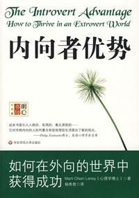

## 一、关于本书




简介：“性格内向”在世俗意义上常常被人们看做是一个不好的标签，但本书的作者（同样也是一名内向者）却展示了一些身为内向者的独特天赋，也给予了内向者们诸多生活上的建议。通过阅读本书，我们能够更加科学、更加正向地认识自己的“内倾性”，减少自卑，并发挥出我们的独特优势。





## 二、内容分享

### 2.1 怎样的人是“内向者”

作为一名 INFJ，我坚定地认为我是一名所谓的“内向者”，但在一些社交场合中，我又偶尔会表现出外向者的特征，这也曾让我感到困惑——到底何为“内向”（有一种更学术的说法叫做“内倾性”）？“内向”和“外向”的本质区别是什么？

> “内向者在人群中占少数，四个人中只有一个是内向者。于是，他们必须额外锻炼一些适应外界的技巧，因为生活中存在的种种压力，逼迫他们像其他人一样生活。”
>
> “内向者最具辨别度的特征是能量来源：内向者的能量来自内心的想法、情感和观念。他们是能量的贮存者。外在世界轻易就能让他们感到过度应激，甚至被“过量感”压迫到窒息。这种感觉有时类似于焦躁感或者麻木感。不论是哪一种，内向者都要限制自己的社交活动，避免能量被榨干。然而，内向者也需要平衡独处时间和社交时间，否则在思维视角和人际关系上就要蒙受损失。懂得平衡能量的内向者拥有独立思考的毅力和能力，能够深入思考，并富有创造性地工作。”
>
> “内向者就像充电电池一样，需要停止供能去休息，这样才能补充电力。刺激性比较弱的环境能为内向者提供支持，帮助他们恢复能量，那是他们天然的栖息地。”
>
> “汲取能量的方式是内向者和外向者之间最为明显的区别。”
>
> “与我们对内向者的刻板印象相反，他们并不一定是安静或者疏离人群的人，只不过生活重心在于内心。他们需要一个安静的、适合自省的地方，让他们将事物参透，让自己充满能量。”
>
> “对于内向者来说，仅仅是身处人群中就能让他们受到过度刺激。人群、教室……任何吵闹嘈杂的环境都会让他们精疲力竭。他们也许很喜欢和人相处，但是在与某个人交谈过后，他们就想退出去休息一会儿，让自己透透气。”

由于以上提到的这些特质，内向者的生活与工作方式也与外向者不同。

以我自己为例，在生活中，当与不太熟悉的人交流时，我一般会尽量避免使用电话、视频等形式（每次别人一言不合直接拉我会议都会让我感到很烦躁），而是将沟通方式限制在文字形式；在工作中，当需求一个接一个地到来，永远做不完的时候，我就只想敷衍了事赶紧把任务完成。只有当自己在时间上富有余量，并且在工作上保有一定的自由度时，才会有心思去琢磨一些技术上的细节，或者去学习一些新的知识。

> “内向者往往在自己意识不到的情况下，尝试限制外界信息进入的方式，以此调节过量的外界刺激。”
>
> “没有压力地专注于一两个领域时，内向者会享受事物内部的复杂细节。可一旦手头上的任务太多，他们就很容易觉得难以承受。”
>
> “内向者偏爱深度，他们限制经验的数量，但会深入体会它们。一般来说，内向者专注于少而精。他们喜欢深入讨论话题，追求‘质’更胜于‘量’。”
>
> “热衷于专注地深究、内省，以及安静地思考，这恰恰是内向者痛恨被打扰的原因。对于内向者来说，从思考的深井中挣扎出来是十分困难的。他们需要花费额外的能量再重新进入专注的思考状态，但其往往没有那么多能量。”

### 2.2 “内向者”的独特天赋

> “以前，一切积极的评价都给了外向者，是时候让内向者认识自己的独特和珍贵了。”
>
> “内向者为世界带来了重要的贡献——专注思考的能力、自省的能力、体悟的能力、观察的能力、打破常规的创造力、不随波逐流的勇气，以及让世界慢下脚步的潜力。当然，内向者更愿意把这些特质直接扔给世界，然后赶紧回家去！”

小时候，由于自己的内向，导致自己在一些公共场合中时常表现得格格不入，并在事后因此陷入自责与自卑。这也曾一度让我认为这是自己的缺点，需要被矫正。

后来，随着我慢慢长大，心智逐渐成熟，经历变得丰富，我似乎发现了自己的一些独特“优势”。并且，随着社交技能的不断锤炼，我也逐渐能够在保有自己特质的同时，在社交场合中带上自己的“面具”，积极地与其他人去进行交互，积极地去与周围的人产生链接。

> “沉默的人往往拥有深刻的洞察力。溪浅声喧，静水流深。”
>
> “内向型性格是一种能够促使你的精神活动转向内在世界的有益的性格。它是一种建设性、创造性的特质，我们在许多为世界的丰富和进步做出卓越贡献的独立思想家身上都能发现这一特质。内向者也可以拥有社交技能，他们喜欢和人相处，享受某些类型的社交活动。但是，聚会上的寒暄会使他们的能量入不敷出。内向者更喜欢一对一的对话，团队活动可能会造成过度的刺激，耗空他们的能量。”
>
> “敏感的人往往生来带有一些特质，这些特质常常被人们称作‘第六感’。他们具有很高的感受力、直觉力和观察力，对事物细节的分辨能力比常人高很多。他们可能会回避社交场合，因为汹涌而来的感受会使他们痛苦万分。因此，我们不难看出为什么内向者看起来专注于自我，或对他人不感兴趣，因为他们在外界信息饱和的情况下会关闭感受的通道。”
>
> “与其说内向者以自我为中心，事实上刚好相反。内向者专注自己的内心，内省自己的感受和经验，这样才能更好地理解外在世界和他人。所谓的‘以自我为中心’事实上恰恰提供给内向者一种了解他人所思所想，站在他人角度思考问题的能力。”
>
> “内向者并不拒绝社交，只不过内向者的社交生态以另一种形式来表达。内向者需要的社交关系较少，但是内向者更加喜欢亲密感和心有灵犀。对于内向者来说，与他人交往需要极大的能量，内向者不太愿意为了社交而消耗太多能量。这就是为什么内向者不喜欢闲聊天。内向者更喜欢言之有物，这样的谈话能够滋养身心、补充能量；这样的对话能带给内向者一种幸福感，也就是研究幸福话题的学者们所说的‘深层快乐’。当内向者大快朵颐这些内涵丰富的思想时，会获得充分的满足和享受。储存能量的倾向同样解释了为什么内向者对他人感兴趣时，更愿意观察他们，而不是加入他们。”
>
> “他们的能量如潮水涨落，行为因此没有多大连续性。有时，他们的电池是充满的，这时就显得外向健谈；有时，他们又精疲力竭，费力地拖拉着自己的四轮马车，这时的他们连一个字都懒得说。这样的表现往往让认识他们的人感到困惑不已。”
>
> “内向者太常被误解了。他们很少展露自己和自己的行为，显得有些冷淡神秘。从表现上，许多内向者丝毫不吐露他们思考的齿轮在转动和摩擦的迹象。在社交场合，他们脸上的表情可能看起来很被动，或者冷若冰霜。除非他们接受了太多信息刺激还回不过神来，或者是真的不感兴趣（谈话内容意义不大），否则他们通常只是在思考人们的对话。但是，他们的表情实在太平淡了，别人都猜不出他们是不是心不在焉。如果内向者不和他人持续地进行眼神交流，也不给出线索，这表明他们正在聆听谈话内容。同时，其他人可能就要排斥这些看似心不在焉的内向者了。”
>
> “内向者保存自己的能量，拥有更多的自我保护方式，生的孩子更少，寿命也更长久。这是因为他们更喜欢简单的生活，偏爱亲密的依恋关系，计划和反思新方式。他们鼓励别人建立审慎自省的习惯，在行事之前多加思考。”
>
> “追求新奇程度低的人往往喜欢内省，满足于慢节奏的生活。他们从寻求刺激或冒险的行为中感受到的更多是不安，而非享受。他们遵守秩序，小心谨慎，享受常规和熟悉带来的舒适，不喜欢招惹太多风险。他们喜欢在大胆行动之前了解整体形势，在长期项目中能更好地集中能量。他们性格温和，善于倾听，待人忠诚。”
>
> “内向者的大脑比起外向者的大脑，在内部活动和思维上具有更高的水平；内向者在需要认真细心和集中能量的任务上做得更好。”

### 2.3 “内向者”的社交建议

作为一名内向者，参与社交是一项非常耗费能量的行为。但通过保持适当的社交频率，学会控制每次社交的时长，能够让我们在保护好自身能量的同时，维护好和周围同事、朋友的关系。

> “我喜欢社交聚会——我确实喜欢——只要我知道很快能离开就行。如果我知道很快就能钻进睡衣，享受卧室的宁静，我就能控制社交聚会所带来的不舒适和精力消耗的感觉。”
>
> “聚会之前，制订你的逃跑计划。在脑海中有一个明确的离开时间。这样你就会知道，自己的精力是有保障的。到了该走的时候，别忘了和主人说再见。有时内向者在快要离开时已经煎熬难耐了，以至于忘掉说声‘谢谢’。”
>
> “内向者常常因为不想出席社交场合而感到内疚或局促不安。因此，尽管对邀请非常在意，但当拒绝邀请时，他们也可能会显得简慢无礼或心不在焉。有时，他们会假装看不见‘盼复’字样，以此避免说‘不’。事情往往会因此变得更糟。学会委婉地说‘不’是很有用的，这样邀请者就不会觉得遭到拒绝。对他们的邀请表示感谢，说清楚你是否能参加。如果你愿意去，对方下次就有可能再邀请你。”

另外，除了重要的工作电话之外，允许自己有不接电话的权力（尤其是陌生人或者不熟悉的人打来的电话）。

> “以下是大多数内向者对电话的评价：它是一种干扰，能耗尽我的能量，并且让我丧失内在的专注力，然后我得再次集聚注意力；打电话需要消耗精力来‘立即答复’；它并没有给我提供愉悦的瞬间。”
>
> “不要因为没有接别人的电话而感到内疚——就像人们常说的，要有筛选。这是你的权利。”
>
> “保持通话简短，除非对方是你想要深入交谈的人。”

最后，虽然许多像我一样的内向者会在社交中倾向于“被动”，但这并不意味着内向者的人际关系是糟糕的。相比于外向者，我们只是获取能量的方式不同，我们需要通过独处来“充电”。

> “大多数内向者都有很好的人际交往能力，与家人朋友关系很好。”
>
> “仅是身边围着许多人——不管是朋友还是敌人——就会耗尽内向者的能量。”

### 2.4 “内向者”的工作建议

对于内向者来说，在工作场合中往往需要逆本能地去表现自己，主动地去汇报、展示自己近期的工作，积极地去与项目中的重要人物进行沟通。

以我自己为例，每当我来到一个新的团队，不熟悉我的人总会以为我经常“摸鱼”，但其实我只是需要更多的时间来对问题进行深入的思考，亦或者需要满足提升自己的需求，在完成工作任务的同时，系统提升自己的工作技能。后来我发现，经常展示一下最近的工作进展（甚至可以是学习了某一项与工作相关的技能），哪怕只有一点，就能让领导放心的同时，享受自己时间安排上的自由度。

> “性格外向者的个性表露在外，而内向者与外向者不同，他们通常会把最好的部分隐蔽起来。对于外向者，你看到什么就是什么。而对于内向者来说，你所看到的只是他们个性的一部分。内向者个性中最丰富、最可靠的部分并不一定与外界分享。让他们敞开心扉需要时间、信任和特定的环境。”
>
> “内向者喜欢埋头苦干，或许不如外向者那样显得‘机灵’。我很安静，但这并不意味着我什么都不知道。”
>
> “内向者往往会因为贡献没有受到重视而感到惊讶。如果他们有过一再被无视和忽略的经历，就可能会心生怨恨。但是，他们依然对这种事情发生的原因感到困惑。工作环境就像社交场所一样，需要某些与内向者天性相违背的技能。受大脑生理机能的影响，内向者的行为方式往往会使其遭到忽略。让我们来看看三个最大的困难来源——不愿在会议上发言、不愿自吹、工作节奏慢。”
>
> “内向者往往觉得，他们不需要别人知道自己在做什么——尤其是在工作中。外向者需要更详细地了解内向者的工作情况，否则可能就会认为内向者没在做事。”
>
> “内向者的领地意识很强。他们喜欢自己的私密空间，而保持空间私密的一种方式是不向外界展示，从而减少向外的能量消耗，同时限制外界对他们的影响。”
>
> “在紧张的环境中，外向者可能会认为内向者节奏慢，所以看问题不敏锐、没有参与感，或者能力不足。因为内向者往往语速缓慢，说话停顿时间又长，可能会表现得对自己的观点犹豫不定。事实上，他们对自己的想法进行了深入的思考。而且，正是因为他们对语义很重视，所以他们想要达到精确，选择最恰当的词语来表达自己的思想。”

### 2.5 “内向者”的人生建议

> “个人步调（Personal Pacing）、优先顺序（Personal Priorities）以及个人界限（Personal Parameters）可以帮助内向性格的你。‘个人步调’指的是，学习设定你自己的节奏，让你完成想要做的事情，而不感到被压垮了或能量耗尽了；‘优先顺序’让你考虑哪些目标最有意义，引导你运用能量实现它们；‘个人界限’可以帮助你创建一个界限，让刺激保持在‘刚刚好’的范围内——既不太多也不太少。当你学会使用这些建议时，你会发现自己可以获得更满意、更充实的生活。”

**个人步调（Personal Pacing）**：接受你能力有限这一事实，并注意你的能量节奏，把大事分解成容易完成的小步骤。

> “我在生活中可能一直会走得很慢，但做成的事情也很多。关键在于步调。步调就是确立自己的节奏，然后继续前进。当你这样做的时候，你需要平衡能量的供给和身体各系统的需求，避免落入缺乏能量的境地。步调也意味着将活动分解成更小的单位。既然你肯定不会一辈子全速前进，那么了解自己的高潮与低潮——什么时候、怎样工作最好，分配多少时间给项目等很重要。你的节奏可能与别人的不同。接受内向的自己是非常重要的一件事。”
>
> “设定个人步调的好处在于，它能让你完成很多事情，同时又不至于精疲力竭。根据任务做规划，设定自己的步调。持续工作，直到全部完成为止。你如果为自己的生活制订了适当的节奏，就能避免拖延症，同时减少了抑郁和焦虑。”
>
> “注意状态的高潮和低谷，精力最充沛的时候做最重要、最困难的工作，精力下降时再去做简单一些的事情。”
>
> “目标要现实，专注于你能合理地获得并享受的事情。”
>
> “微运动是以某种方式让我们前进的微小的、微小的步骤。小步骤最重要的一点是，它能立即减少我们的压力，让我们继续前行。当内向者面临一项令人生畏的任务时，他们会立刻想象它会消耗自己多少能量。按部就班的方法可以马上缓解对于精力不足的恐惧。更有意思的是，只要从小处做起，自然就会想要做更多的事情。关键是要一点点前进，提醒自己你能做到。对内向者来说，日拱一卒是最有效的工作方式。”

**优先顺序（Personal Priorities）**：选择对你有意义的事情去做，并不断评估做出的选择是否适合自己。

> “大多数内向者关心事情的意义所在。追寻意义能使你保持能量充沛，使你早上想从床上一跃而起。”
>
> “把目标写下来似乎是一项令人生畏的工作。恐惧可能会突然冒出来：你会想到，要是目标没实现怎么办？目标是错误的怎么办？我连目标都想不出来怎么办？你可能会学鸵鸟，把事情都掩盖起来，盲目地希望你能得到想要的一切。但当你这样做的时候，通常意味着一件事：你没有在过自己想要的生活。像鸵鸟那样把头埋在沙子里，就好比跟着自己的车狂奔，方向盘却在别人手里。”
>
> “重新评估是非常重要的。不断思考对你来说什么是重要的，什么是有意义的。考虑一下自己是否真的想做这些事情。这是你觉得你应该做的事情，还是别人认为你应该做的事情？记住，长大成人最重要的事情之一，就是能够自己做出选择。”

**个人界限（Personal Parameters）**：通过设置界限来保护自己内向的天性。

> “我们这些内向的人常常会因为时间和能量有限以致没法做更多的事情而内疚，所以对别人提出的任何要求都会让步，丝毫不做出限制。或者，我们不能准确地评估自己的能量供给，设定的界限要么太严，要么太松。我们需要规范外部世界，这样它就不会入侵和过度刺激我们，同时我们又可以适当地参与其中。许多人不理解我们对个人时间和空间的需求。给自己保留空间，以便保存能量、履行责任和完成目标。”
>
> “你可以制订一些策略而不是通过退缩来保护自己。随着学会与人们更多地交往，你会发现生活更丰富，更少孤立状态。你会觉得自己更加强大，更有干劲，更清楚想在哪里和怎样消耗自己的能量。这是值得做的事情。”
>
> “设定界限意味着决定哪些人、哪些事可以进入你的生活，哪些人、哪些事又要远远隔开。这是一个有意识的筛选和分类过程。内向的人需要个人隐私，围上篱笆。”

## 三、心得体会

通过本书，我对自身性格的“内向”有了更加理性、客观并且深刻的认识。

之前，偶然有一次在网上刷到钱婧老师的直播切片，钱老师讲到自己也是一个很“I”的人，但她会尽量不让自己的“I”影响到工作、影响到与他人的协作，从而给他人带来不好的体验。“内向”并不是自己可以为所欲为的借口，我们是应该顺应自己的内心，但也更应该多多体谅他人的感受，多从他人的角度出发看待问题。

另外，学会接纳自己的“内倾性”，不要因此而感到自卑，就像上面提到的，它也有诸多优点——**“你越能欣赏自己的内向型性格，并且享受它，你就越能热切地自我接受、理解和成长。”**

最后，引用本书结尾处作者对内向者们的一段寄语：**“好好休息，花点时间出去玩，不要把事情看得那么严重；欣赏自己的内心世界，欣赏自己的优点和局限，享受自发性的一面；保持和谐；品味孤独；心存感激；做好你自己；记住，让你自己的光芒闪亮！”**
