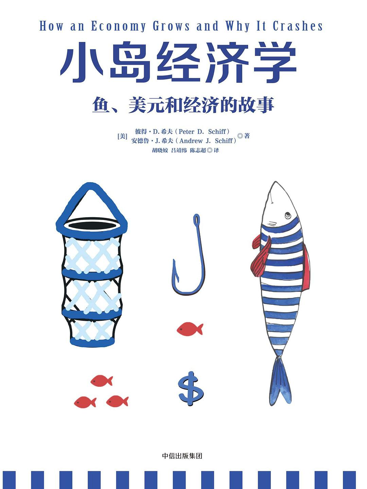

## 一、关于本书




简介：本书通过将国家比作一个“小岛”，使用“鱼”、“渔网”以及“鱼邦储备券”等概念，形象地解释了经济学中的诸多概念，通俗易懂地揭示了经济学的运行原理。作者对“通货膨胀”、“信贷危机”以及“房地产泡沫”等经济现象进行了深入的分析和解释，清晰地点明了当今社会经济所存在的问题，丰富了我对于世界的认知，是一本非常适合非专业人士入门的经济学读物。





## 二、内容分享

### 2.1 小岛经济学

在一个小岛上，人们以捕鱼为生……

一开始，人们徒手进行捕鱼，当天捕的鱼只够当天吃，为了生存，人们必需日日不断地坚持捕鱼。

随着第一张渔网（资本）的发明，提高了人们的生产力，从而可以将更多的鱼存储起来以备不时之需（储蓄），此外，人们也有了更多地时间追求更加丰富生活，亦或是进行创造性工作（进一步提高生产力）。

> “资本指的是一种设备，这种设备的建设和使用本身没有什么意义，其意义在于利用设备建设和制造其它需要的东西。”
>
> “努力使有限的资源产生最大的效益以尽可能满足人类的需求，这就是经济这一概念最简单的定义。工具、资本以及创新是实现这一目标的关键。”
>
> “经济增长的原因：找到了生产人类所需物品的更好方式。”

**个人的一点思考**：如果我们将“捕鱼”理解为“重复性的工作”、将“经济发展”理解为“个人能力的提高”，那么当我们将这一套理论运用到实际生活中，我是否可以这样认为——如果我们每天的时间除了休息之外都被重复性的工作占满，没有额外的时间去学习提升自己，那么我们个人的成长速度将会是缓慢、甚至停滞的？

后来，随着经济规模不断扩大，小岛上出现了“政府”和“社会分工”。

> “在一个经济体中，如果人们有所分工，从事不同的商业和服务活动，其结果一定会比所有人都做同一种工作要好。分工增加产量，高产量又能提高生活水平。”

“社会分工”带来了各种各样的就业岗位，人们需要掌握特定的技能才能找到对应的工作，企业也需要雇佣合适的员工来创造利润。

> “一名员工的具体价值主要取决于三个方面：需求（雇主是否需要这名员工所掌握的技能）、供应（有多少人具备这些技能）以及生产力（这名员工对那些任务的完成程度如何）。”
>
> “员工只要工作就有报酬，而企业主想得到回报只能等到企业赢利，它们的收益是对承担风险的回报，也是对成功整合稀有资源的回报。对利润的不懈追求推动了产品创新、企业发展与经济增长。正是这样的推动力提高了每个人的生活水平。”

当个人的财富积累到了一定规模，人们为了让自己的鱼（钱）更加安全，于是就出现了“银行”。人们将自己的“鱼”存入银行，银行再用这笔钱对外发放贷款，创造收益的一部分用于支付储户的利息，剩下的则作为银行的赢利。其中，银行的“利率”是调控国家经济的关键。

> “贷款利率决定了银行能支付给储户的利息。存款利率是随存款年限递增的。存款年限越长，造成银行存款短缺的风险越低。因此，如果储户愿意长期储蓄，获得的利率也就较高，进行短期储蓄的储户所获得的利率则较低。”
>
> “高利率会抑制借贷，延缓经济增长。但同时，高利率也能刺激储蓄。最终，银行资产会再次积累起来，到那时利率又会下降。而较低的存款率表明人们更愿意将储蓄用于近期消费，因而抑制了为满足未来消费需求而进行的投资。”

### 2.2 量化宽松政策

一个国家的经济并非是一直处于增长中的，当市场的调节能力失控，且政府又恰好做出了错误的决策时，就有可能造成经济的衰退，甚至是经融危机。

而对于“如何解决经济衰退”这个问题，在经济学上主要有两派观点：

- **“凯恩斯学派”**：在经济不景气时，政府可以通过扩大货币供给和财政赤字缓和自由市场的波动；
- **“奥地利学派”**：经济衰退是经济繁荣期所做出的错误决定的必要补偿，经济迅猛发展过后必然会有一个相应的衰退期。

作者认为，当经济危机来临时，“奥地利学派”的观点才是正确的道路，而不是“凯恩斯学派”。

为什么“凯恩斯学派”的观点是错误的？

> “大多数经济学家认为，给老百姓更多的钱花就可以增加需求，但是这种做法并不能改变真正的需求，只会使人们花更多的钱购买已经生产出来的商品。只有增加供给才能切实满足人们更多的需求。”
>
> “政府总会通过各种形式干预储蓄的配置，包括政府贷款担保、公司及个人税收减免以及税务罚款等。这些政策的关键推动因素就是认为政府规划者要比储蓄者更清楚什么有利于社会的发展。然而，实际上，历史上充斥着各种浮夸的政策与方案，这些方案都是政府智囊团策划的，最终全都没有兑现他们的承诺。更重要的是，政府介入储蓄者和借款人之间采取的强制手段将借款的原因与结果割裂开来，使得储蓄的分配效率极为低下。贷给个人或者企业的款项如果无法成功促成必要的创新或者提高产能，就会浪费储蓄的供给，削弱整体经济。”
>
> “不断扩大货币供应量的做法以及政府看似无限的负债能力掩盖了一个事实——实际信贷是受有限储备制约的。”
>
> “我们的消费不能超过产能，我们的借款不能超出存款，至少不能长期这样。我们必须生产出什么东西，才会使消费有价值。”

“量化宽松”政策：

> “尽管很多人知道美国依赖量化宽松，但很少有人真正看透其本质：向金融市场注入新的资金，以推动价格上涨。实际上，量化宽松不过是通货膨胀的一种委婉表达，它也成为美联储将政府债务货币化的隐秘手段。但想用量化宽松政策来修复萎靡的经济，就好比企图用汽油去救火一样，汽油越多，火势就越旺。量化宽松政策是延长经济衰退的办法，而不是促进经济复兴的良方。”
>
> “通货膨胀不过是把财富从以某种货币储蓄的人手中转移到以同种货币负债的人那里。如果遇到恶性通货膨胀，存款就会变得一文不值，负债却一笔勾销。引发恶性通货膨胀以及随后经济灾难的原因都惊人地相似。这些国家都是通过降低货币价值偿还巨额外债，结果，本国的人民陷入了赤贫之中。”

“通货紧缩”：

> “……”

……

> “美联储理论上是一家私有银行，但实际上却是美国财政部的延伸，它制定了美国的基准利率，影响着整个市场。美联储可以把利率降到足够低，这样企业和个人就更愿意借贷，以此刺激不景气的经济。低利率会刺激借贷、抑制储蓄，难怪美国已经由一个储蓄者的国家转变成了借款人的国家。”

### 2.3 房地产泡沫

……

## 三、心得体会

初读本书时，正值 24 年 9 月，当时美联储时隔多年再次宣布降息，全球的经济情况都或多或少地受到了影响，国内的投资市场也开始变得活跃。在此之前，我对于经融领域可谓是一无所知，于是乘此机会，我决定恶补一波“基础”。

本书以“小岛”作为故事，生动形象地解释了经济学中的许多概念，更巧的是，“银行降准降息”以及“房地产泡沫破碎”等现象此时恰好就发身在我的身边，理论结合实际，让我对书中提到的经济学理论有了更加深刻的认识和理解。
