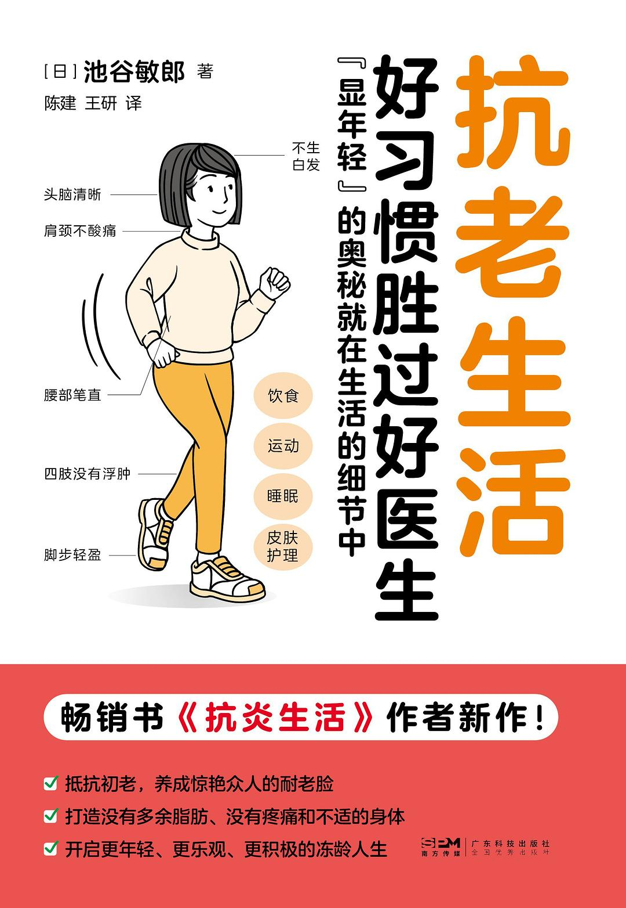

## 一、关于本书




简介：本书的作者是一位心血管方面的医学专家，他利用自己的医学知识，通过长期的探索和实践，发现了能够让人保持年轻的秘诀。本书不仅展示了多种致人衰老的原因，还从饮食、运动以及人际交往等诸多方面介绍了保持健康的诀窍。养成良好的生活习惯，抗老生活从今天开始！





## 二、内容分享

### 2.1 致人衰老的原因

血管的氧化和糖化：

> “血管越健康的人外表看起来越年轻；相反，血管老化越严重的人外表看起来越苍老。”
>
> “越爱吃甜品、面包、米饭的人看起来越衰老。甜食会使血糖值急剧上升，进而使血管被氧化。”

内脏脂肪和皮下脂肪的增加：

> “与年轻人相比，年长的人运动量下降，肌肉量减少，基础代谢整体下降，更易产生脂肪堆积。但很多人无视身体变化，仍保持和年轻时相同的膳食结构，进一步加速了脂肪堆积。很多人认为，人到中年后身体发福属于自然规律，自身无法控制。但在我看来并非如此，我发自肺腑地认为，‘人到中年仍保持身量纤纤’，那才是人生中一笔巨大的财富。凡是身材发福的人大概率自我管理能力很差。尽管胖瘦纯属个人私事，但不难看出比起那些大腹便便的人，身材紧致苗条的人更容易获得人们的好评与信赖。”
>
> “从食物中获取的能量不足，人就会产生饥饿感，如果此时没有进食，身体为了获取能量，就会开始燃烧体内脂肪。但是，如果此时立即进食，身体从食物中获取了所需的能量，就会失去来之不易的燃脂机会。而且，如果一下子吃得过饱，身体就会将超过代谢所需的能量转化成脂肪储存于体内。由于运动有抑制食欲的效果，所以我建议大家在感到饥饿时适量饮茶饮水，再适量做些运动。”
>
> “每餐尽量摒弃“一点不剩”的做法。肥胖的中老年人几乎都有每餐过量进食的习惯。从小大人就教导我们“吃饭时不要剩饭”，只要剩饭我们就会心生负罪感，这种心情我十分理解。因此建议大家取餐时尽量少取，在餐馆用餐时要半份米饭，尽量不剩。”

肌肉力量下降导致体态不佳：

> “只要你昂首挺胸，保持身姿端正，外貌年龄就会年轻 20 岁。如果不能保持良好的体态，个人形象就会越来越差。”

大脑和神经的老化：

> “稳定血糖值对于避免患阿尔茨海默病及保持大脑健康具有极其重要的意义。血糖大幅波动会扰乱大脑运转，很有可能对大脑造成不可逆的损伤。”
>
> “睡眠不足会对大脑状态造成很大的负面影响，原因之一是失眠会导致血管受损。得不到充足的睡眠，自主神经系统就会高度紧张，交感神经就会处于优势地位，致使身体始终处于紧张状态，血管收缩，血压升高，血液更容易凝结，最终导致血管堵塞和动脉硬化。同时，血压升高还会导致心跳加快，加重心脏负担。”

精神衰老：

> “积极向上、朝气蓬勃的心态会让人昂首挺胸，从容不迫地面对一切，会驱使人从每天的运动方式和饮食搭配着手，尝试着慢慢改变整个生活。”
>
> “尝试让自己改变一下，做事量力而为，工作中懂得取舍，多做自己喜欢的事情，与赞美自己的人交友，这就是防止精神衰老的秘诀。”

### 2.2 使人年轻的生活习惯

饮食：

> “‘饿了就吃’的饮食方式，无形中剥夺了身体燃烧脂肪的机会。当我们感到饥饿时，应该明白这其实是脂肪在燃烧的信号，一定要充分把握这个减肥瘦身的时机。此时，可以喝点水、做些舒缓的运动，最好 30 分钟至 1 个小时内不要进食。”
>
> “正确的进食时间并非基于三餐的饭点，而是基于你的饥饿程度。”
>
> “抗衰老饮食的‘终极要义’就是控糖。因体质和运动量不同，每个人合理的摄糖量有很大差异。如果你此前从未有意识地进行控糖，我建议先将面包、米饭等主食的摄入量减半。或者，你可以平衡全天的主食摄入量，比如早餐不吃主食，其他照旧。”
>
> “过量饮食不仅会导致体态肥胖，还会损害血管和内脏。‘剩下的饭菜扔掉太可惜’，不少人对浪费粮食都心存负罪感，尽可能不剩饭菜，于是尽力将富含糖分的食物全部吃光，结果导致内脏脂肪不断堆积，形成恶性循环，得不偿失。”

运动：

> “运动是抗衰老的有效手段，但适度运动即可，高强度的运动反而可能会加速衰老。中老年人如果进行高强度运动，不仅会加重心血管系统的负担，还会导致身体生成大量损害血管健康的活性氧，所以并不推荐。当然，如果高强度运动是长久以来的兴趣爱好，也无须停止；若并非兴趣爱好，则无须勉强进行。”
>
> “如果我们能够维持适当的肌肉量，就能保持良好的体态，视觉上也会更加年轻。维持体态本身也需要肌肉的参与，维持体态的过程可以自然而舒缓地锻炼肌肉。另外，如果我们的肌肉结实有力，运动起来就不会吃力，自然脚步轻盈、爬楼无碍。运动离不开肌肉，肌肉又在运动中得到锻炼，形成良性循环。另外，如果我们能够维持适当的肌肉量，即便摄入过量的糖分，身体也会将其转化为能量被肌肉消耗掉。所以，保持适当的肌肉量，可以提高我们身体的基础代谢能力，有助于保持苗条体态。”
>
> “餐后原地踏步可抑制血糖升高。通常情况下，血糖会在用餐后的 30 分钟至 1 个小时内达到峰值。血糖值急剧上升是导致血管老化、脂肪堆积的‘元凶’。在血糖达到峰值前运动，不仅可以抑制身体对食物中糖分的吸收，还可以促进已被吸收的糖分转化为能量被消耗。这时血糖并不会出现急剧上升的情况，因为糖分在变成脂肪储存起来之前就已经被消耗掉了。我推荐大家选择原地踏步或原地慢跑的运动方式。这两种运动即便餐后身体沉重，也可以轻松地进行。”
>
> “即使短时间、小范围地进行运动，长期坚持也会效果显著。不必去健身房，也不必更换运动服，无须浪费多余的时间和金钱，只是在日常生活中稍微活动一下身体就可以保持健康。比如：不靠椅背坐在椅子上的时候，当作没有椅背，挺胸收腹；去附近便利店时，不要悠闲地散步前往，而是稍微增加一些运动强度，慢跑着过去；站着乘地铁、公交或是等待红绿灯的时候，都可以做收腹运动。”

睡眠：

> “完成工作固然重要，但从医生的立场来看，我希望各位养成‘再忙也要按时睡觉’的习惯。也就是说，优先预留出睡眠时间，其余时间才是工作时间。”
>
> “睡前 90 分钟停止进食。睡眠期间是人体各个脏器休养、调整的时间。在睡眠过程中，胃会通过不断收缩，清除残留在胃部的食物残渣、刮掉旧黏膜来实现内腔清洁。如果在睡前进食，食物残渣滞留在胃中，胃就不得不强行开启持续消化模式，本应进行的大蠕动被迫停止。睡眠期间，胃在一刻不停地执行消化任务，直至清晨内部垃圾也没有得到及时清理，自然而然不会产生饥饿感。”

泡澡：

> “暖身的泡澡有促进血液循环、保持血管年轻态的功效。人在泡澡时，血管会扩张，血管内壁会分泌养分滋养血管，因此泡澡是有效的抗衰老方式。”

皮肤护理：

> “‘过度清洁’会加速皮肤老化。无论是脸部还是身体，通常一天内用洗面奶或沐浴露清洗一次即可，没有必要多次清洗。皮肤污垢积累过多的话另当别论，但如果只是平时生活中沾染了些许污垢，用热水就足以清洗干净，无须担心皮肤保湿成分会过多流失。沐浴后，身体和脸部都要涂抹保湿霜以免皮肤干燥。”
>
> “紫外线会导致皮肤衰老。短期日晒会使皮肤干燥、长斑；长期日晒则会损伤深层皮肤，引发皱纹生长和皮肤松弛。脸部皮肤是决定一个人外貌年龄最重要的因素，所以我建议男性也应尽可能地做好紫外线防护。”

人际交往：

> “一个人心态年轻，外表也会年轻。”
>
> “和朝气蓬勃、阳光开朗、积极向上的人一起共事，自己也会变得活泼起来；和无精打采、消极低沉的人一起共事，自己也会受其影响，干劲不足。”

### 2.3 养生 Tips

- 肚子饿了以后不着急吃饭，而是先喝水，做简单的运动；
- 饮用无糖的咖啡、红茶，经常喝绿茶。如果是瓶装饮料则选择茶饮料，如果不是瓶装饮料就选择无糖的水和茶；
- 吃饱了以后，即使有剩菜也不强迫自己必须吃光；
- 常吃大豆，以及豆腐等豆制品；
- 养成饭后散步或原地踏步的运动习惯；
- 在通勤的地铁和公共汽车上尽量站着，有意识地步行一段路程；
- 每天至少保证 7 个小时的睡眠时间，如果是 8 个小时就更好了；
- 感到压力大时，用运动或唱歌等方法来发泄情绪；
- 积极与不熟悉的人和年轻人交流。

## 三、心得体会

重视个人健康问题，是对自己的人生负责。养成良好的生活习惯，抗老生活从今天开始！
