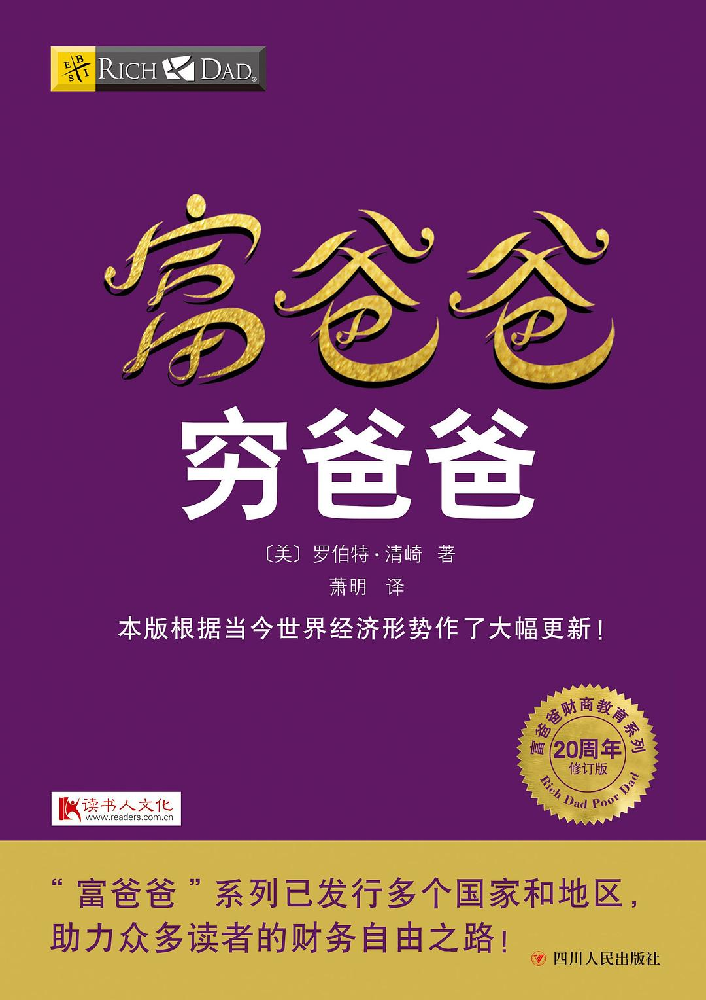
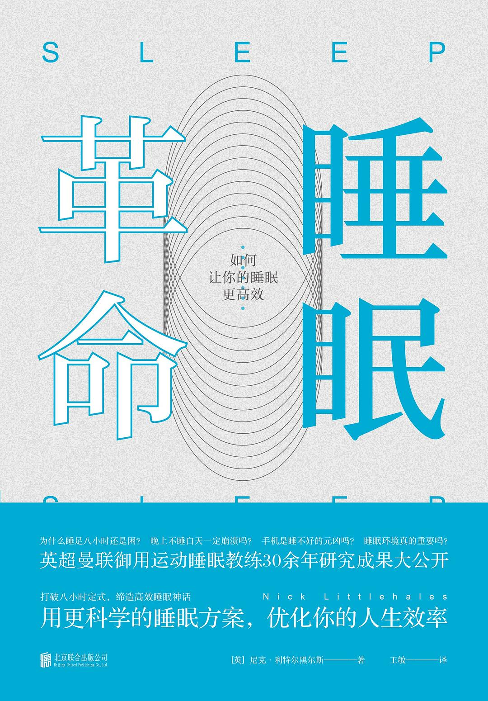

<!-- ## 一、前言

读书，是我在工作之余的一大爱好，它能够让我短暂地从生活的琐碎中抽离出来，沉浸在自己的世界中，享受片刻的安宁。此外，读书，尤其是读好书，能够激发我们的思考，让我们以更多地视角来认识和理解这个世界。因此，读书于我而言，是一项可以坚持终身的志趣。

在我的读书生涯中，有不少我认为比较好的、对我个人的成长非常有帮助的一些书，我将在本文中对它们进行归纳和展示，主要分为技术类书籍和人文社科类书籍两大类。 -->

## 我的书单

### 技术类

|    分类    |                    书名                     |                        作者                        |
| :--------- | :------------------------------------------ | :------------------------------------------------- |
| Python     | 《Python 编程 - 从入门到实践》              | Eric Matthes                                       |
| C++        | 《C++ Primer》                              | Stanley B. Lippman / Josée Lajoie / Barbara E. Moo |
| Java       | 《Java 核心技术 - 卷 1》                    | Cay S.Horstmann                                    |
| Java       | 《Java 核心技术 - 卷 2》                    | Cay S.Horstmann                                    |
| Java       | 《深入理解 Java 虚拟机》                    | 周志明                                             |
| 计算机网络 | 《图解 HTTP》                               | 上野宣                                             |
| 计算机网络 | 《图解 TCP/IP》                             | 竹下隆史 / 村山公保 / 荒井透 / 苅田幸雄            |
| 操作系统   | 《鸟哥的 Linux 私房菜》                     | 鸟哥                                               |
| 数据库     | 《MySQL 必知必会》                          | Ben Forta                                          |
| 设计模式   | 《图解设计模式》                            | 结城浩                                             |
| 依赖管理   | 《Maven 实战》                              | 许晓斌                                             |
| 机器学习   | 《统计学习方法》                            | 李航                                               |
| 深度学习   | 《深度学习入门 - 基于 Python 的理论与实现》 | 斋藤康毅                                           |
| AI 框架    | 《深入浅出 PyTorch 从模型到源码》           | 张校捷                                             |
| AI 系统    | 《AI 系统原理与架构》                       | ZOMI 酱                                            |


  
  
  
  
  
  
  
  
  
  
  
  
  
  


### 人文社科类

|   分类   |        书名        |          作者           |
| :------- | :----------------- | :---------------------- |
| 心理学   | 《非暴力沟通》     | 马歇尔·卢森堡           |
| 心理学   | 《娱乐至死》       | 尼尔·波兹曼             |
| 心理学   | 《我有自己的宇宙》 | 钱婧                    |
| 心理学   | 《被讨厌的勇气》   | 岸见一郎 / 古贺史健     |
| 经济学   | 《富爸爸穷爸爸》   | 罗伯特·清崎             |
| 经济学   | 《小岛经济学》     | 彼得·希夫 / 安德鲁·希夫 |
| 个人成长 | 《费曼学习法》     | 尹红心 / 李伟           |
| 个人成长 | 《海绵阅读法》     | 李小墨                  |
| 个人成长 | 《认知觉醒》       | 周岭                    |
| 个人成长 | 《早起的奇迹》     | 哈尔·埃尔罗德           |
| 个人健康 | 《睡眠革命》       | 尼克·利特尔黑尔斯       |


  
  
  
  
  
  
  
  
  
  
  


## 读书笔记

### 心理学



 



### 经济学



 



### 个人成长



 



### 个人健康


